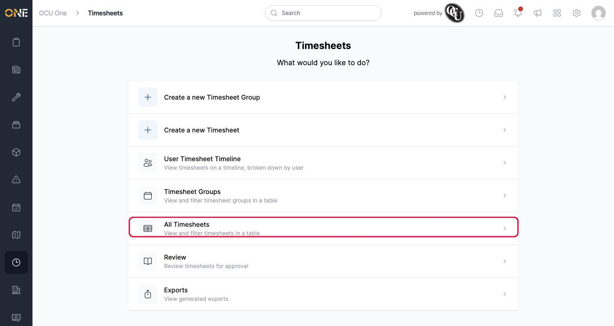
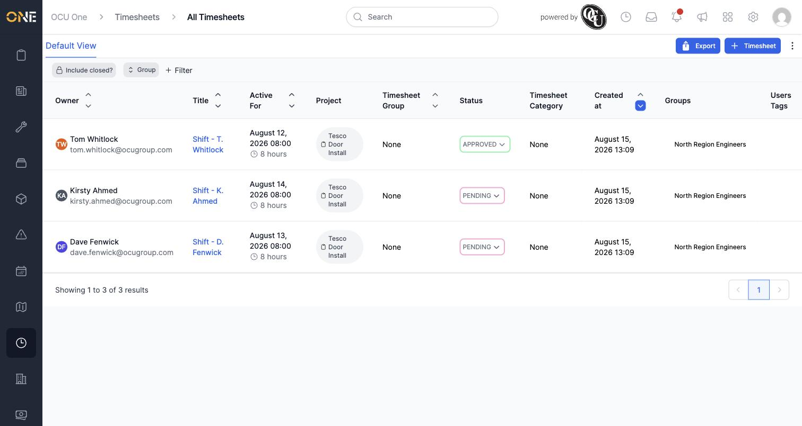
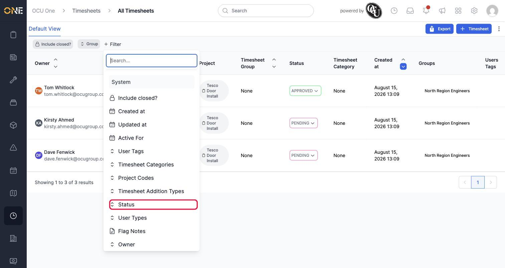
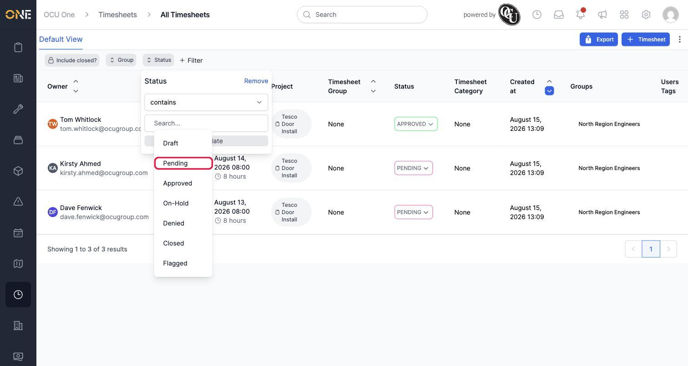
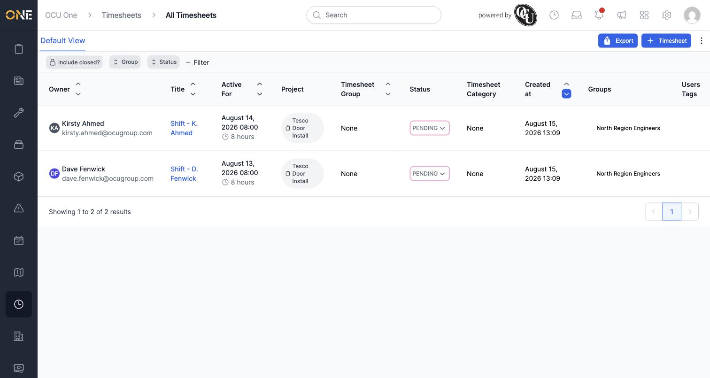
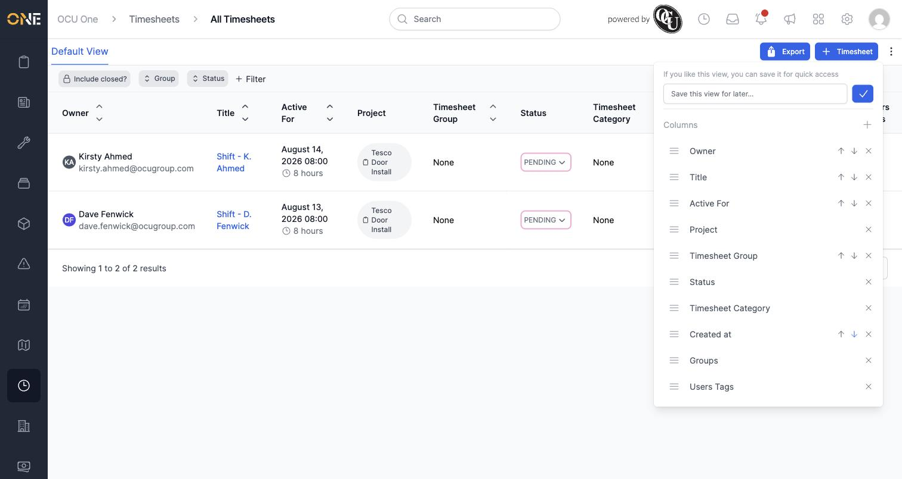

# Browsing all timesheets in the table view

The table view is where you see every timesheet across your organisation at once, and narrow it down with filters — useful for managers and finance staff who need to review or export time logged by other people, rather than just their own.

## Getting there

From the Timesheets landing page, choose **All Timesheets** ("View and filter timesheets in a table"):

This opens the table of timesheets, with columns for Owner, Title, Active For (the date/duration), Project, Timesheet Group, Status, Timesheet Category, Created at, and Groups — showing every timesheet across the organisation you have permission to see, most recent first. Here it's narrowed with a Group filter to one team, "North Region Engineers":

## Filtering the table

Click **+ Filter** to see everything you can narrow the list by — status, project code, timesheet category, date ranges, user tags, groups, and more:

To narrow this further down to just the pending timesheets in that team:

1. Click **Status** to add that filter.
2. Choose **Pending** from the list of statuses:

   

Filters combine together, so with both Group and Status applied, the table narrows to only timesheets that match both:

Any filter chip can be edited or removed later by clicking it again.

## Adjusting columns and saving the view

The **⋮** menu next to the Export button lets you reorder or remove columns, add others, and save your current filters and columns as a view you can quickly return to later:

## Other actions from this screen

- **Timesheet** (top right) creates a new timesheet directly, if you need to log time on someone else's behalf.
- **Export** starts a payroll export from the timesheets currently shown — covered in its own guide on creating a timesheet export.
- **Include closed?** reveals timesheets that have been closed out, which are hidden by default.
