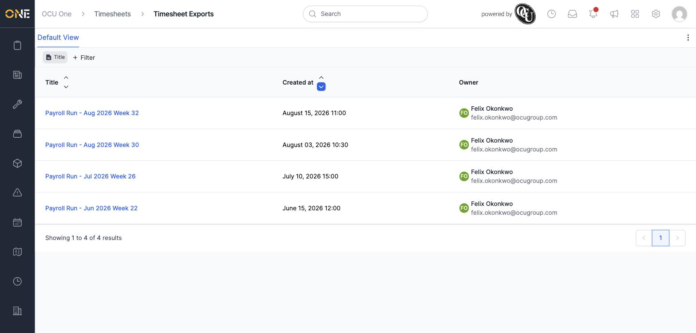
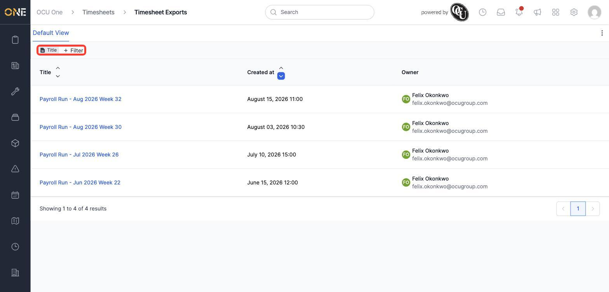
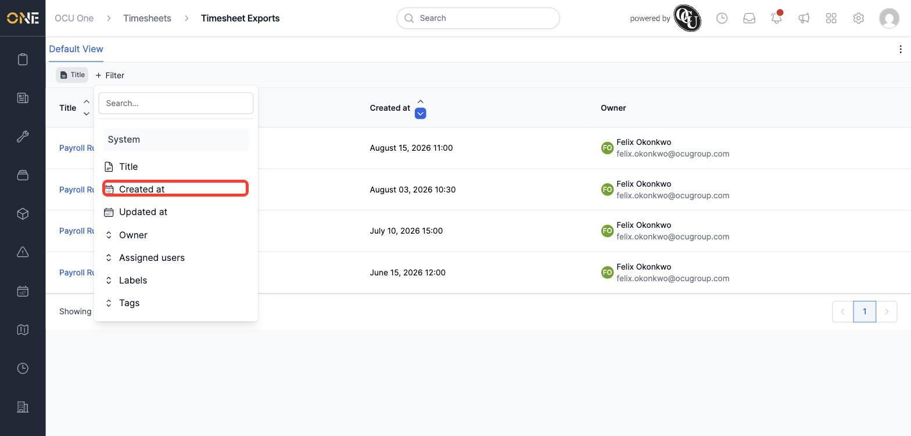
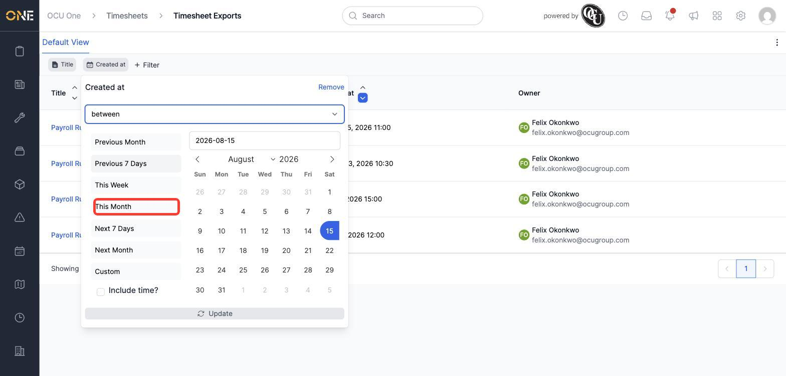
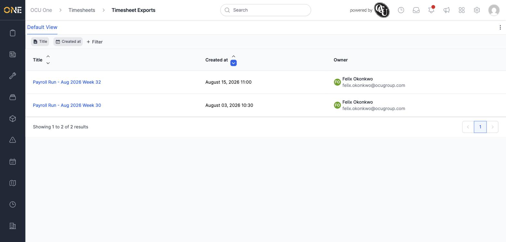

# Browsing and filtering timesheet exports

The **Timesheet Exports** list shows every export that's been created. When there are a lot of them, filtering helps you find a specific one quickly — for example, everything created this month.

## Browsing the list

Open **Timesheet Exports** (under **Timesheets** in the navigation). Each row shows the export's title, when it was created, and who created it:

## Filtering the list

1. Click **+ Filter**.

   

2. A list of fields you can filter by appears — **Title**, **Created at**, **Updated at**, **Owner**, **Assigned users**, **Labels**, and **Tags**. Click **Created at**:

   

3. A panel opens for that field. Change the dropdown from **equal to** to **between**, then pick one of the quick date ranges — **This Month** covers everything created since the start of the current month:

   

   Other quick ranges are available too — **Previous Month**, **Previous 7 Days**, **This Week**, **Next 7 Days**, **Next Month** — or choose **Custom** to set your own exact start and end dates.

4. Click **Update**. The list refreshes to show only exports created within that range — out of 4 exports spanning June to August, only the 2 created in August remain:

   

## Other things worth knowing

- You can add more than one filter at once — each appears as its own chip along the top, and results have to match all of them together.
- To change a filter you've already added, click its chip to reopen the panel and adjust it.
- To remove a filter entirely, open its panel and click **Remove**.
- Filtering by **Title** works like a text search — it matches exports whose title contains whatever you type, useful when you know roughly what an export was called (e.g. a specific pay period).
