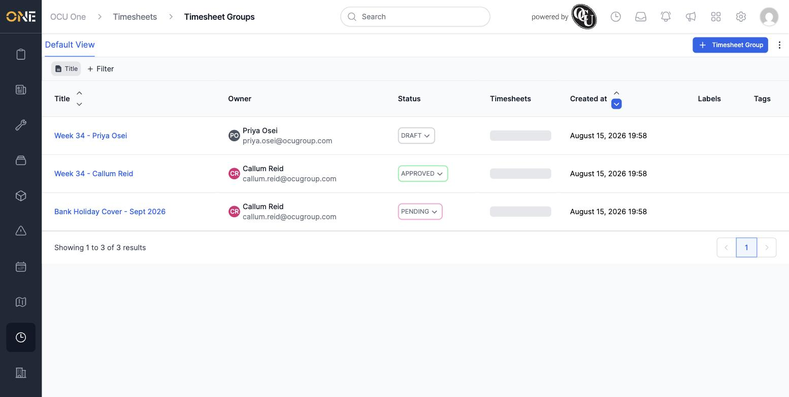
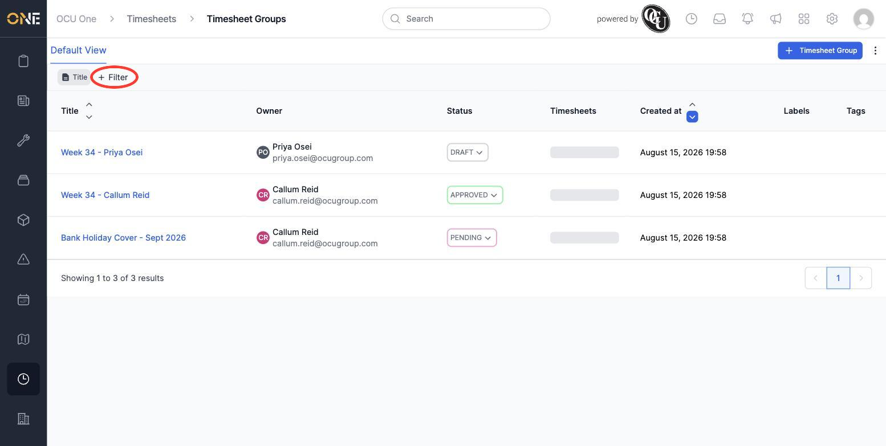
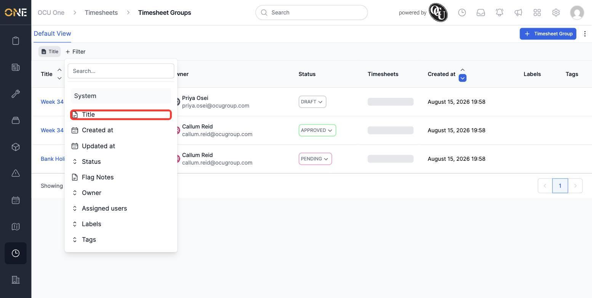
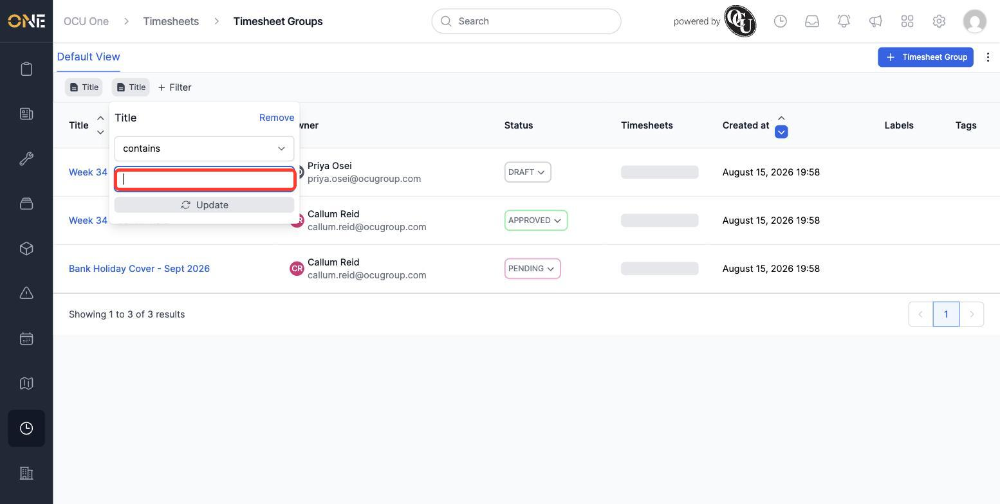
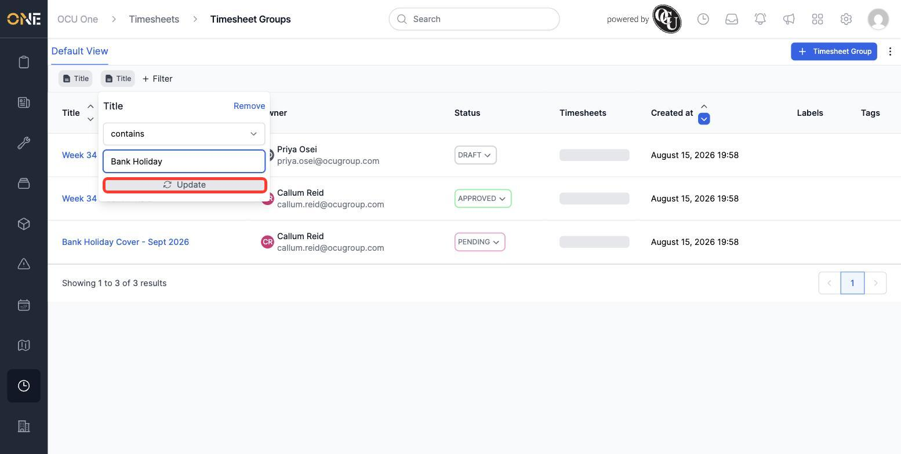
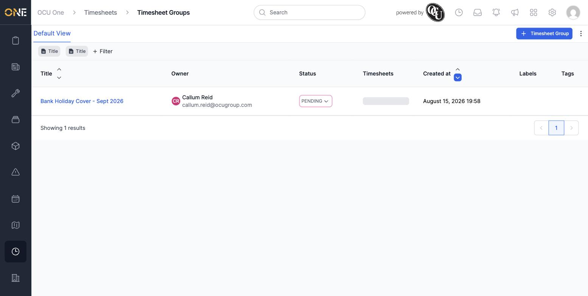

# Browsing and filtering timesheet groups

The **Timesheet Groups** list shows every timesheet group in one place. When there are a lot of them, filtering lets you narrow the list down to just the ones you're looking for.

## Browsing the list

Open **Timesheet Groups** (under **Timesheets** in the navigation). Each row shows the group's title, its owner, current status, how many shifts are in it, and when it was created:

## Filtering the list

1. Click **+ Filter**.

   

2. A list of fields you can filter by appears — **Title**, **Created at**, **Updated at**, **Status**, **Flag Notes**, **Owner**, **Assigned users**, **Labels**, and **Tags**. Click the one you want to filter on — for example, **Title**:

   

3. A panel opens for that field. For **Title**, it defaults to matching titles that **contain** whatever text you type. Click into the text box and type what you're looking for:

   

4. Type your search text (e.g. "Bank Holiday") and click **Update**.

   

5. The list refreshes to show only groups matching your filter:

   

## Other things worth knowing

- You can add more than one filter at once — each one you add appears as its own chip along the top, and results have to match all of them together.
- To change a filter you've already added, click its chip to reopen the panel and adjust it.
- To remove a filter entirely, open its panel and click **Remove**.
- Filtering by **Status** works the same way as **Title**, but lets you pick from the group's actual statuses (Draft, Pending, Approved, On-Hold, Denied, Closed, Flagged) instead of typing text — handy for quickly finding everything that's still waiting on a decision.
