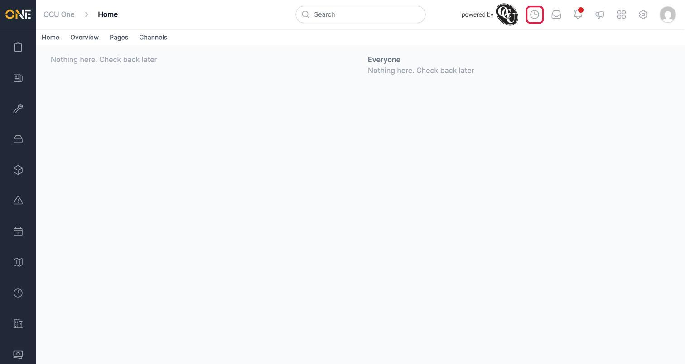
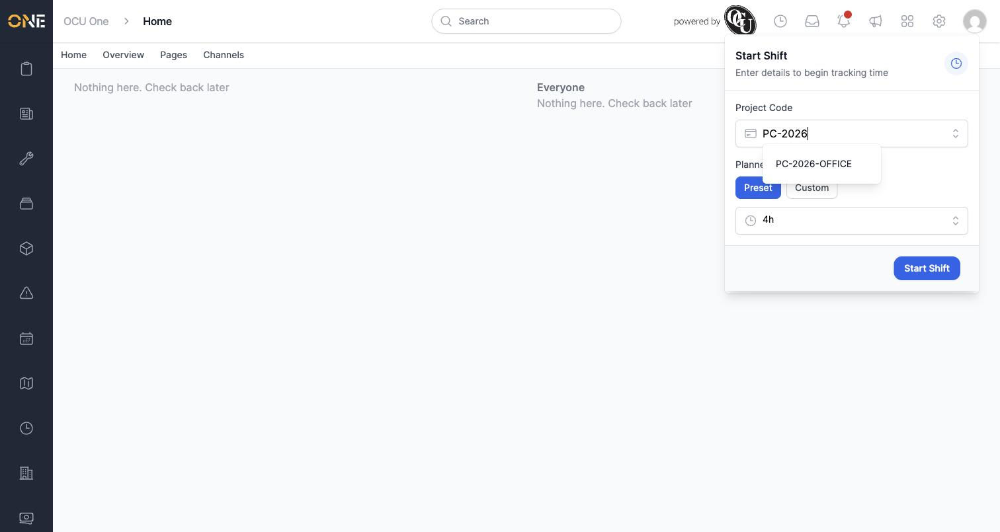
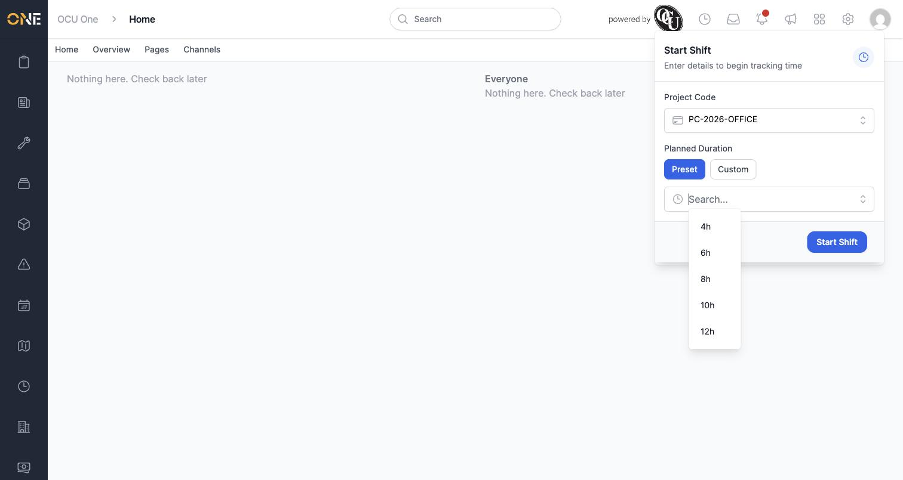
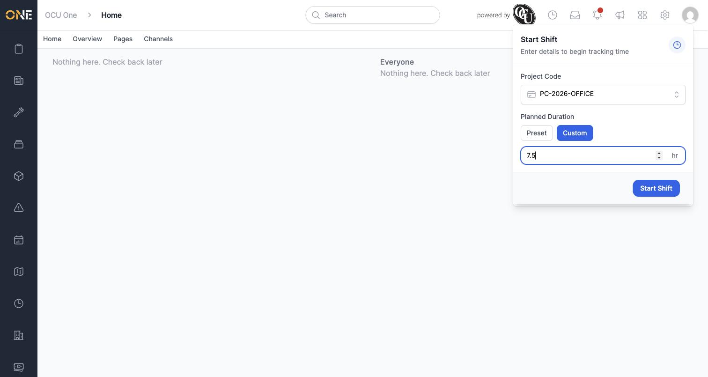
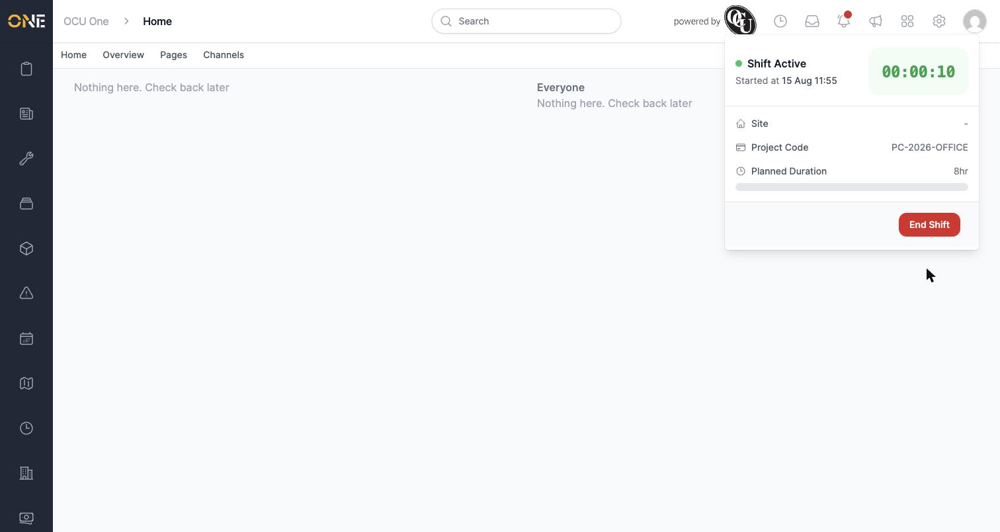
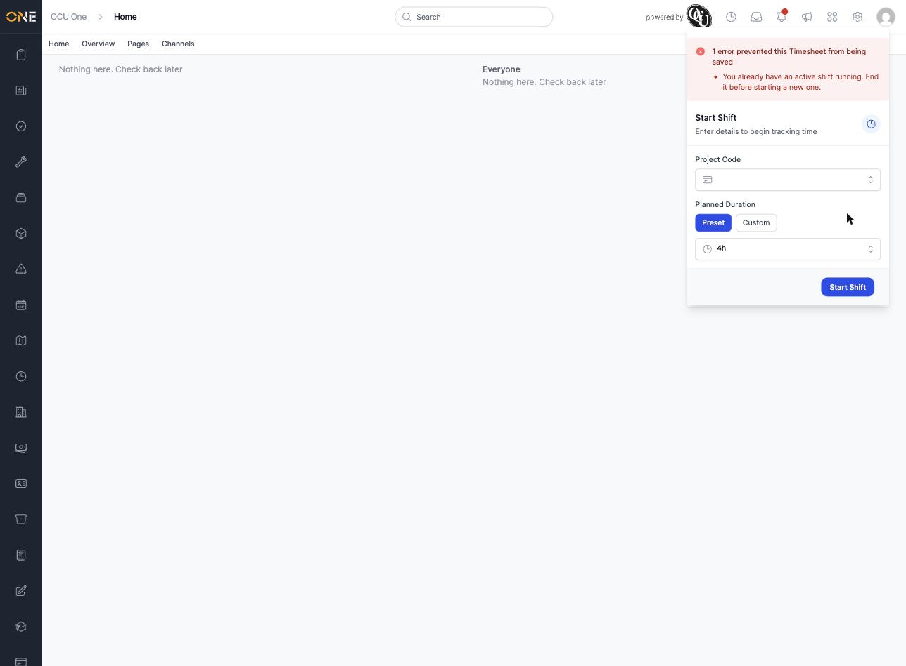

# Clocking in and starting a shift

Starting a shift is how you begin tracking your working time in OCU One. It's available from anywhere in the app, on any page, using the clock icon in the top toolbar — you don't need to navigate to a specific screen to clock in.

## Starting a shift

1. Click the clock icon in the top toolbar (next to the "powered by" logo).

   

2. A **Start Shift** panel drops down with two things to fill in: a Project Code and a Planned Duration.

   

3. Click into the **Project Code** field and type to search for the code you're working under. Select it from the matching results.

   

4. Set your **Planned Duration** — how long you expect the shift to run. There are two ways to do this:
   - **Preset** — pick from a list of common shift lengths (4h, 6h, 8h, 10h, 12h).
   - **Custom** — switch to the Custom tab to type in any number of hours, useful if your shift doesn't match one of the standard lengths.

   

   Switching to Custom replaces the dropdown with a plain number field, so you can enter a duration the presets don't cover — including fractions of an hour, like 7.5.

   

   This is only a planned figure to track progress against — it doesn't cap or limit your shift. You can still end your shift earlier or later than planned.

5. With both fields filled in, click **Start Shift**.

   

## Once your shift has started

The panel switches to show your shift is now active:

This view shows:
- A live timer counting up from when you started
- The time your shift started
- Your **Site** (this fills in automatically when a site is known — it shows a dash if none is set)
- Your **Project Code**
- Your **Planned Duration**, with a progress bar that fills up as you approach that planned length

From here you'd use the **End Shift** button when you're finished — see the separate guide on ending a shift and confirming your hours for that step.

## Checking whether a shift is running

Once you've started a shift, you don't need to reopen this panel to check it's still running — a small green dot appears on the clock icon in the toolbar any time you have an active shift, visible from any page in the app.

A couple of things worth knowing:
- You can only have one shift active at a time. If you click the clock icon while a shift is already running, you'll see the **End Shift** panel instead of Start Shift.
- If you already had the Start Shift panel open and a shift gets started in the meantime (for example, from another tab or your mobile app), trying to submit that panel now shows a clear error instead of doing nothing: "You already have an active shift running. End it before starting a new one."

  

- The Project Code field only lets you search and select from codes that have already been set up for your organisation — if the one you need isn't listed, check with your manager or administrator.
