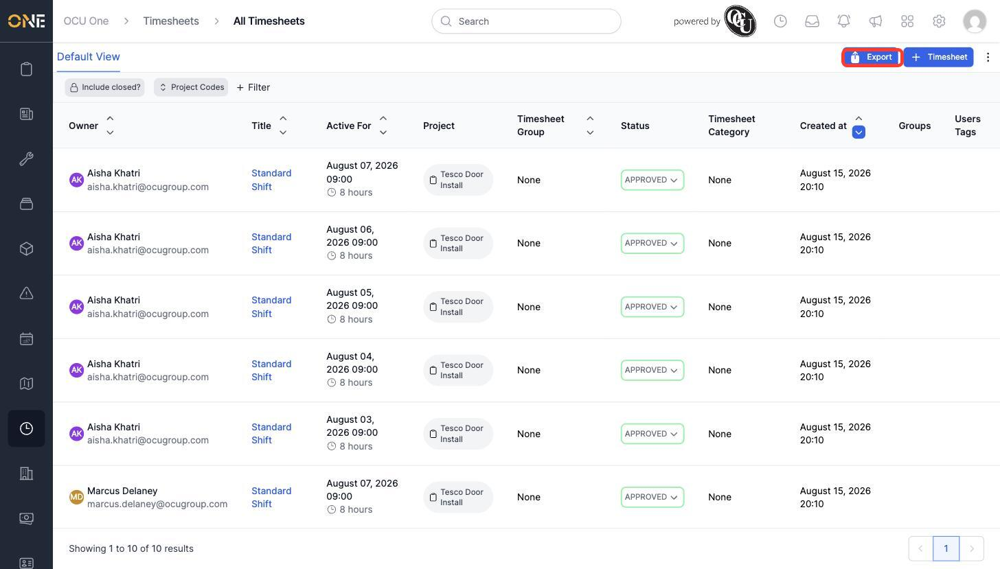
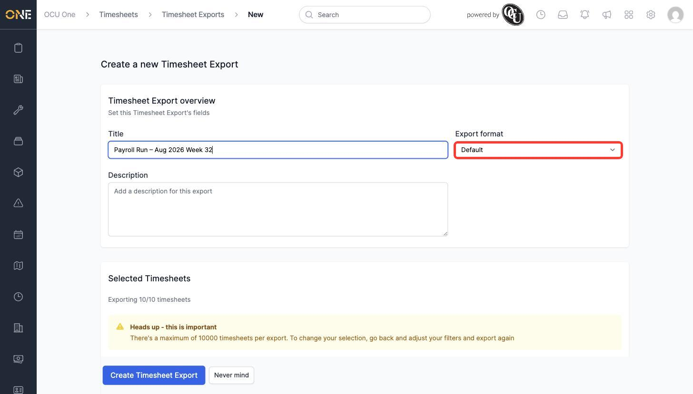
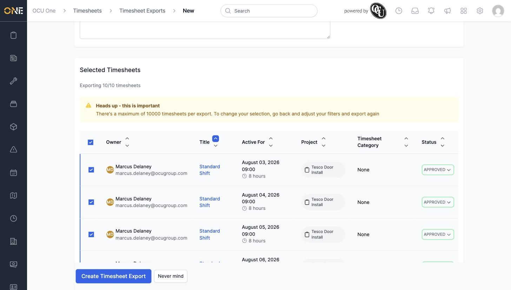
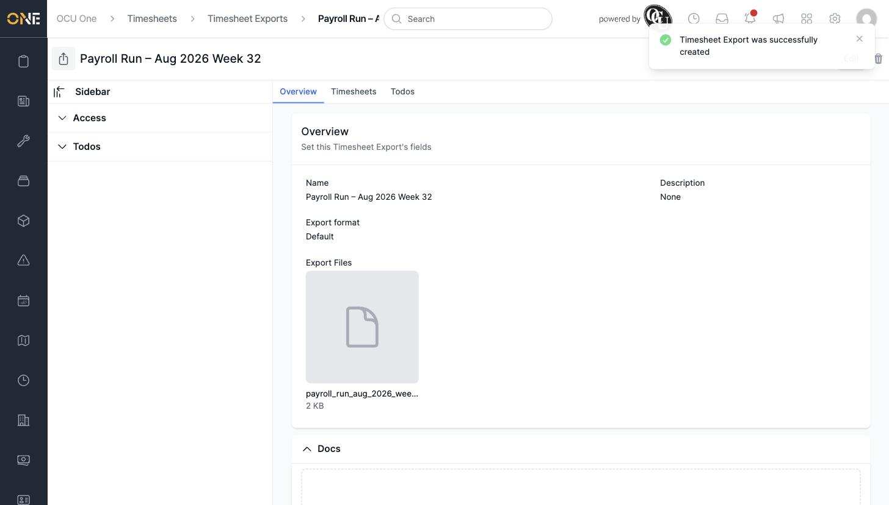

# Creating a timesheet export for payroll

A Timesheet Export bundles up a set of timesheets into a downloadable file, ready to hand off to payroll. This guide covers picking which timesheets to include and creating the export.

## Choosing which timesheets to export

The timesheets you select for an export come from the main **Timesheets** list, using whatever filters you've applied there — so the first step is to narrow the list down to exactly the timesheets you want.

1. Open **Timesheets** and use **+ Filter** to narrow the list down — for example, by project, date, or status — until it only shows the timesheets you want to include.

   

2. Click **Export** in the top right. This carries your current filter through to a new export, so only the timesheets you just filtered to are brought across.

## Creating the export

1. On the **Create a new Timesheet Export** screen, fill in:
   - **Title** — a descriptive name, e.g. "Payroll Run – Aug 2026 Week 32".
   - **Export format** — choose **Default** for a standard CSV file, or one of the other formats (**Sage 200**, **SagePay**, **Payrite**) if your organisation uses one of those payroll systems.
   - **Description** (optional) — any extra context for whoever reviews this export later.

   

2. Below that, the **Selected Timesheets** table shows exactly which timesheets will be included, carried over from the filter you applied on the Timesheets list. Check the "Exporting X/X timesheets" line to confirm it matches what you expect before continuing.

   

   There's a maximum of 10,000 timesheets per export — if you need to change which timesheets are included, go back to the Timesheets list, adjust your filters, and export again.

3. Click **Create Timesheet Export**.

   Once created, the export generates its file automatically — you'll see it appear under **Export Files** on the export's Overview tab, ready to download:

   

4. The export's **Timesheets** tab lists every timesheet that was included, so you can double-check exactly what went into the file:

   

**Something worth knowing:** the file isn't a one-time snapshot — if you later change the **Export format**, the file is regenerated to match. See the separate guide on reviewing an export for how to bulk-update the status of every timesheet in an export once payroll has processed it.
