# Creating and managing a timesheet group

A Timesheet Group is a bundle of one or more shifts, created ahead of time, for a specific person. It's a quick way to pre-book time — for example standby cover over a bank holiday, or a block of shifts for a temporary or agency worker — without having to enter each shift one at a time once the work has actually happened.

This guide covers creating a new timesheet group, viewing what's inside one, and editing, changing the status of, or deleting an existing group.

## Creating a new timesheet group

1. Open **Timesheet Groups** (under **Timesheets** in the navigation) and click **Timesheet Group** in the top right.

   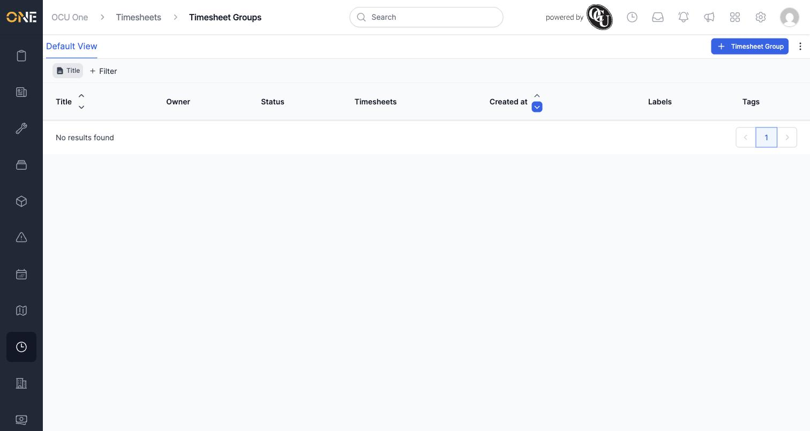

2. You'll land on the **Create a new Timesheet Group** screen.

   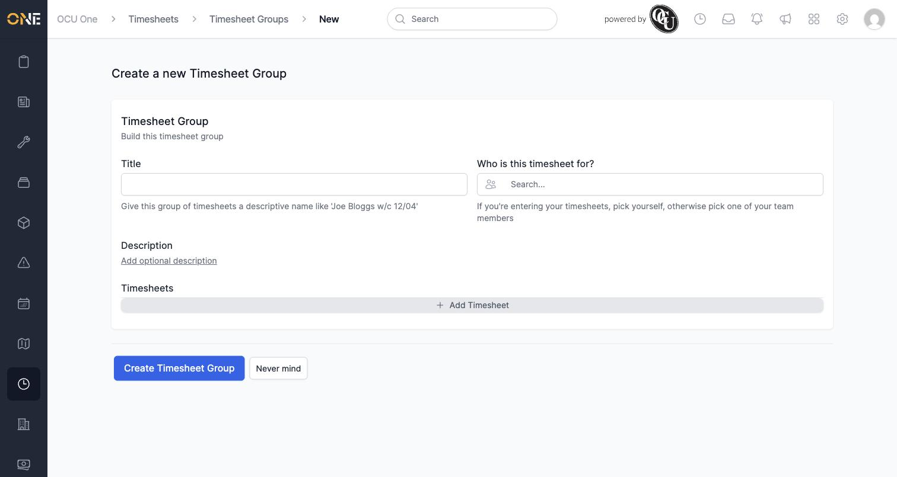

   Fill in:
   - **Title** — a descriptive name for this group, e.g. "Bank Holiday Cover - Aug 2026". The field's own hint suggests a format like "Joe Bloggs w/c 12/04", but any name that makes sense to you and your team is fine.
   - **Who is this timesheet for?** — search for and select the person (or people — see below) these shifts belong to. Pick yourself if you're entering your own time, or a team member if you're entering it on their behalf.
   - **Description** (optional) — click **Add optional description** to reveal a text box for any extra context. Click **Never mind** if you open it and change your mind.

   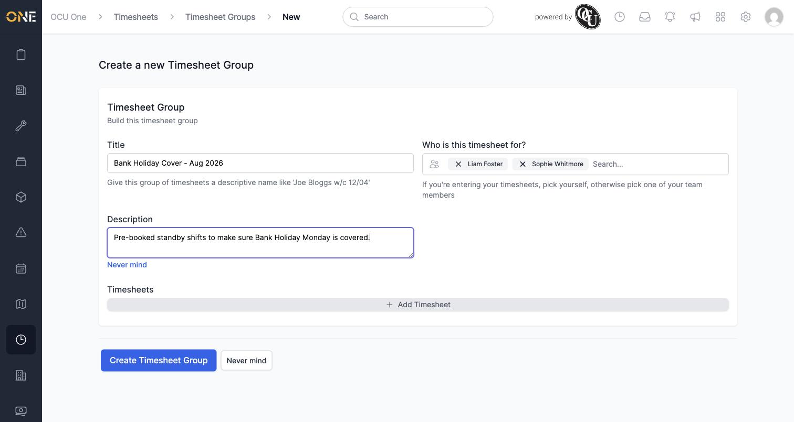

   **Something non-obvious:** you can select more than one person in "Who is this timesheet for?" — but doing so does **not** create one shared group. Instead, it creates a **separate copy of the whole group** for each person you selected, all with the same title and the same shifts. This is useful when several people need identical cover (e.g. two engineers on standby the same day) without you having to build the group twice.

3. Under **Timesheets**, click **Add Timesheet** to add a shift to the group. Repeat to add more than one — for example an AM and a PM shift on the same day.

   For each shift, fill in:
   - **Type** — what kind of time this is (e.g. Shift, Travel, Break).
   - **Started** — the date and time the shift begins.
   - **Duration** — how long the shift lasts, in hours and minutes.
   - **Title** — a short label for this specific shift.
   - **Project** — which project this time should be logged against. **This field is required** — if you leave it blank, the shift won't save (see the next step).
   - **Category** (optional) and **Project Code** (optional) — further classification for the shift, if your organisation uses them.
   - **Additions** (optional) — any extra timesheet addition types that apply (e.g. an allowance).

   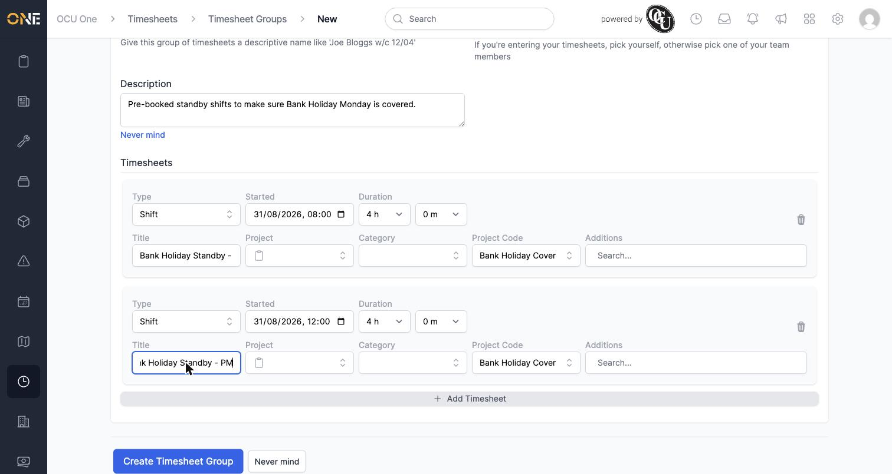

4. Click **Create Timesheet Group** to save.

   If you forget to set **Project** on a shift, you'll see an error like this instead of the group being saved — go back and pick a project for the shift the error refers to, then submit again:

   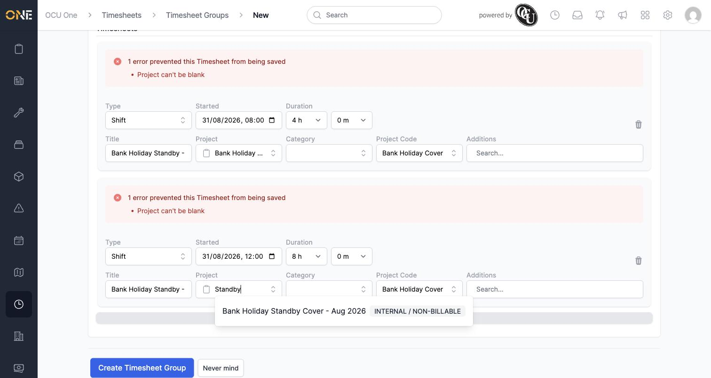

   Once everything's filled in correctly, the group is created and you're taken to its overview page:

   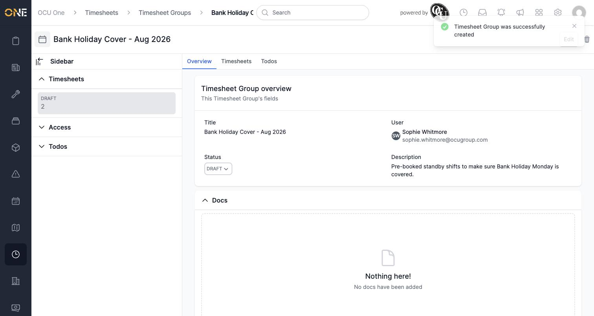

   If you selected more than one person in step 2, you'll land on the last person's copy of the group — check the list view (step 7 below) to see all the copies that were created.

## Viewing a timesheet group

A timesheet group has three tabs, shown in the sidebar and along the top:

- **Overview** — the group's title, owner, status, and description.
- **Timesheets** — every shift in this group, with its owner, title, active time, and project.

  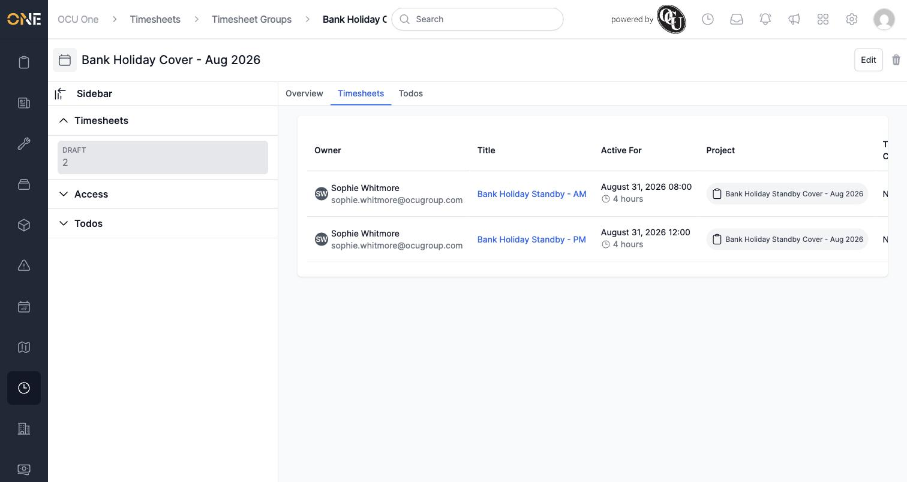

- **Todos** — any to-dos attached to this group (empty until you add one).

## Managing timesheet groups from the list

Open **Timesheet Groups** to see every group. If you selected multiple people when creating a group, you'll see one row per person here, all sharing the same title:

### Changing a group's status

Click the status badge on a group's row (it starts as **Draft**) to open a dropdown of every available status:

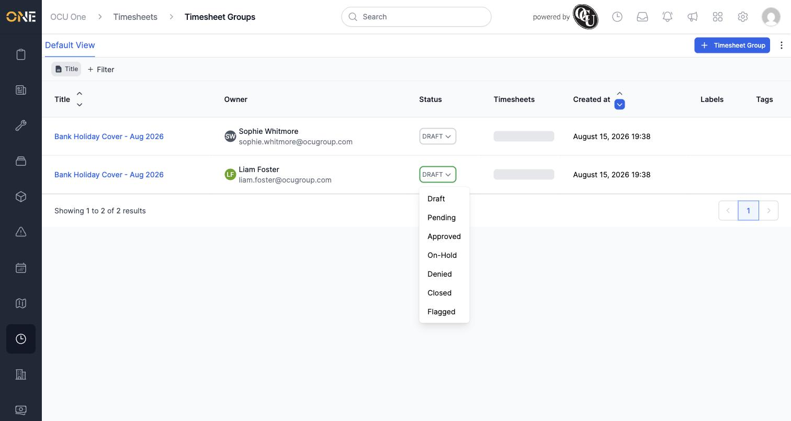

Pick a new status and it updates immediately, without leaving the list:

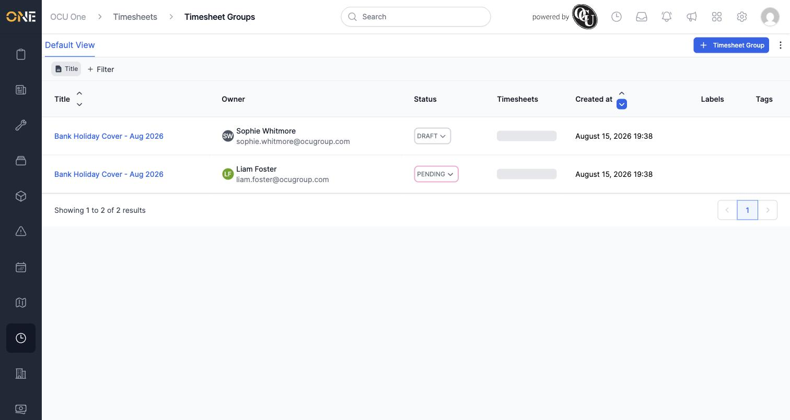

You can also change the status from the group's own **Overview** tab, in the same way.

### Editing a group

Open a group and click **Edit** in the top right. You'll see the same form used to create it — title, description, and the list of shifts — but **not** the "Who is this timesheet for?" field, since a group's owner can't be changed once it's been created.

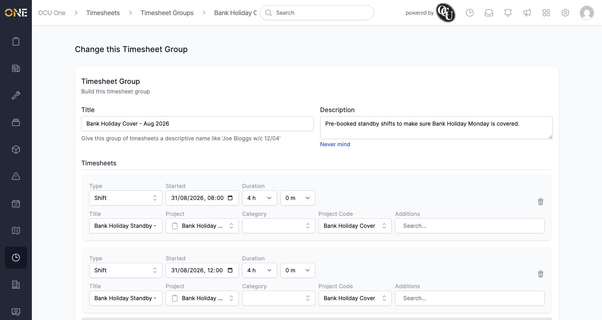

From here you can:
- Change the title or description.
- Add another shift with **Add Timesheet**.
- Remove a shift with the bin icon next to it.

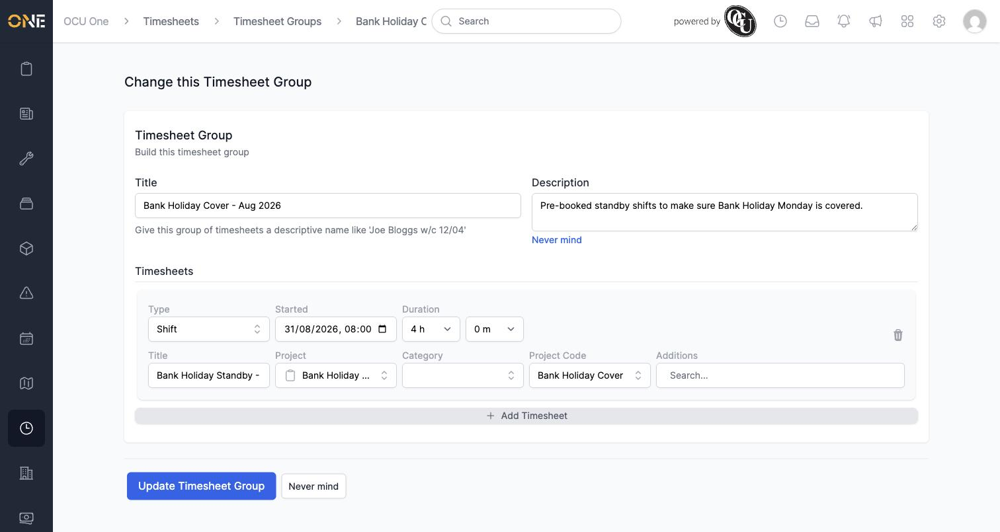

Click **Update Timesheet Group** to save your changes. A confirmation message appears and the group's shift count updates to match:

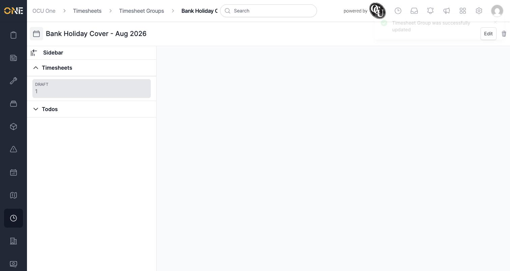

### Deleting a group

Open the group and click the bin icon in the top right (next to **Edit**). A confirmation box appears — click **Yes** to permanently delete the group and everything in it, or **Cancel** to back out.

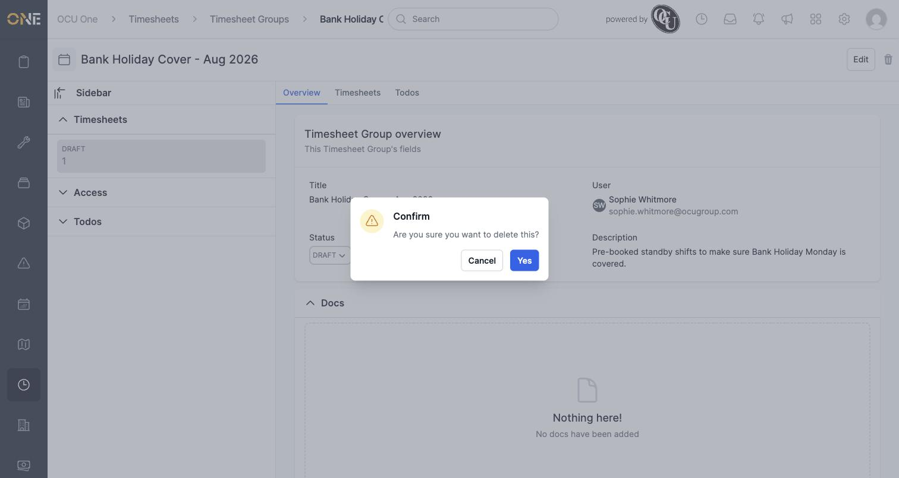

Once confirmed, the group disappears from the list:

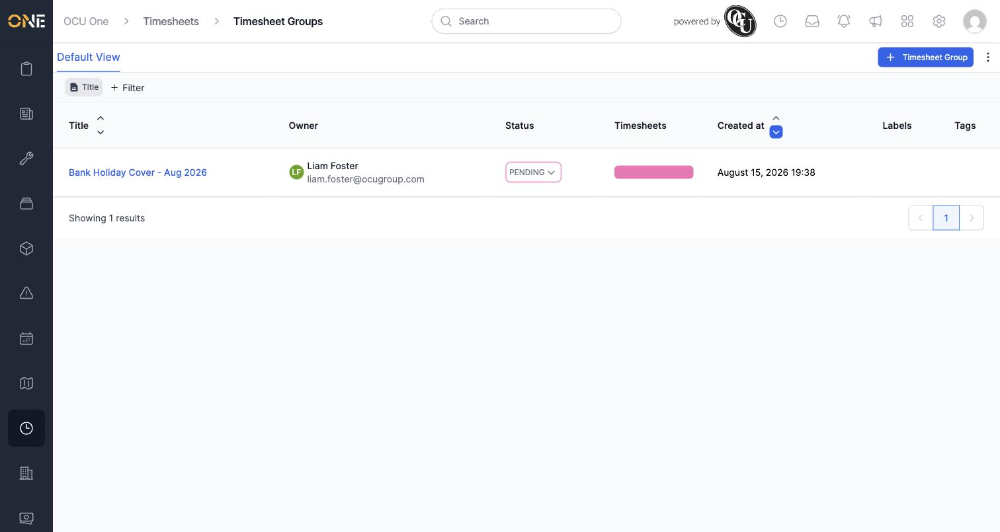

Deleting a group is permanent and removes every shift inside it — if you only want to remove one shift, edit the group instead and remove that shift on its own (see **Editing a group** above).
