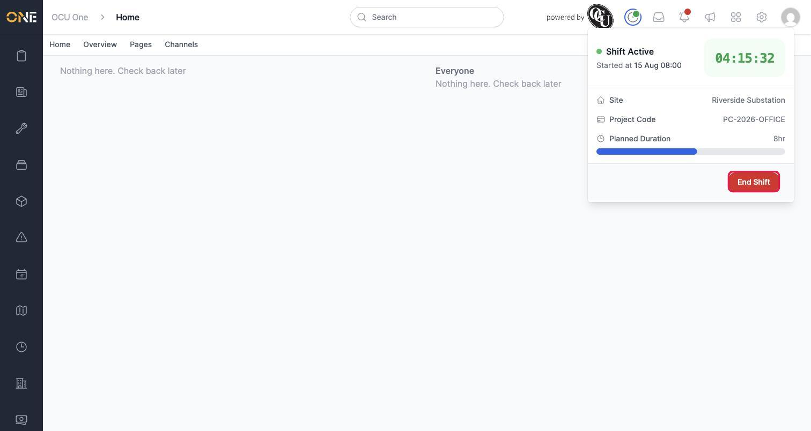
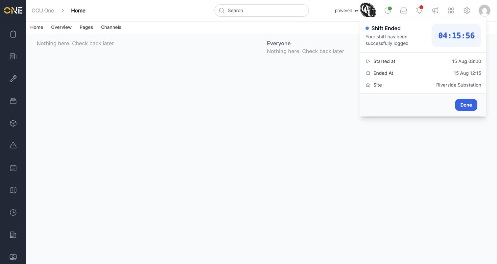
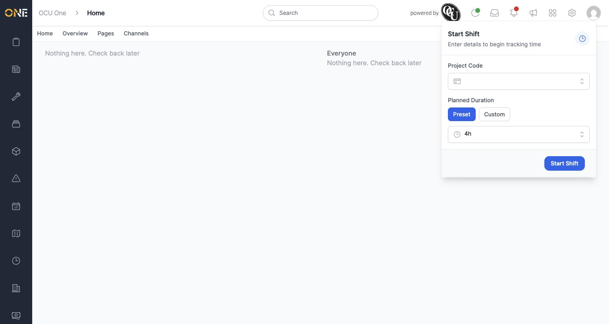

# Ending a shift and confirming hours worked

Once you've started a shift (see the separate guide on clocking in and starting a shift), the same clock icon in the top toolbar is where you go to end it and log your hours.

## Ending your shift

1. Click the clock icon in the top toolbar. Since you have a shift running, this opens the **Shift Active** panel rather than the Start Shift form — showing your live timer, Site, Project Code, and Planned Duration progress bar.

   

2. Click **End Shift** to finish tracking time.

## Confirming your hours

As soon as you end your shift, the panel switches to a confirmation screen:

This shows:
- **Your shift has been successfully logged**, with the total time worked shown large at the top
- **Started at** — when you clocked in
- **Ended At** — when you just clicked End Shift
- **Site** — the site your shift was logged against, if one was set

There's nothing to edit here — it's a summary confirming what was recorded. If a time or detail needs correcting afterwards, that's done from the timesheet itself (see the guide on viewing and editing an individual timesheet), not from this panel.

3. Click **Done** once you've checked the summary. This closes the confirmation and returns you to the Start Shift form, ready for whenever you next clock in.

   

## Good to know

- Ending your shift submits it for approval — it moves out of the "in progress" state and into your team's normal timesheet review process, so don't expect to see the same entry as still "active" afterwards.
- You can only end a shift that's currently running under your own account. If you don't see the End Shift option, check that a shift is actually active — the toolbar clock icon shows a small green dot whenever one is.
