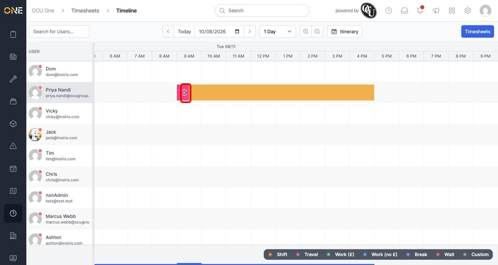
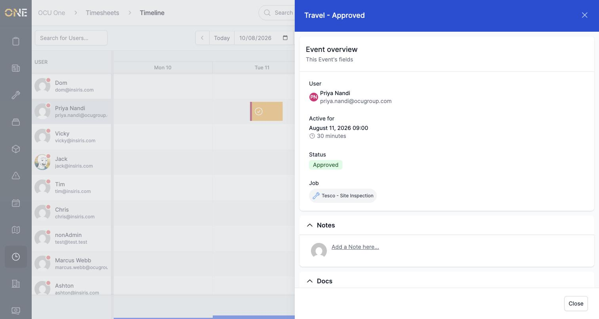
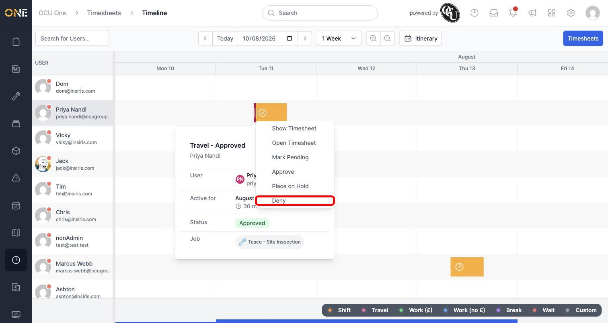
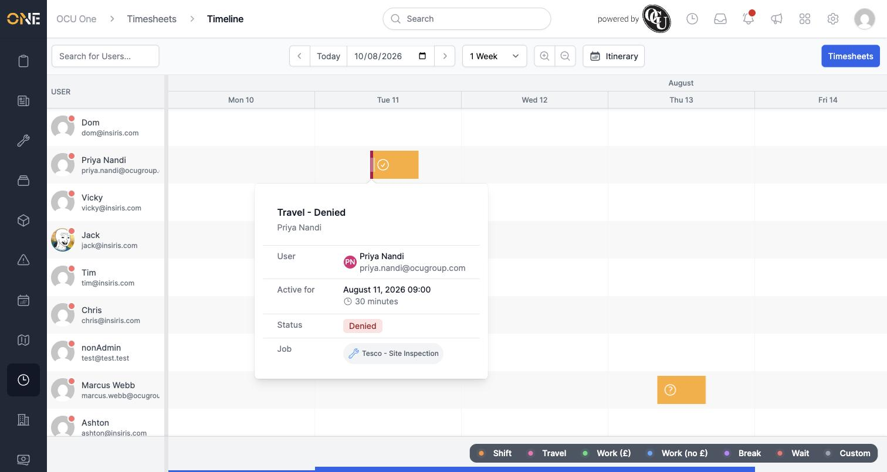

# Inspecting and updating a shift event from the timeline

A shift can contain smaller events nested inside it — travel time, a break, or waiting time — each logged separately from the main shift. The timeline lets you look at one of these events on its own and change its approval status, without leaving the schedule view.

## Finding a nested event

Widen the timeline to a single day to see nested events more clearly. Here, Priya Nandi's shift includes a short **Travel** event at its start, shown as a narrower strip in a different colour:

## Inspecting the event

Click directly on the nested strip (rather than the shift around it) to see that event's own details:

This shows who it belongs to, when it runs, its current status, and — if it's linked to a job — which one. Here, the Travel event is linked to **Tesco - Site Inspection**.

## Updating its status

Right-click (or click and hold) the event to bring up its actions:

Choosing an option — here, **Deny** — updates the event immediately, and its icon changes to match:

## Good to know

- This context menu updates the status of just the event you clicked — not the whole shift it belongs to. Approving or denying the parent shift is done separately, either from the timeline or from the weekly review grid.
- The same click-and-inspect approach works for any event type shown in the legend (Travel, Break, Wait, and so on), not just the example shown here.
