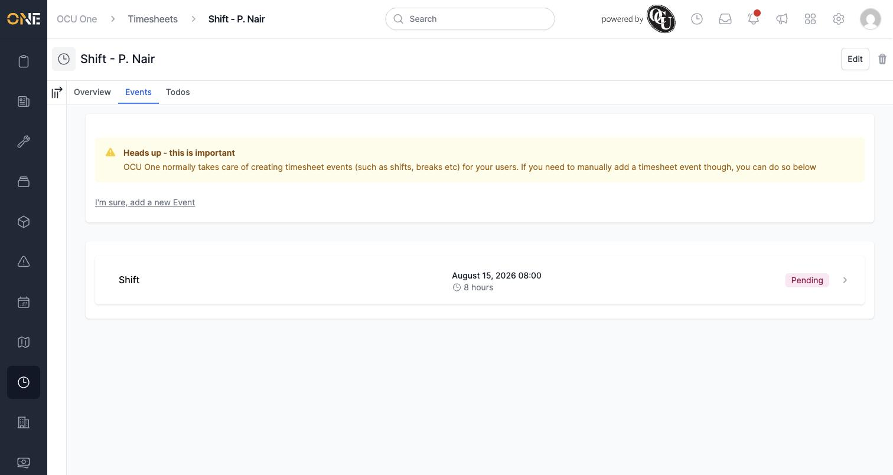
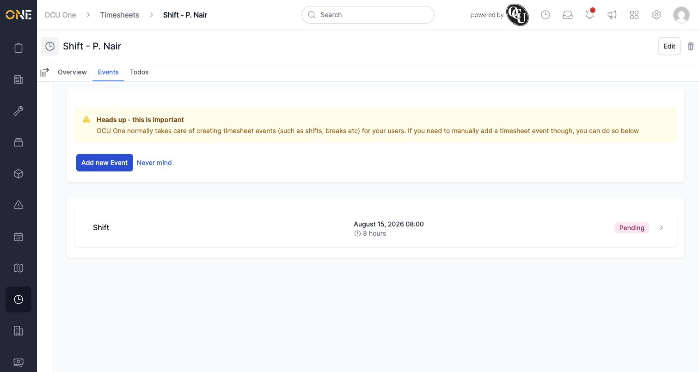
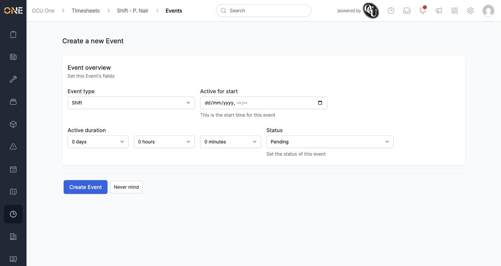
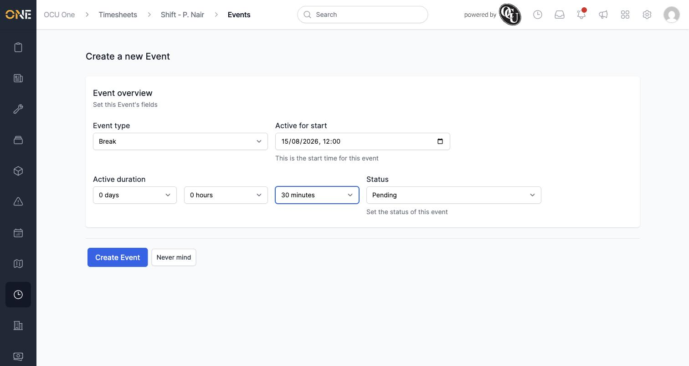
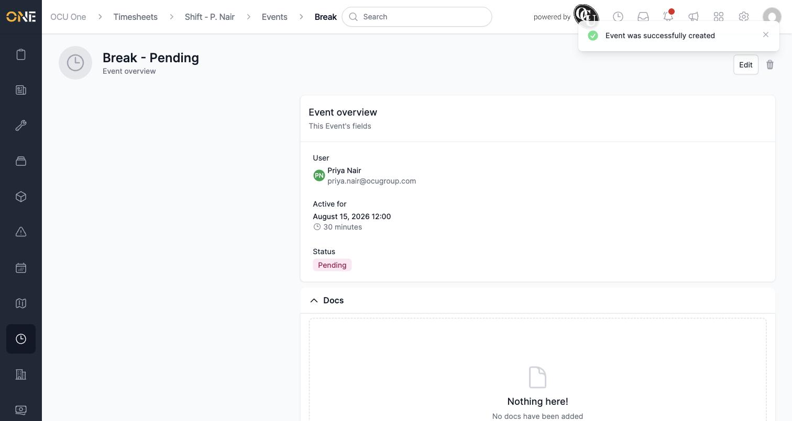
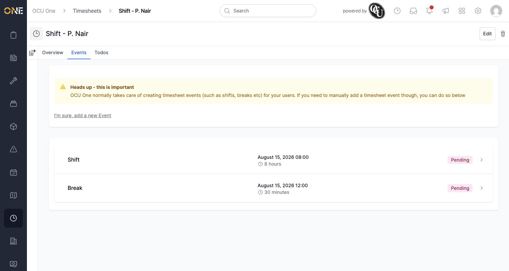
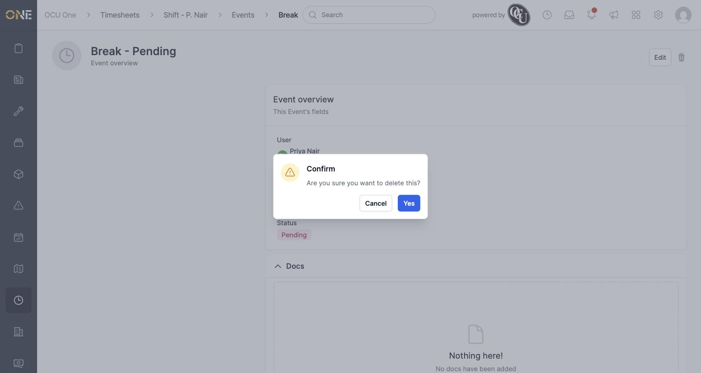

# Logging a break or other shift event

A timesheet is made up of individual "events" — the shift itself is one, and things like breaks or travel time are others. OCU One normally creates these for you automatically as you clock in and out, but this guide covers adding one yourself when you need to.

## Finding the Events tab

Open the timesheet you want to add an event to, and select its **Events** tab. You'll see any events already recorded — usually just the Shift itself to start with:

Notice the heads-up message: OCU One takes care of creating these events for you in the normal course of clocking in and out, so this is really meant for exceptions — correcting a missed break, adding travel time that wasn't captured automatically, and so on.

## Adding an event

1. Click **I'm sure, add a new Event**. This reveals a confirmation step rather than jumping straight to the form, since manually adding events isn't something you'd normally need to do:

   

2. Click **Add new Event** to open the form:

   

3. Fill in the details:
   - **Event type** — choose what kind of event this is (Break, Travel, Wait, and so on)
   - **Active for start** — the date and time the event began
   - **Active duration** — how long it lasted, in days/hours/minutes
   - **Status** — defaults to Pending

   Here's a 30-minute lunch break logged at 12:00:

   

4. Click **Create Event**. You'll land on the new event's own page, showing who it belongs to, when it happened, and its status:

   

Back on the Events tab, your new event now sits alongside the shift:

## Editing or deleting an event

From an event's own page you'll also find **Edit** and delete options — the same pattern used throughout the app. Deleting asks you to confirm first:

Whether you see these options at all depends on your permissions — many users can add an event but can't edit or delete one afterwards, since corrections are typically left to a manager during review rather than the person who logged it.
