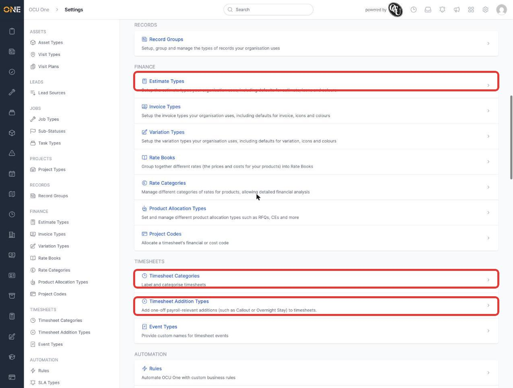
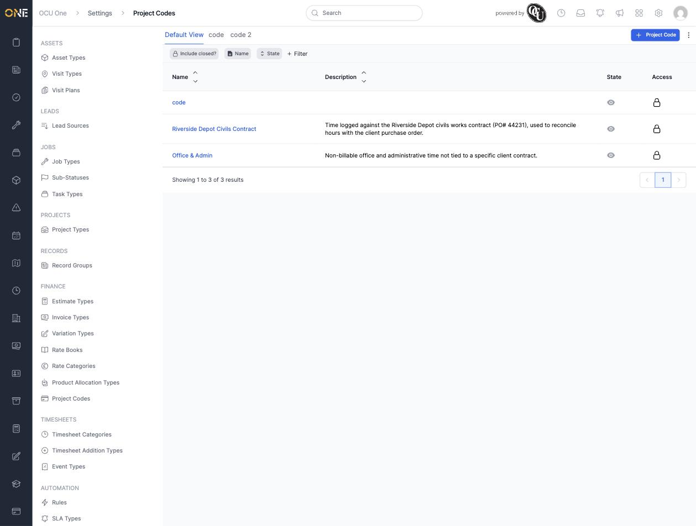
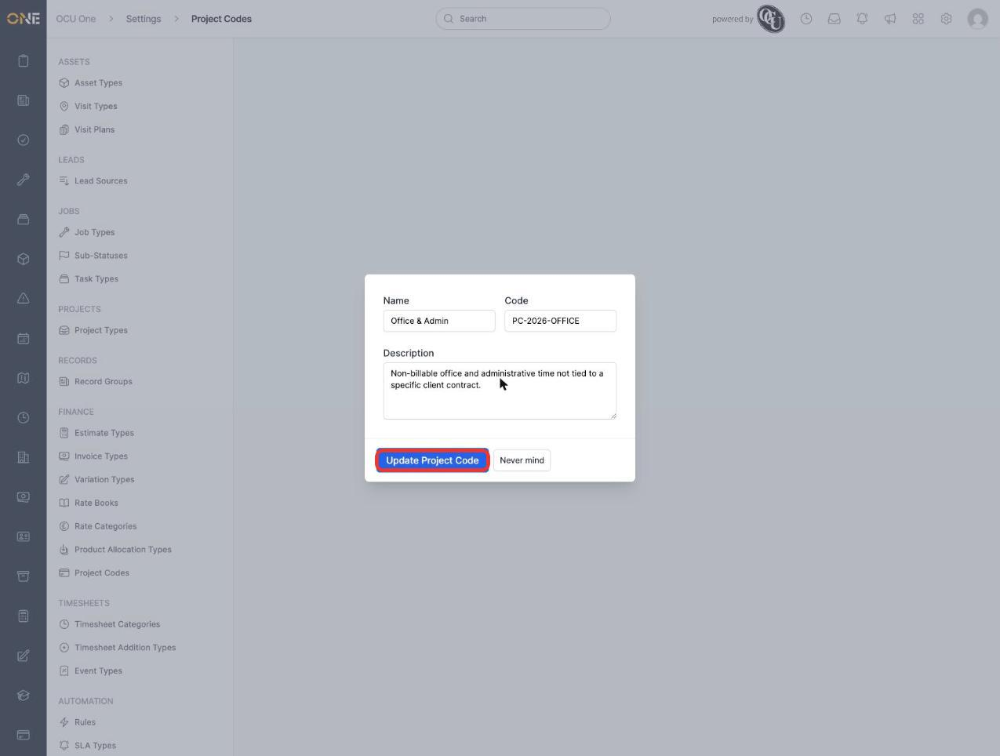
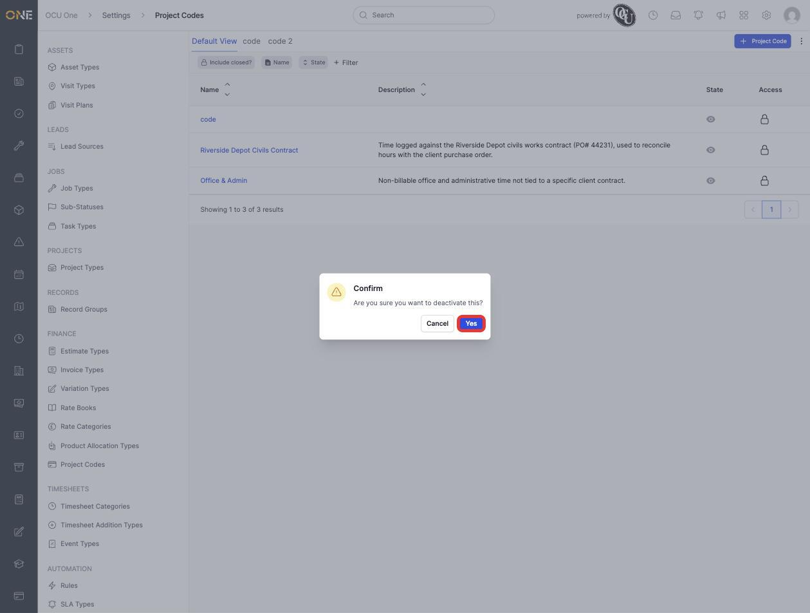
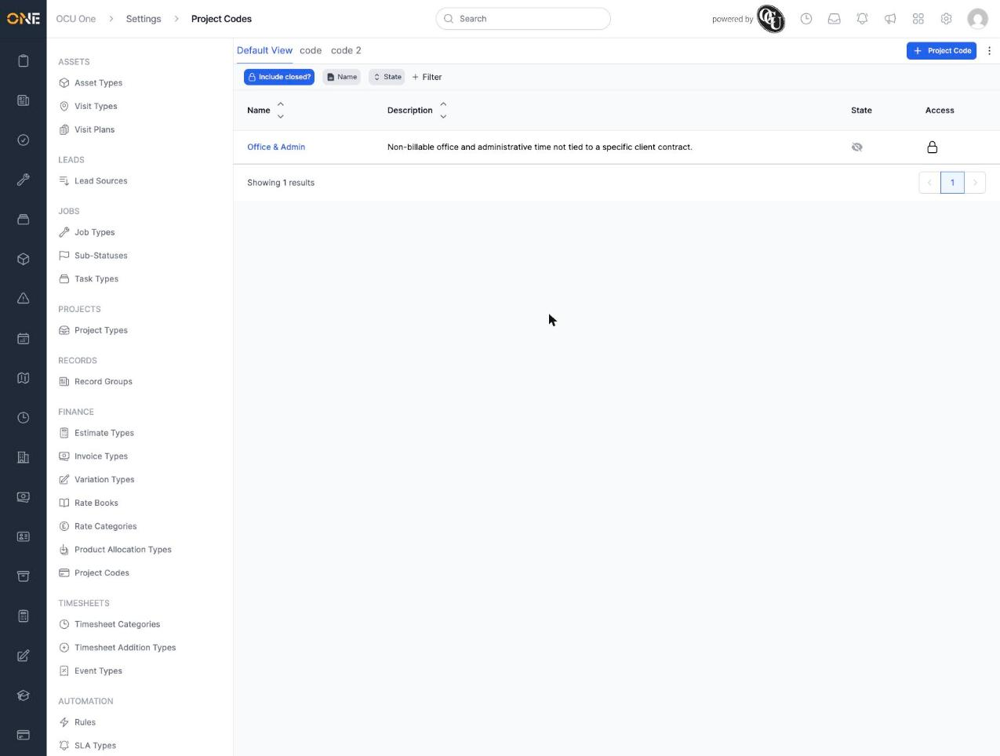
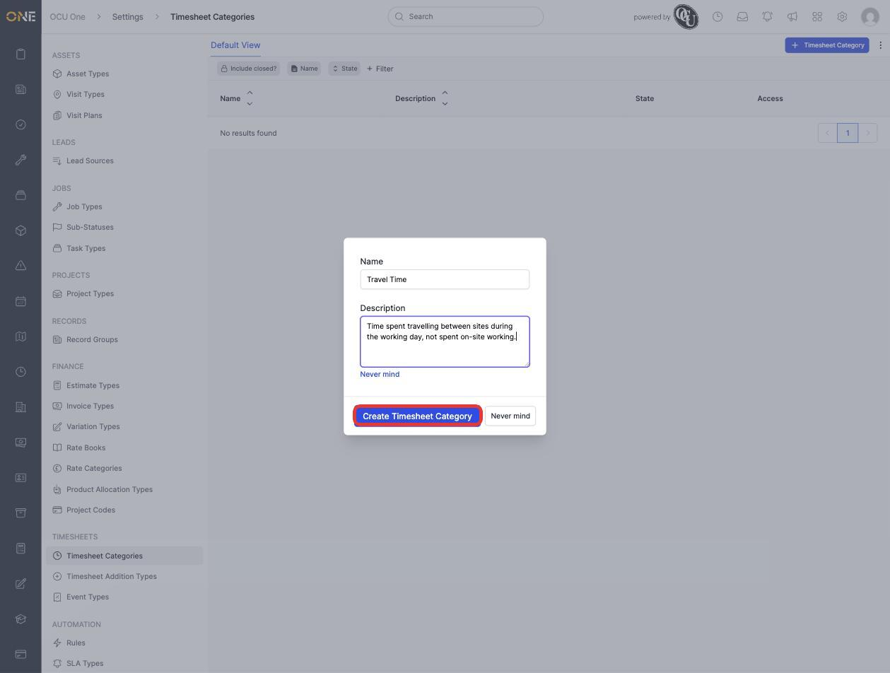
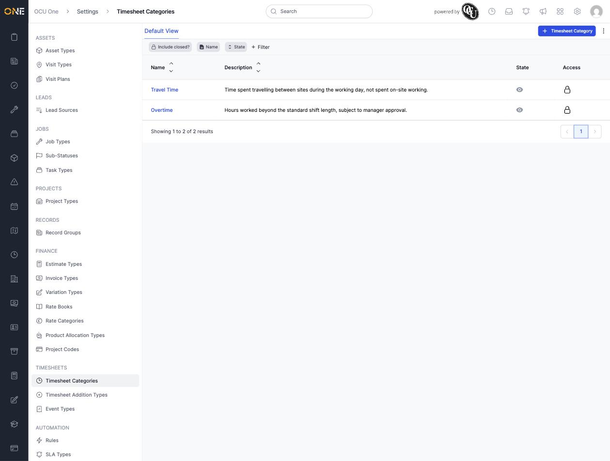
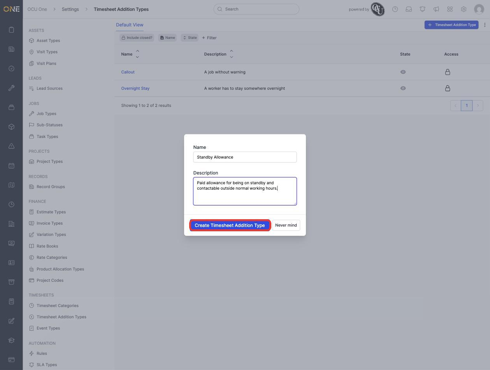
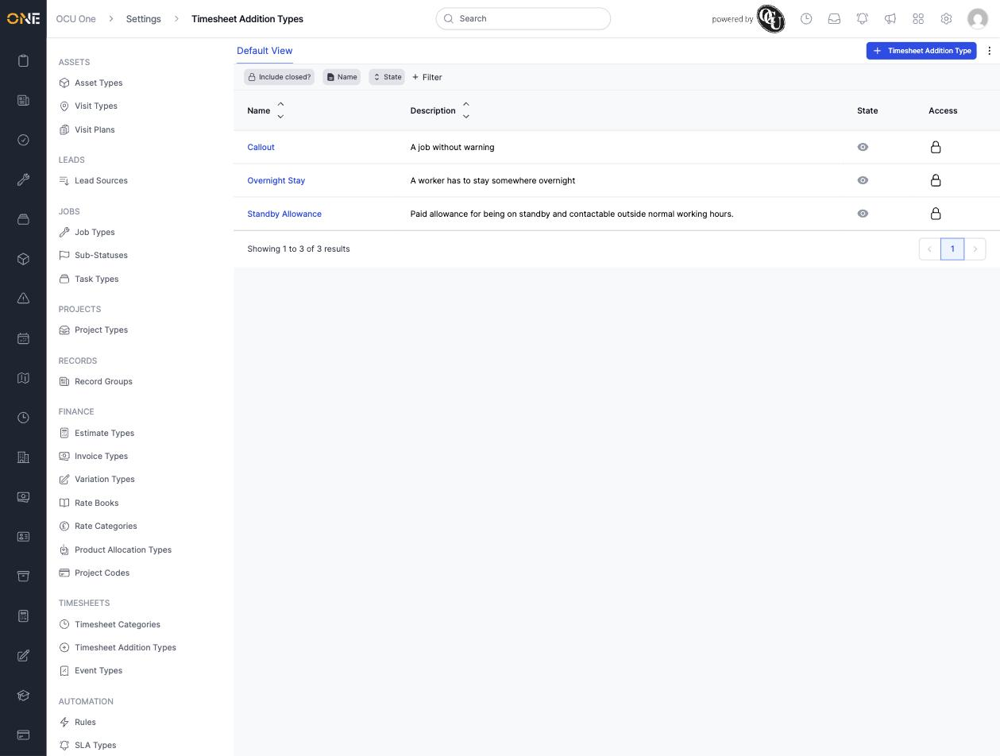

# Managing project codes, timesheet categories, and timesheet addition types

These three lists live together in **Settings**, under the **Finance** and **Timesheets** sections, and are all reference data used when someone logs time on a timesheet:

- **Project Codes** ("Allocate a timesheet's financial or cost code") — under **Finance**
- **Timesheet Categories** ("Label and categorise timesheets") — under **Timesheets**
- **Timesheet Addition Types** ("Add one-off payroll-relevant additions (such as Callout or Overnight Stay) to timesheets") — under **Timesheets**

They work the same way as most other Settings reference-data lists: you can create, edit, deactivate/reactivate, or permanently delete an entry, and each one shows up wherever that kind of data is picked elsewhere in the app (for example, when starting a shift or reviewing a timesheet).

## Project Codes

A project code is a financial or cost code you can attach to a timesheet — useful for time that isn't logged against a specific project, like office time or a general contract code.

Open **Project Codes** under **Settings > Finance**. Each row shows the code's name, description, and whether it's active:

Note that the list doesn't show the actual **code** value as a column — only the name and description. To see or check a project code's code, open it for editing.

### Creating a project code

Click **+ Project Code**, fill in a **Name**, **Code**, and optional **Description**, then click **Create Project Code**:

### Editing a project code

Click a project code's name in the list to open it for editing. Update any of the fields and click **Update Project Code** to save:

### Deactivating and reactivating a project code

Click the eye icon in the **State** column to deactivate a project code. You'll be asked to confirm:

A deactivated project code drops off the default list and off the picker used elsewhere in the app. To find it again, add a **State** filter and search for **Inactive** — the default list only shows active codes, and the **Include closed?** toggle at the top doesn't reveal deactivated codes (it's for a different, more permanent "closed" status, not "inactive"):

To reactivate it, click the same icon (now showing a crossed-out eye) and confirm.

## Timesheet Categories

Timesheet categories label and categorise timesheets — for example, "Travel Time" or "Overtime" — so they can be grouped and reported on.

Open **Timesheet Categories** under **Settings > Timesheets**, and click **+ Timesheet Category**. Fill in a **Name**; the **Description** field is hidden behind an **Add Description** link — click it to reveal the text box before typing:

Once created, the category appears in the list alongside any others:

Editing, deactivating, and reactivating a timesheet category works exactly the same way as for project codes above: click the name to edit, or click the **State** column icon to deactivate/reactivate (with the same confirmation step).

## Timesheet Addition Types

Timesheet addition types are one-off, payroll-relevant additions that can be added to a timesheet — for example **Callout** or **Overnight Stay**.

Open **Timesheet Addition Types** under **Settings > Timesheets**. Click **+ Timesheet Addition Type**, fill in a **Name** and **Description** (both fields are shown directly here — no expander like Timesheet Categories), and click **Create Timesheet Addition Type**:

The new addition type appears in the list alongside the existing ones:

As with the other two lists, editing and deactivating/reactivating an addition type works the same way — click the name to edit, or use the **State** column icon to toggle it active/inactive.

## Other things worth knowing

- All three lists support the same filtering tools as other Settings lists: filter by **Name** (or **Description**, for Project Codes and Timesheet Addition Types), by **State**, by **Labels**, or by **Tags** using **+ Filter**.
- Deleting an entry entirely (rather than deactivating it) isn't available from these list screens — deactivating is the supported way to retire a code, category, or addition type you no longer want offered when logging time, while keeping any historical timesheets that already reference it intact.
