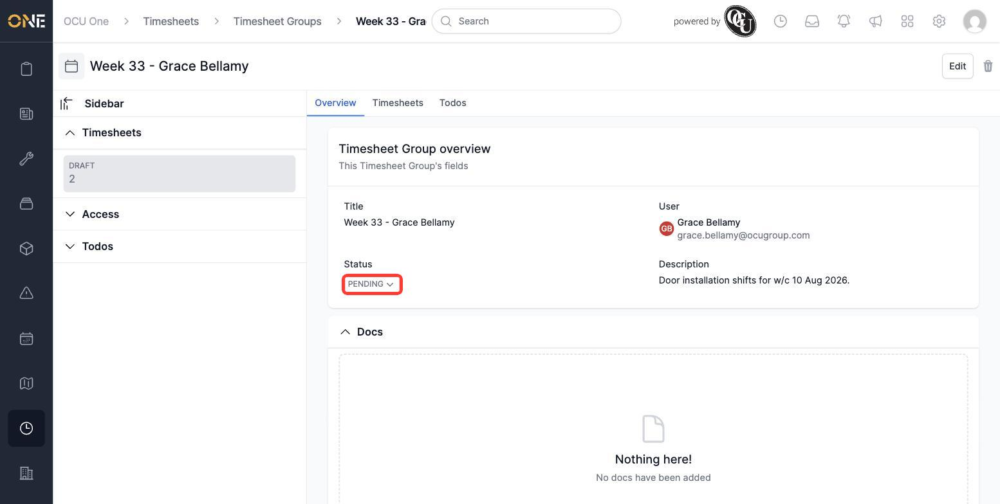
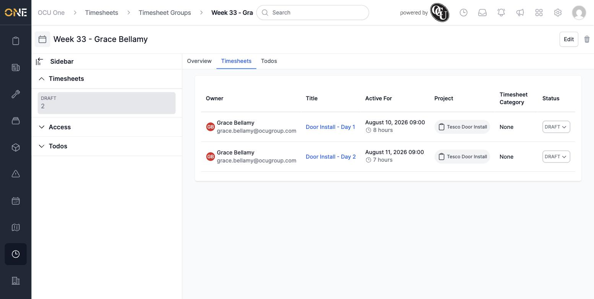
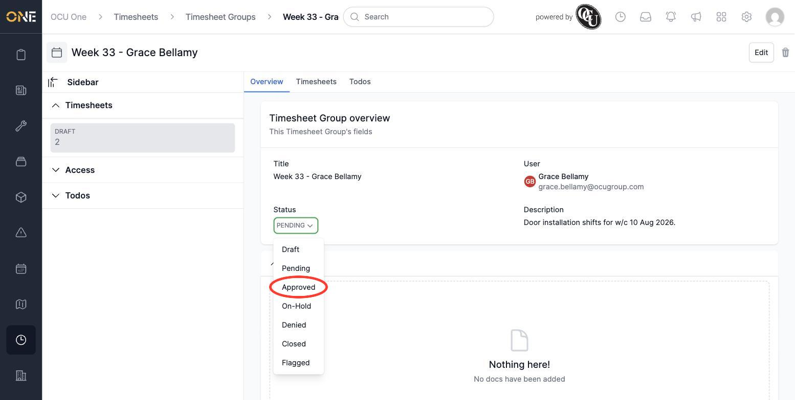
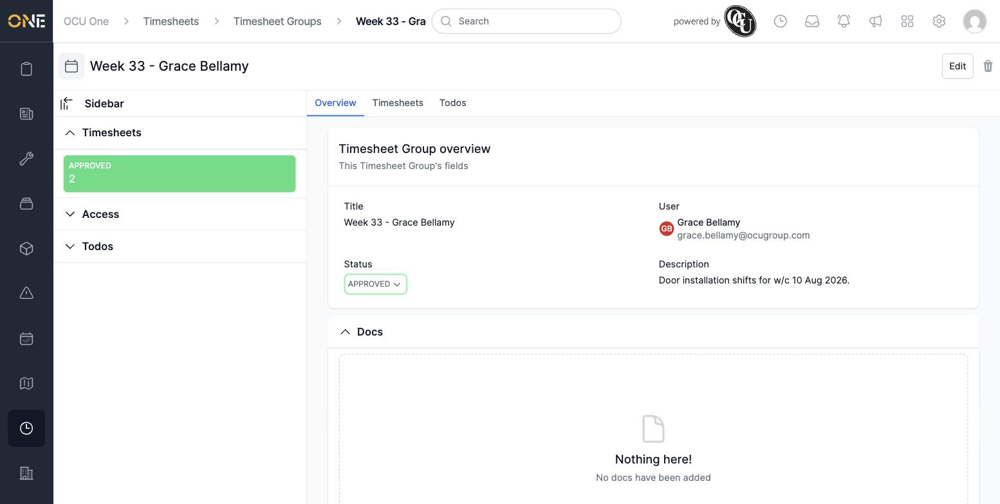

# Reviewing a timesheet group and approving or denying its timesheets

Once someone's shifts have been added to a Timesheet Group — whether they entered them themselves or a manager pre-booked them — that group needs to be reviewed and moved to **Approved** (or **Denied**, if something's wrong) before it counts as finalised. This guide covers opening a timesheet group to review what's in it, and changing its status.

## Opening a timesheet group to review it

Open the group from the **Timesheet Groups** list (see the separate guide on browsing and filtering timesheet groups for how to find the one you're after). You'll land on its **Overview** tab, which shows the group's title, who it belongs to, its current status, and its description:

Before deciding what to do with it, check the **Timesheets** tab to see exactly what's in the group — every shift, its date, and how long it lasted:

## Approving or denying the group

1. Back on the **Overview** tab, click the **Status** dropdown (it shows the group's current status, e.g. **Pending**).

2. A list of every status you can move the group to opens up:

   

   - Choose **Approved** if the shifts are correct and you're happy to sign off on them.
   - Choose **Denied** instead if something's wrong and the person needs to fix and resubmit it.
   - The other options (**On-Hold**, **Closed**, **Flagged**) are also available here if you need them — On-Hold to pause a decision, Closed once everything's fully wrapped up, or Flagged to mark something as needing attention.

3. Click your chosen status. It's applied immediately — there's no separate "save" step.

   

**Something worth knowing:** changing the group's status also updates every shift inside it that's still in a Draft or Pending state, moving them to match. You don't need to open each shift individually and change its status one by one — approving or denying the group takes care of all of them together.

You can change the status again later the same way if you need to — for example moving a group from Denied back to Pending once the person has corrected it and it's ready for another look.
