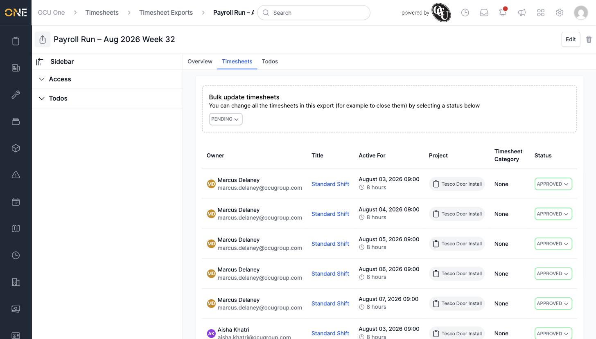
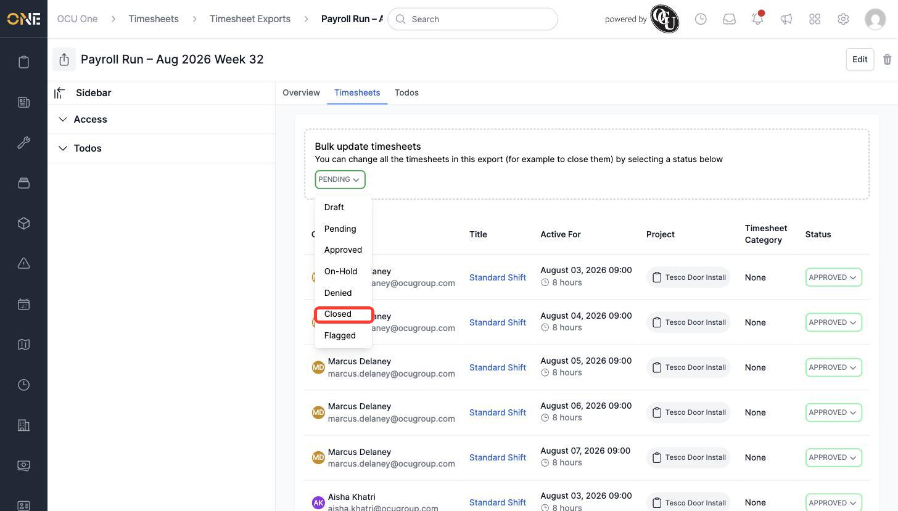
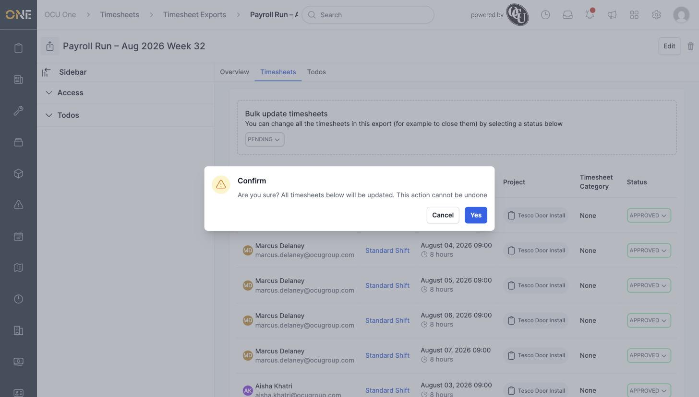
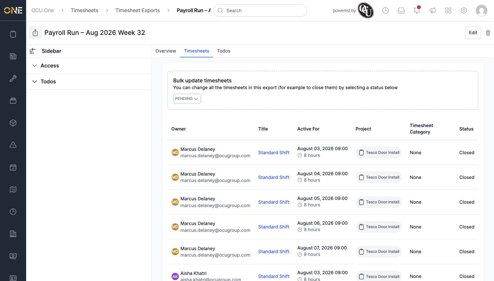

# Reviewing an export and bulk-updating its timesheet statuses

Once a Timesheet Export has been created and handed off, you'll often want to update every timesheet inside it at once — for example, marking them all as **Closed** once payroll has processed them — rather than updating each one individually.

## Reviewing what's in an export

Open the export from the **Timesheet Exports** list, then go to its **Timesheets** tab. This lists every timesheet included in the export, along with a **Bulk update timesheets** panel at the top:

## Bulk-updating the status

1. In the **Bulk update timesheets** panel, click the status dropdown (it shows the most common current status, e.g. **Pending**).

2. Choose the status you want to move every timesheet in this export to — for example **Closed**, once payroll has processed them:

   

3. A confirmation box appears, warning that this can't be undone:

   

   Click **Yes** to go ahead, or **Cancel** to back out.

4. Every timesheet in the export updates to the new status straight away:

   

**Something worth knowing:** this bulk action updates *every* timesheet in the export in one go — there's no way to select a subset from this screen. If you only want to change the status of one or two timesheets, open them individually instead. And because the confirmation box means what it says — the change genuinely can't be undone from here — double-check you've picked the right status before clicking **Yes**.
