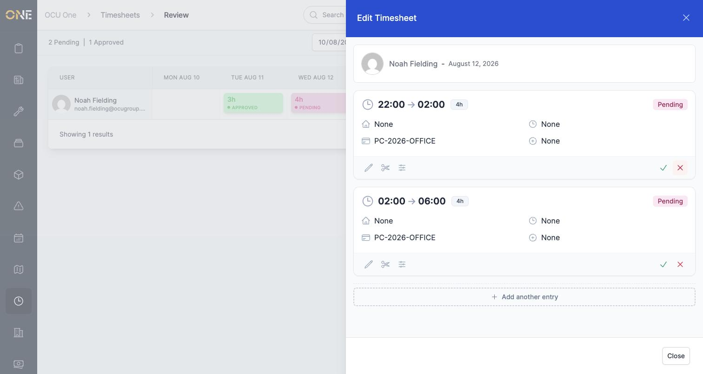
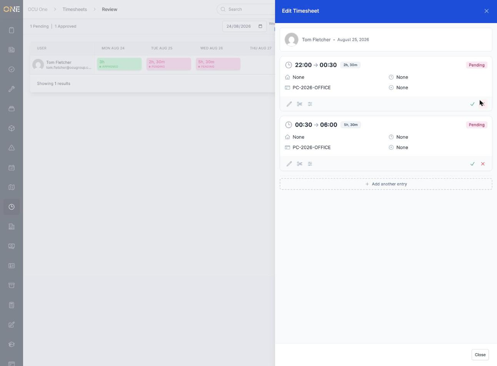
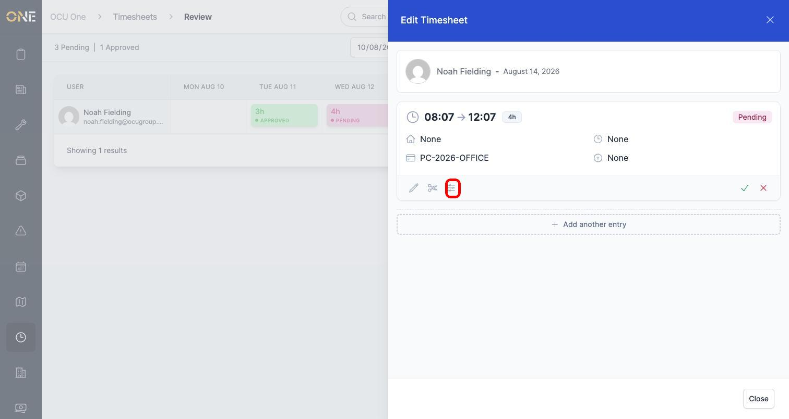
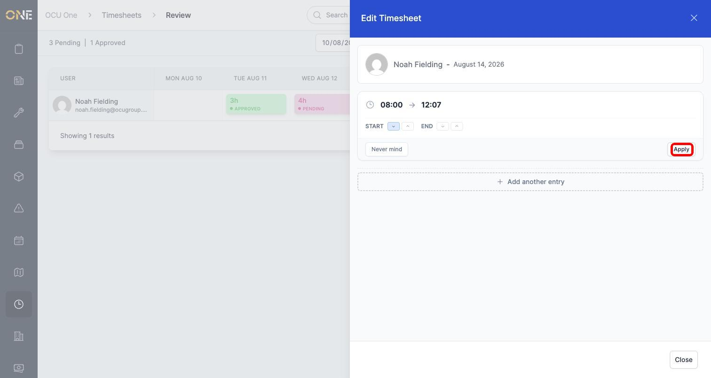

# Rounding or splitting a timesheet entry during review

Sometimes an entry is nearly right, but not quite — a shift crossed midnight and really belongs to two different days, or a clock-in time is a few minutes off a clean hour. Rather than retyping the whole entry, the review grid lets you round or split it directly.

Open any entry from the review grid to see these options: click it to bring up its card, which shows a row of icons underneath its details — edit (pencil), split (scissors), and round (sliders):

## Splitting an entry

Splitting is for a shift that should really be recorded as two separate entries — for example, an overnight shift that crosses midnight, or a shift where someone switched project or task partway through. Click the **scissors** icon:

The form suggests a split time roughly halfway through the shift — here, 02:00 for a shift running 22:00 to 06:00. Adjust it if needed, then confirm. The single entry becomes two, each with its own hours:

Both halves keep the same category, project code and other details as the original — you can edit either one afterwards if they need to differ.

You can also type in your own split time instead of using the suggested one — including a time just after midnight, like 00:30 for an overnight shift. It's handled correctly and splits the entry exactly where you asked:

## Rounding an entry

Rounding is for cleaning up a start or end time that's a few minutes off a round hour — for example, someone clocked in at 08:07 instead of 08:00. Click the **sliders** icon:

This opens the rounding form, with separate controls for the start and end times:

For each, the down arrow rounds to the start of the current hour and the up arrow rounds to the start of the next hour. Clicking an arrow previews the new time at the top before you commit to anything. Here, rounding the start **down** takes 08:07 to 08:00:

Click **Apply** to confirm. The entry updates immediately — the start time and duration both reflect the change, while the end time and everything else stays the same:

## Good to know

- Rounding only ever moves a time to the start of its current or next hour — it doesn't round to the nearest 15 or 30 minutes.
- You can round the start, the end, or both at once — each has its own independent up/down control, and nothing is applied until you click **Apply**.
- Both actions can be undone afterwards using **edit** — a split can be reversed by deleting one half and extending the other; a round can be corrected the same way you'd fix any other time.
