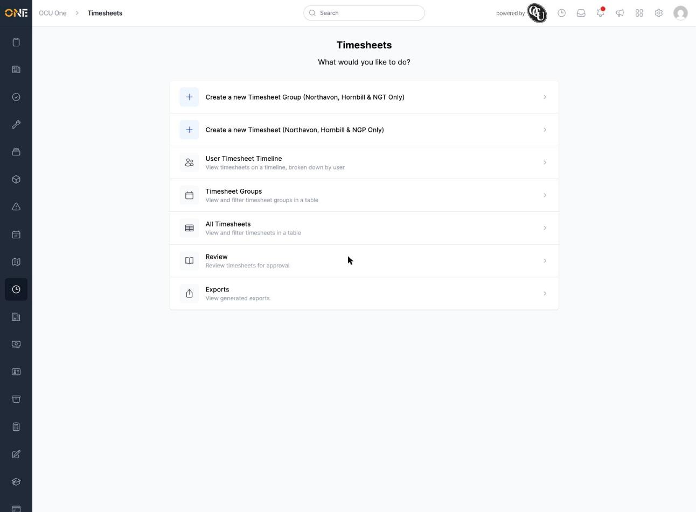

# Using the Timesheets landing page

The Timesheets landing page is the entry point for everything to do with timesheets — clocking in, reviewing your team's hours, and running payroll exports. Click the clock icon in the left-hand sidebar to get there.

## What's on this page

The page asks **"What would you like to do?"** and lists the timesheet actions and views you have access to:

- **Create a new Timesheet Group** — set up a group of timesheets to be reviewed and approved together.
- **Create a new Timesheet** — start a new timesheet entry directly.
- **User Timesheet Timeline** — view timesheets on a timeline, broken down by user.
- **Timesheet Groups** — view and filter timesheet groups in a table.
- **All Timesheets** — view and filter every timesheet in a table.
- **Review** — review your team's pending timesheets for approval.
- **Exports** — view timesheet exports already generated for payroll.

Click any option to go straight to that section. Which options appear depends on your permissions — for example, **Review** only shows up if you're set up to approve timesheets for a team, and **Exports** only if you have access to payroll exports.
