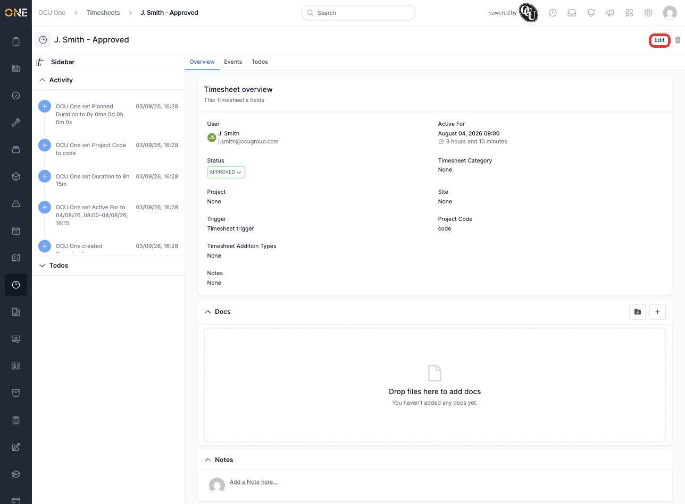
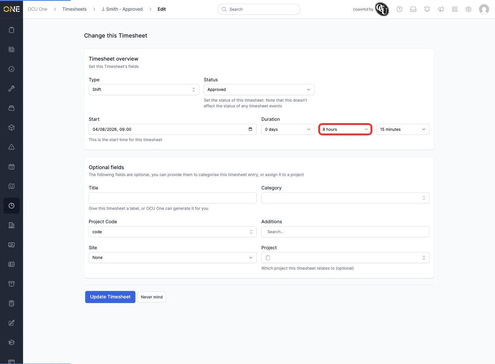
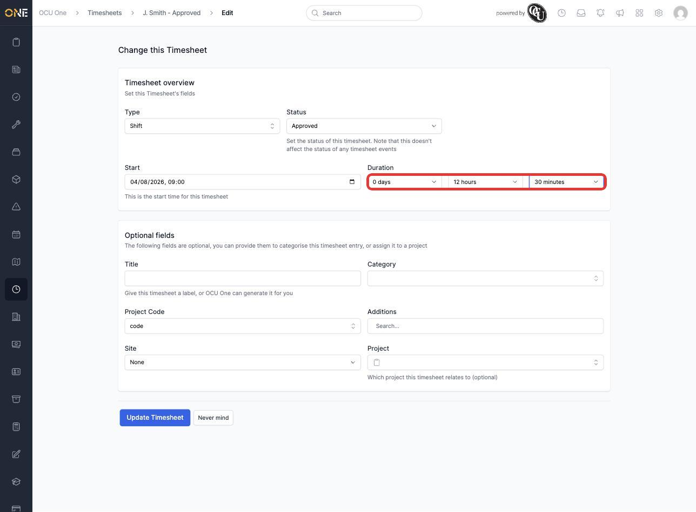
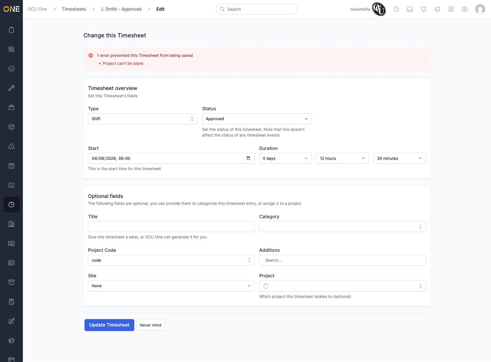
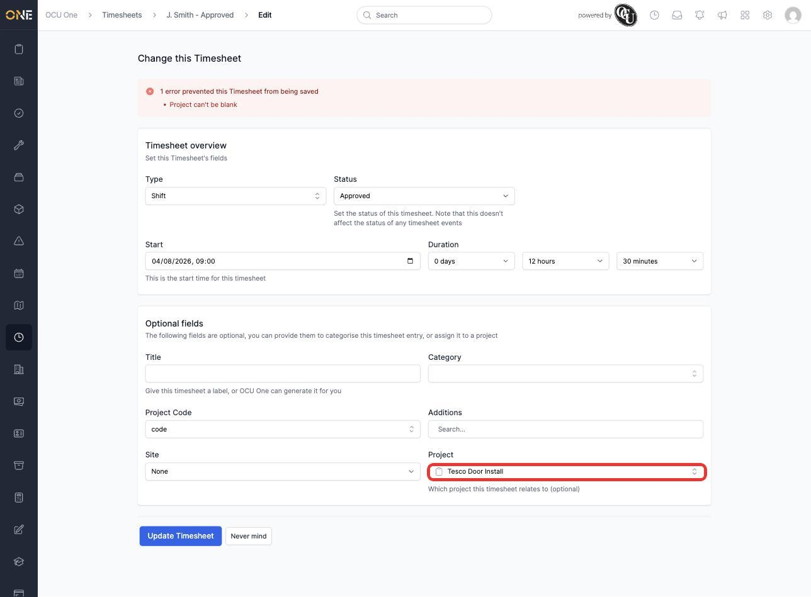
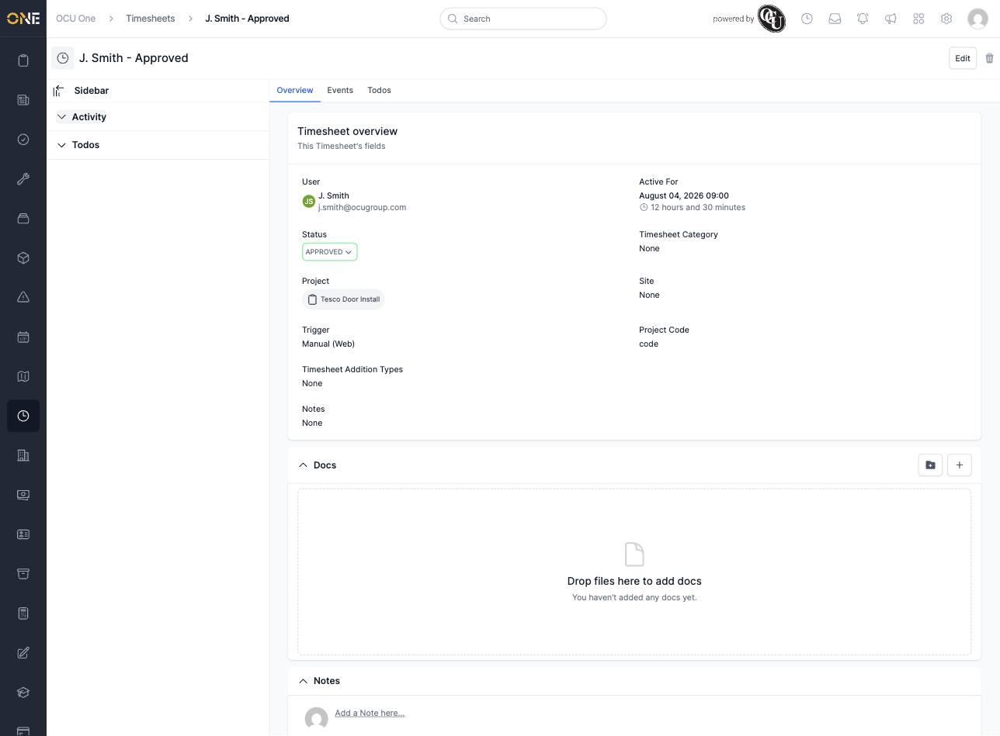

# Viewing and editing an individual timesheet

Every shift, break, or other logged period of work in OCU One is recorded as a timesheet. This guide covers a single timesheet's detail page — what's shown there, and how to change it.

## Viewing a timesheet

Open a timesheet from a user's timesheet list, or from wherever it's linked (for example a job or the weekly review grid). The overview shows the timesheet's key details at a glance:

- **User** — who the timesheet belongs to
- **Active For** — the date and start time, plus the total duration
- **Status** — Draft, Pending, Approved, and so on
- **Project**, **Timesheet Category**, **Site**, **Project Code** — how the timesheet is categorised
- **Trigger** — how the timesheet was created (for example clocking in on mobile, or entered manually on the web)

Click **Edit** in the top right to change any of these fields.

## Editing a timesheet

The edit screen is split into the timesheet's core details and a set of optional fields.

1. **Type** and **Status** — the kind of timesheet (for example Shift) and its current approval status. Changing the status here doesn't affect the status of any timesheet events underneath it.
2. **Start** — the date and time the timesheet begins.
3. **Duration** — set using three dropdowns: days, hours, and minutes. The hours dropdown only offers whole hours up to a maximum for a single timesheet — it won't let you pick anything longer, so a very long shift needs to be split into more than one timesheet or event instead.

   

4. Under **Optional fields**, you can add a **Title**, **Category**, **Project Code**, **Additions**, **Site**, and **Project**. If you leave the Title blank, OCU One generates one for you (as seen in the "J. Smith - Approved" title used throughout this guide).

Here, the duration has been changed to 12 hours 30 minutes:

Click **Update Timesheet** to save your changes.

### If a required field is missing

Depending on how this timesheet was created, some fields that look optional may still be required before it can be saved — for example, a timesheet may need a **Project** set. If you try to save without it, OCU One shows an error at the top of the form and won't save your changes until it's filled in:

Search for and select the right project in the **Project** field to resolve it:

Once you click **Update Timesheet** again, your changes are saved and you're returned to the overview page showing the new details:

## Things to know

- The **Active For** duration's hours can't be set past the form's maximum in one go — if a shift genuinely ran longer, log it as more than one timesheet or event rather than trying to force it into a single entry.
- Whether a field like **Project** is truly optional depends on how the timesheet was set up — don't assume every "Optional fields" entry can always be left blank.
- A timesheet can also have **breaks or other events** logged against it — see the guide on logging a break or other shift event for that part of the picture.
