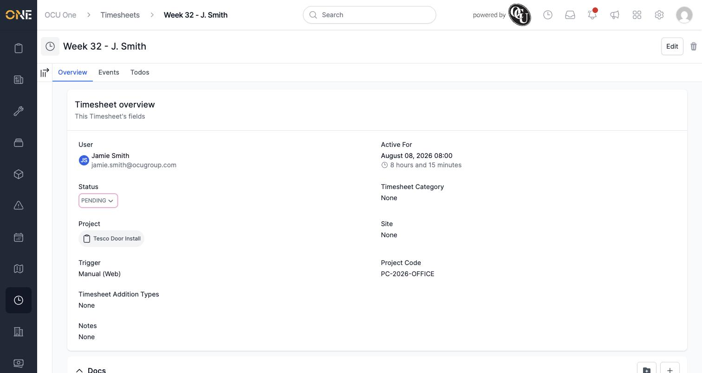
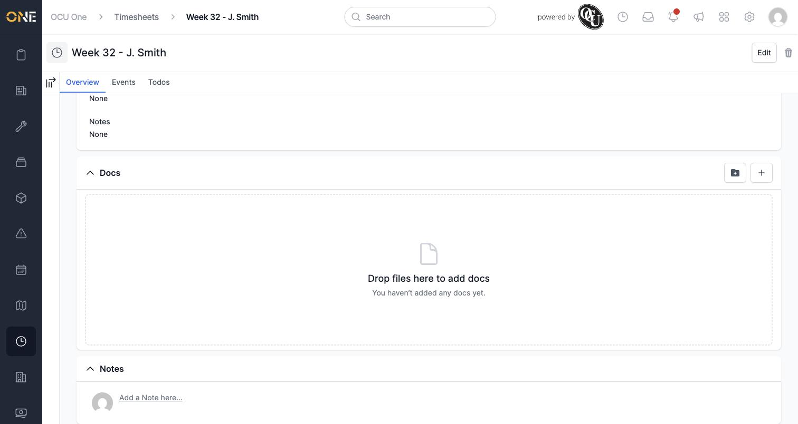
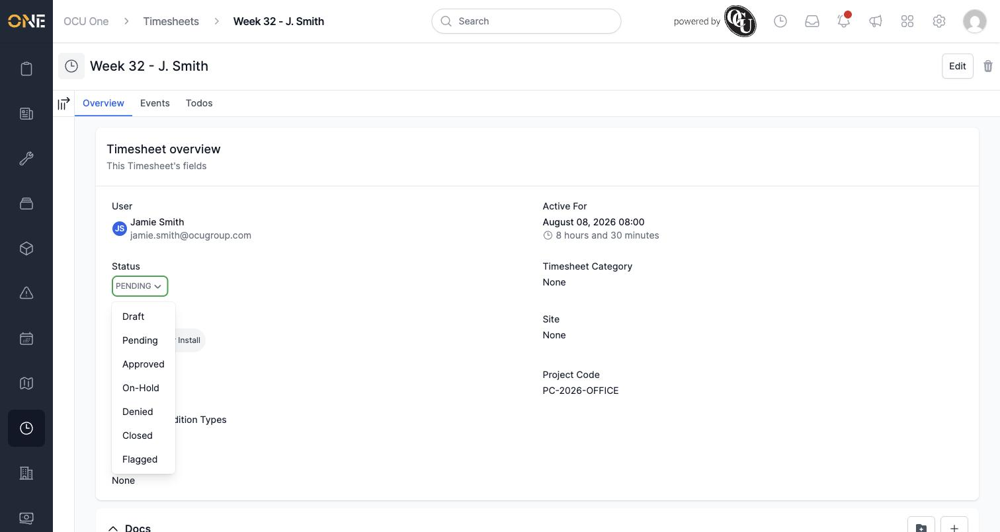
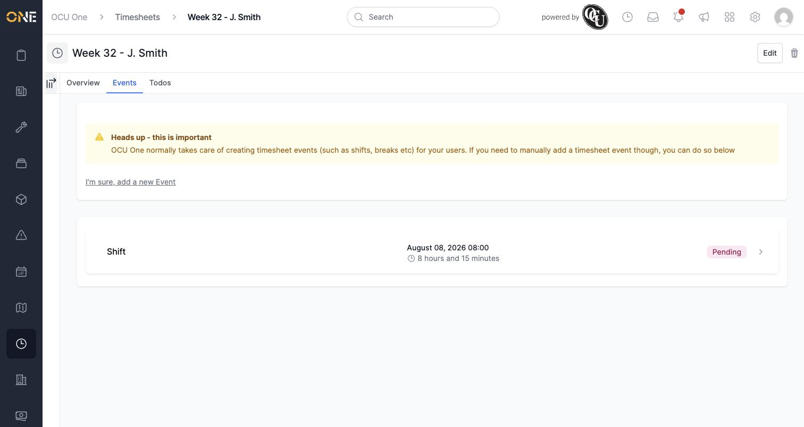
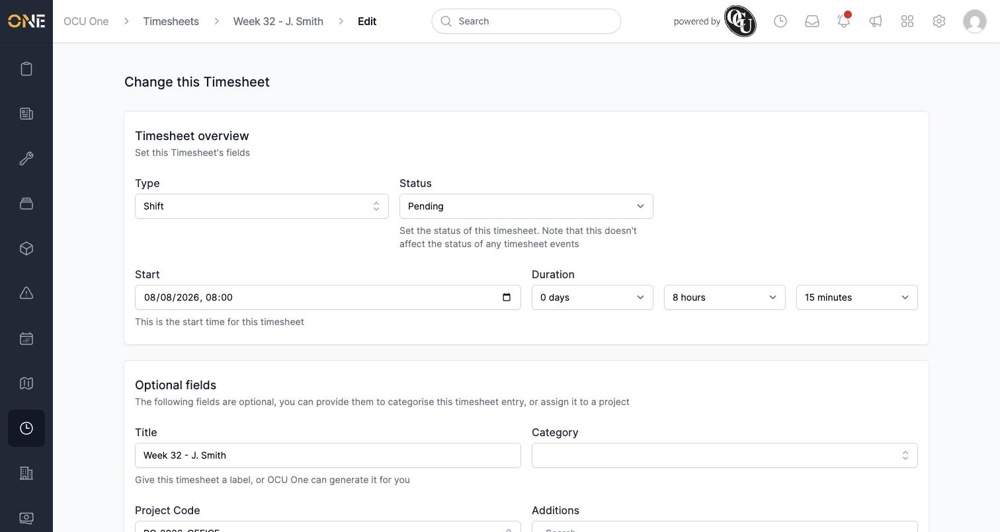
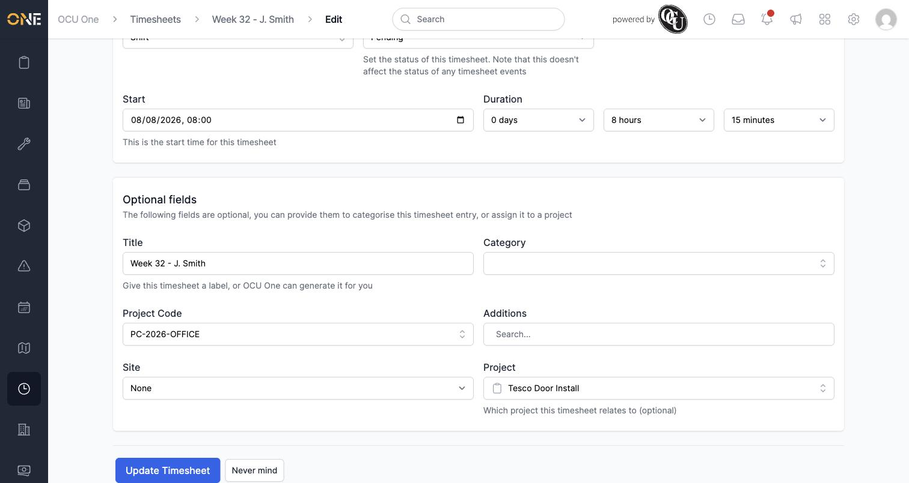
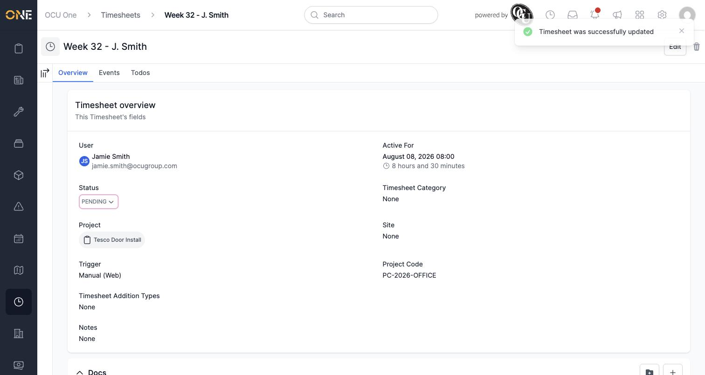
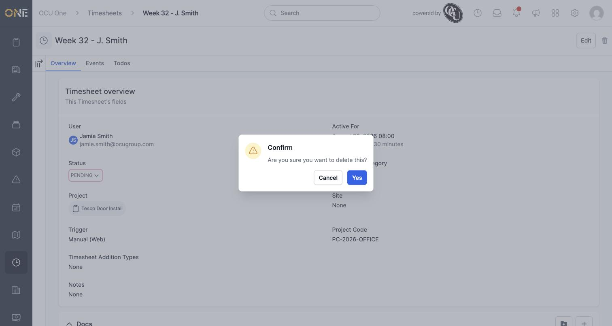

# Viewing and editing an individual timesheet

Every logged shift becomes its own timesheet record, which you can open to review the details, make corrections, or remove it entirely. This guide walks through that record's Overview and Events tabs, editing it, and deleting it.

## Opening a timesheet

Open a timesheet from a list (such as the timesheets table, or the weekly review grid) to reach its detail page. At the top you'll always see its name, an **Edit** button, and a delete (bin) icon.

## The Overview tab

The Overview tab is a read-only summary of everything recorded against the shift:

- **User** — who the timesheet belongs to
- **Active For** — the date/time it started, and the total duration recorded
- **Status** — shown as an editable dropdown if you have permission to change it directly (otherwise it's plain text)
- **Timesheet Category**, **Site**, **Project Code**, **Timesheet Addition Types** — optional classification fields, shown as "None" when not set
- **Project** — the project (if any) the time was logged against
- **Trigger** — how the shift was started (e.g. "Manual (Web)")
- **Notes** — a free-text description field, if one was added

Scrolling down, you'll also find **Docs** (attach files to the timesheet) and a **Notes** thread for comments — the same drag-and-drop docs and commenting pattern used elsewhere in the app.

A sidebar toggle (the icon next to the tabs) opens an **Activity** log of every change made to the timesheet, and a **Todos** panel for any to-dos linked to it.

### Changing the status directly

If you have permission, clicking the Status dropdown lets you set it straight from the Overview tab — useful for a manager correcting a status without going through the full weekly review flow:

Which options you see here depends on your permissions. Approving or denying timesheets as part of a routine review is covered in the separate guide on the weekly review grid.

## The Events tab

The Events tab lists the individual time entries (shifts, breaks, and so on) that make up this timesheet. OCU One normally creates these automatically as you clock in and out, but you can add one manually if you need to:

Logging a break or other event this way is covered in its own guide.

## Editing a timesheet

Click **Edit** to open the edit form. The first section covers the core details:

- **Type** — the kind of timesheet entry
- **Status** — same status choices as the Overview tab
- **Start** — the date and time the shift began
- **Duration** — split into days / hours / minutes fields, so you can correct the hours worked precisely

Further down are the optional fields:

- **Title** — a custom label; leave it blank and OCU One will generate one for you
- **Category** and **Additions** — optional classification and any extra timesheet additions
- **Project Code** and **Site**
- **Project** — which project this timesheet relates to (optional)

Make your changes and click **Update Timesheet** (or **Never mind** to discard them). You'll see a confirmation and the updated figures on the Overview tab:

Note that the free-text **Notes** field shown on the Overview tab isn't editable from this form — it's set elsewhere.

## Deleting a timesheet

Click the bin icon next to Edit to delete the timesheet. You'll be asked to confirm before anything is removed:

Confirming removes the timesheet permanently, so only do this for entries you're sure shouldn't exist (a duplicate or a test entry, for example) rather than ones that just need correcting — for those, use Edit instead.
