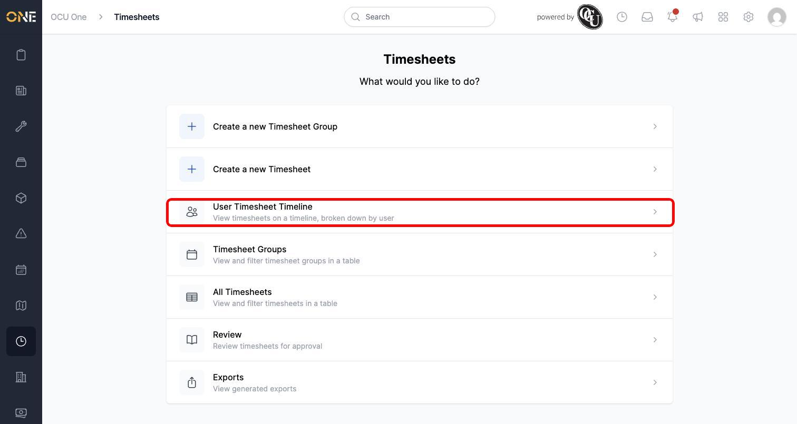
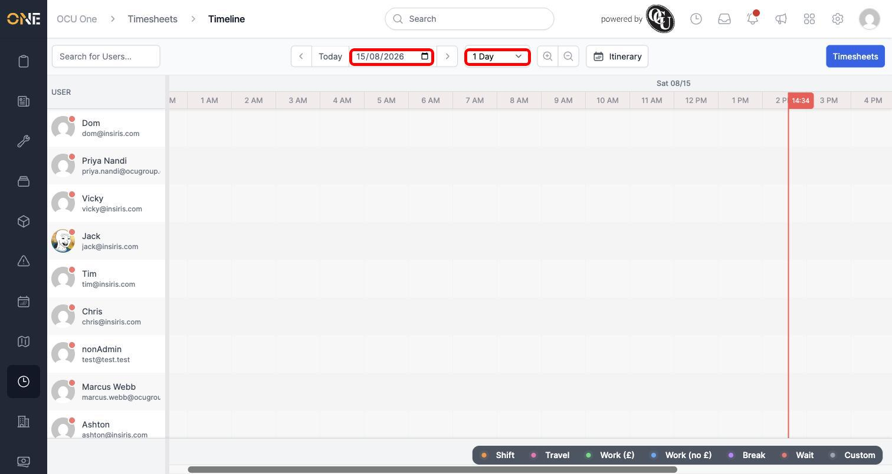
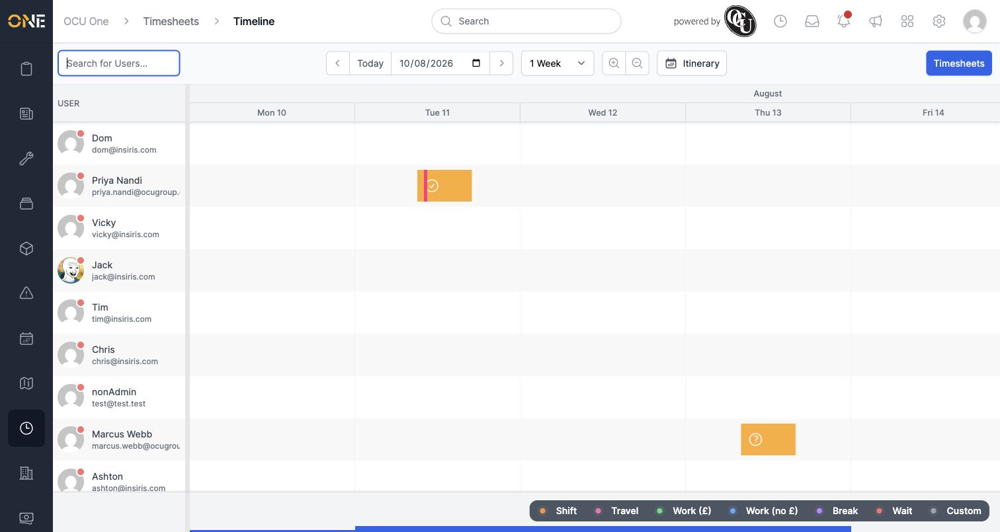
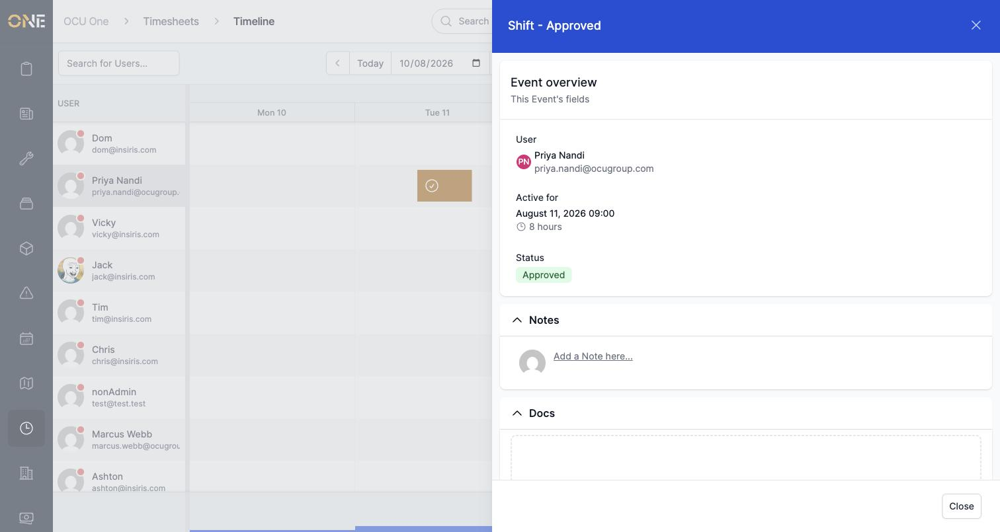

# Viewing the company shift timeline

If you want to see who's working when, at a glance, across your whole team, the timeline gives you a single visual view of everyone's shifts — rather than looking through timesheets one at a time.

## Getting there

From the Timesheets landing page, choose **User Timesheet Timeline**:

## Reading the timeline

Each row is a person, and each coloured bar is a shift or other logged event, positioned along the time axis. By default you see today, one day at a time:

Use the **date picker** to jump to a different day, and the dropdown next to it to widen the view — to 2 or 3 days, a week, two weeks, or a month — so you can see more of the schedule at once. Here's a week view with two people's shifts visible:

A small icon on each bar shows its approval status at a glance — a checkmark for approved, a question mark for pending, and so on. The key at the bottom right of the page explains what each colour means (Shift, Travel, Break, and so on).

Use **Search for Users** in the top left to filter the list down to specific people by name — handy when your team list is long and you only need to check on a few people.

## Inspecting a shift

Click any bar to see its full details — who it belongs to, when it runs, its status, and (if relevant) the job or task it's linked to:

## Good to know

- The timeline shows every active user in your organisation, not just people with shifts that day — rows with nothing scheduled simply appear empty.
- A shift can contain smaller events nested inside it, such as a travel or break period — these show as a thinner coloured strip within the main bar. Inspecting and updating one of these is covered in its own guide.
