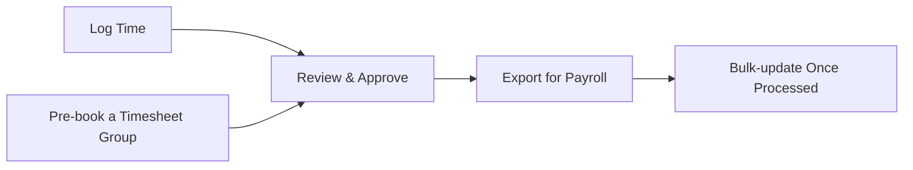

# Timesheets — Overview

If you clock in and out, log a break, or review your team's hours, you'll be working with **Timesheets** somewhere along the way. This guide explains the core pieces — Timesheets, Timesheet Groups, and Timesheet Exports — and how they fit together, before you dive into the detailed guides for each part.

## The core pieces

A **Timesheet** is a single logged period of time — a shift, a break, travel, or other tracked activity — tied to a person, a project, and a start and end time (or a running duration if it's still active).

A **Timesheet Group** bundles several timesheets together under one title. Groups are mainly used to pre-book time ahead of it happening — for example standby cover over a bank holiday, or a block of shifts for a temporary worker — so they can be created, reviewed, and approved as a set rather than one shift at a time.

A **Timesheet Export** bundles a set of already-logged timesheets into a downloadable file, ready to hand off to payroll.

## Why this matters

Timesheets are how time worked turns into hours that get paid and jobs that get costed accurately. Getting the flow right matters for:

- **Payroll accuracy** — the hours that go into an export are only as good as what was logged and approved before it.
- **Manager oversight** — someone needs to check hours before they're treated as final, whether that's one timesheet at a time or a whole team's week at once.
- **Traceability** — every timesheet moves through a clear set of statuses (Draft, Pending, Approved, On-Hold, Denied, Closed, Flagged), so it's always clear where a given shift stands and who signed off on it.

## The end-to-end flow

It starts with **logging time**. Most timesheets begin with someone clocking in and out for themselves — see [Clocking in and starting a shift](Clocking%20in%20and%20starting%20a%20shift.md) and [Ending a shift and confirming hours worked](Ending%20a%20shift%20and%20confirming%20hours%20worked.md) — with breaks or other activity logged alongside via [Logging a break or other shift event](Logging%20a%20break%20or%20other%20shift%20event.md). Once a timesheet exists, it can be opened and adjusted directly — see [Viewing and editing an individual timesheet](Viewing%20and%20editing%20an%20individual%20timesheet.md).

Time doesn't always have to be logged after the fact, though. A manager can pre-book a block of shifts for someone ahead of time using a **Timesheet Group** — see [Creating and managing a timesheet group](Creating%20and%20managing%20a%20timesheet%20group.md). Selecting more than one person when creating a group makes a separate copy of it per person, so several people can be pre-booked identical cover in one go. Groups are found and managed via [Browsing and filtering timesheet groups](Browsing%20and%20filtering%20timesheet%20groups.md).

However a timesheet comes to exist, it needs **reviewing and approving** before it's treated as final. For individual and team-wide review, see [Browsing all timesheets in the table view](Browsing%20all%20timesheets%20in%20the%20table%20view.md), [Approving or denying timesheets for your team (weekly review grid)](Approving%20or%20denying%20timesheets%20for%20your%20team%20%28weekly%20review%20grid%29.md), [Adding or editing a timesheet entry from the review grid](Adding%20or%20editing%20a%20timesheet%20entry%20from%20the%20review%20grid.md), and [Rounding or splitting a timesheet entry during review](Rounding%20or%20splitting%20a%20timesheet%20entry%20during%20review.md). For a whole Timesheet Group at once, approving or denying moves every shift inside it together — see [Reviewing a timesheet group and approving or denying its timesheets](Reviewing%20a%20timesheet%20group%20and%20approving%20or%20denying%20its%20timesheets.md). To see everyone's logged time laid out visually rather than as a list, there's also the shift timeline — see [Viewing the company shift timeline (Gantt/scheduler)](Viewing%20the%20company%20shift%20timeline%20%28Gantt-scheduler%29.md) and [Inspecting and updating a shift event from the timeline](Inspecting%20and%20updating%20a%20shift%20event%20from%20the%20timeline.md).

Once timesheets are approved, they're ready to hand off to payroll. Bundle the ones you need into a **Timesheet Export** — see [Creating a timesheet export for payroll](Creating%20a%20timesheet%20export%20for%20payroll.md) — which generates a downloadable file in the format your payroll system expects. After payroll has processed an export, bulk-update every timesheet inside it in one go — see [Reviewing an export and bulk-updating its timesheet statuses](Reviewing%20an%20export%20and%20bulk-updating%20its%20timesheet%20statuses.md) — and find past exports again via [Browsing and filtering timesheet exports](Browsing%20and%20filtering%20timesheet%20exports.md).

## The flow at a glance

- **Log Time** — clock in and out, log breaks, or pre-book a Timesheet Group ahead of time.
- **Review & Approve** — check hours one at a time, across a team via the review grid, or a whole Timesheet Group at once.
- **Export for Payroll** — bundle approved timesheets into a downloadable file.
- **Bulk-update Once Processed** — move every timesheet in an export to its next status (e.g. Closed) in one action.

Not every timesheet passes through a Timesheet Group — most are logged directly by clocking in and out — but every timesheet, however it was created, ends up reviewed and, eventually, exported.
