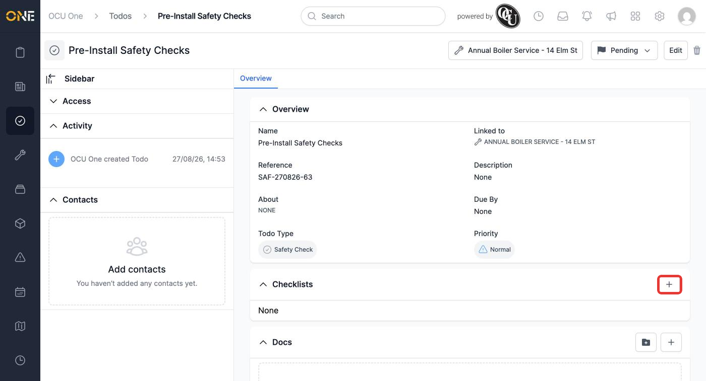
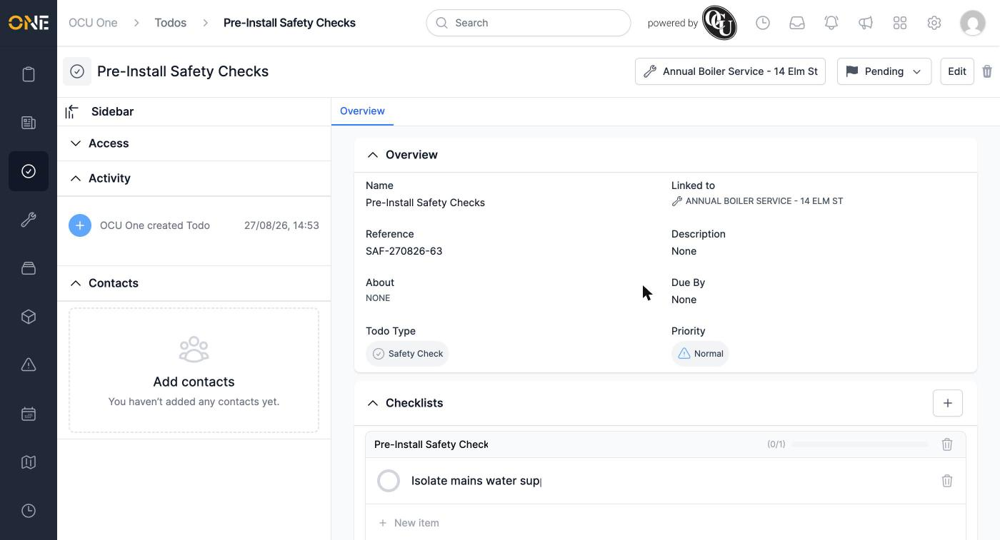

# Adding a checklist to a todo

A checklist lets you break a todo down into a list of smaller steps, each of which can be ticked off individually — useful for anything with a set sequence of things to check or complete, like a set of pre-work safety checks. Checklists live on individual todos (both standalone todos and ones attached to a job or project), rather than being a separate feature attached directly to a job or project itself.

## Adding a checklist

Open a todo and find the **Checklists** section on its Overview tab. Click the **+** button in its top-right corner.

*"Pre-Install Safety Checks", a todo attached to the "Annual Boiler Service" job, with no checklists yet.*

A new checklist is created immediately, with a placeholder title and one placeholder item — there's no separate "create" form to fill in first.

## Naming it

Click the checklist's title and replace the placeholder text with something descriptive, then click away to save.

*The checklist's progress counter — shown as a fraction and a progress bar — starts at 0 until items are ticked off.*

From here, you can add as many items as the checklist needs — see [[Adding, checking off, and removing checklist items]] for the rest of that walkthrough.

**Worth knowing:** a todo can have more than one checklist — click **+** again to add another alongside the first. Each is tracked and progressed independently.
