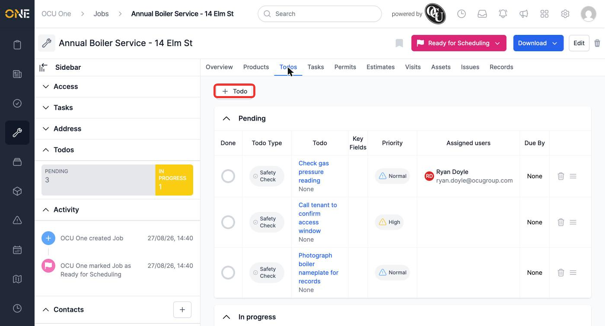
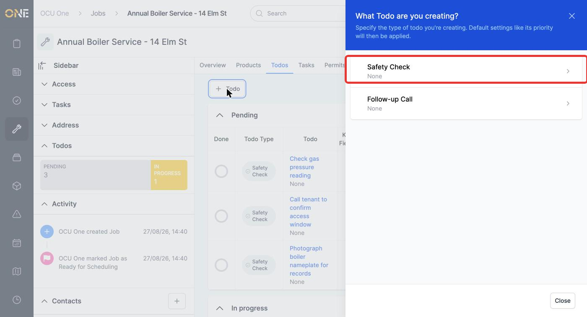
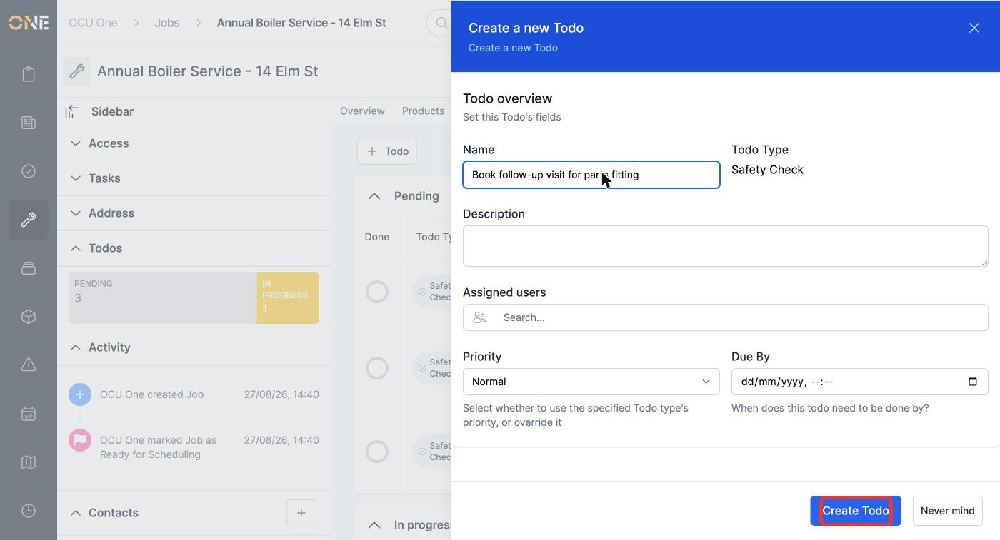
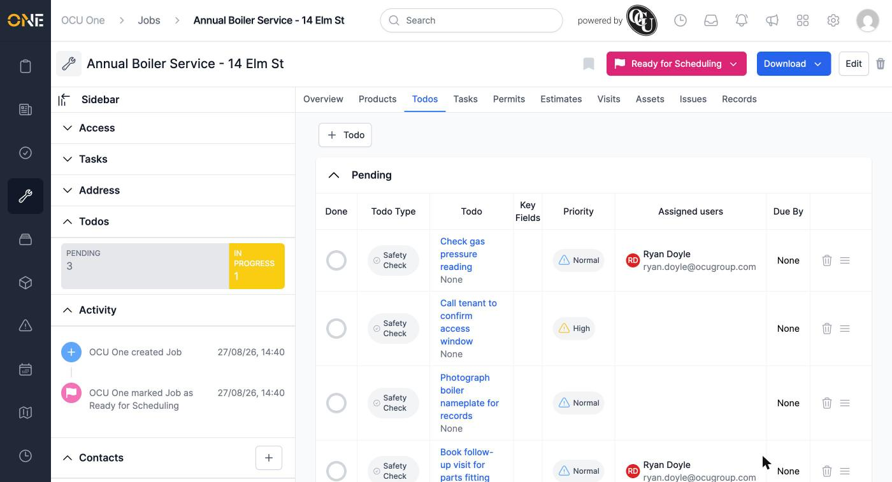
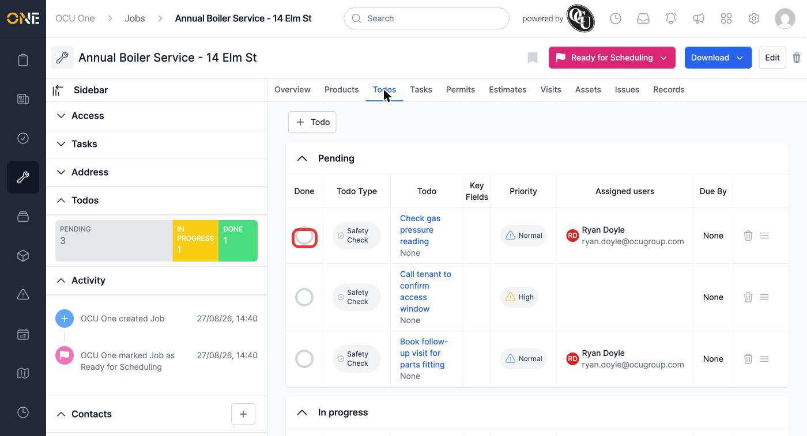
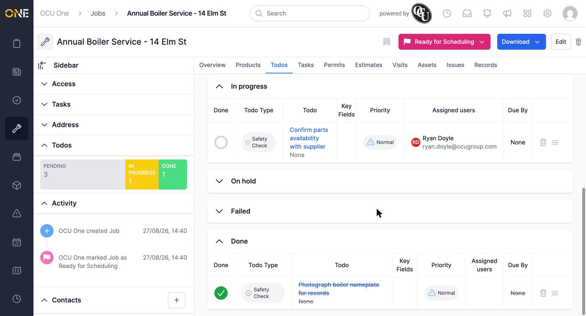

# Adding and managing todos on a job or project (Todos tab)

As well as standalone todos, you can attach todos directly to a job, project, or other record via its **Todos** tab — useful for tracking small tasks specific to that piece of work, without them cluttering the main standalone Todos list.

This guide uses a job as the example, but the same tab and behaviour appear on any record type that supports it.

## The Todos tab

Open a job and click its **Todos** tab. Todos here are grouped into sections by status — Pending, In Progress, On Hold, Failed, and Done — each showing the todo's type, priority, assigned users, and due date.

*The Pending section of the Todos tab. The sidebar's "Todos" summary also shows a running count by status.*

## Adding a todo

Click **+ Todo**. As with a standalone todo, you're first asked to pick a **Todo Type**.

*The type picker opens as a slide-over rather than a full page.*

Fill in the same fields as a standalone todo — Name, Description, Assigned users, Priority, and Due By — then click **Create Todo**.

*A todo being added directly against this job — no need to link it back manually afterwards.*

The new todo appears in the list immediately, already linked to this job.

*The todo is now part of this job's Todos tab.*

## Marking a todo done from the list

Rather than opening each todo individually, click the round circle in the **Done** column of its row to toggle it complete.

*Clicking the circle marks the todo done (or pending again) without leaving the list.*

The todo moves into the **Done** section, shown with a strikethrough, and the status summary in the sidebar updates.

*Each status section can be collapsed independently — useful once a job has built up a long list of completed todos.*

Each row also has a trash icon to delete the todo, and a drag handle to reorder todos within their section.
