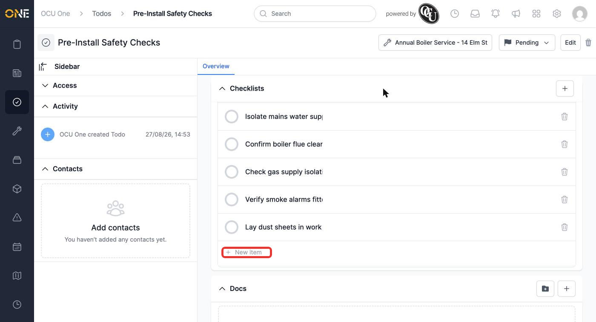
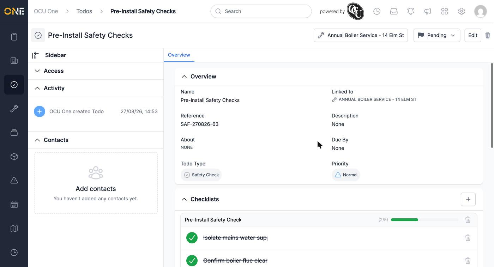
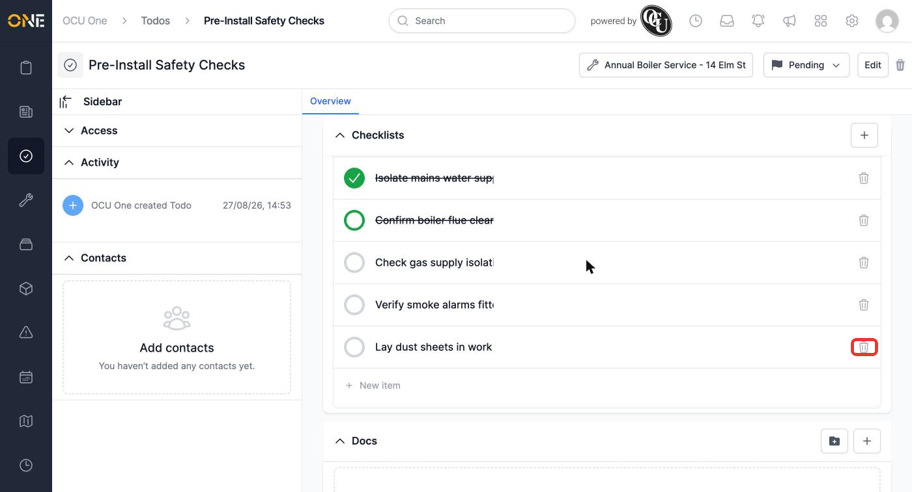
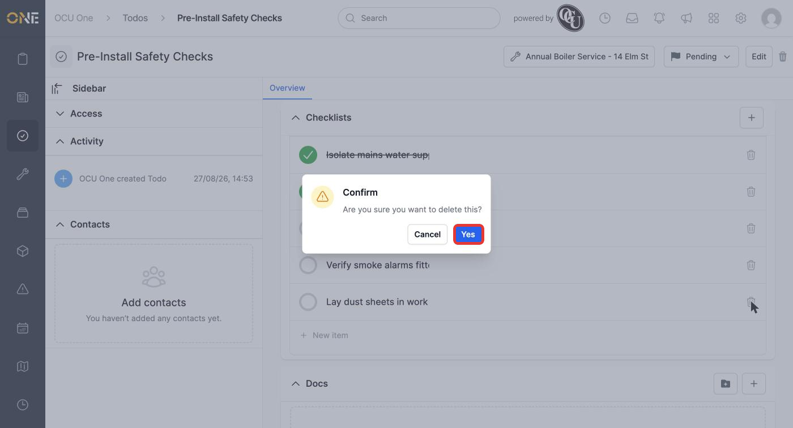
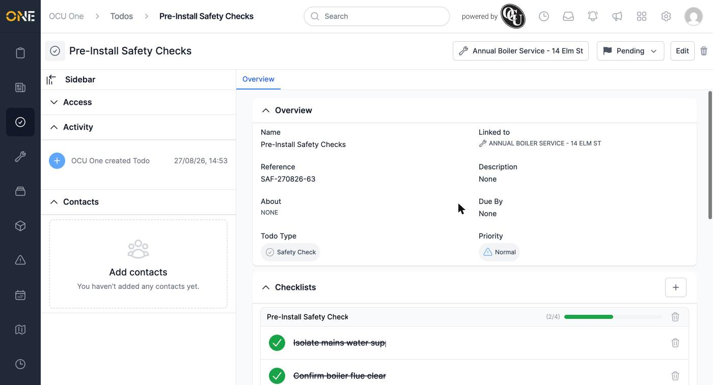

# Adding, checking off, and removing checklist items

Once a checklist exists on a todo (see [[Adding a checklist to a todo]]), you can build it out with individual items, tick them off as they're done, and remove any that turn out not to be needed.

## Adding items

At the bottom of the checklist, click **New item**. Like the checklist itself, a new item is created immediately with placeholder text — click it and type over the placeholder, then click elsewhere to save.

*"Pre-Install Safety Checks" with five items. Click "New item" again to keep adding more.*

## Checking items off

Click the circle to the left of an item to mark it done. Completed items show a filled green circle and strikethrough text.

*The checklist's progress bar and "(2/5)" counter update immediately as items are ticked.*

Click a ticked item's circle again to un-tick it if you change your mind.

## Removing an item

Click the trash icon on the right of any item you no longer need.

*Removing "Lay dust sheets in work area" — it turned out not to apply to this job.*

You're asked to confirm before it's removed.

*Confirm to permanently remove the item from the checklist.*

The item disappears immediately, and the checklist's total item count (and progress percentage) adjusts to match.

*Removing an item is permanent — there's no undo, so double-check before confirming on one you've already ticked off.*
