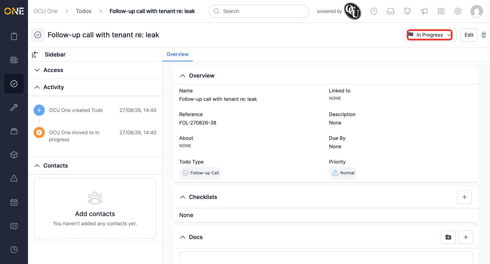
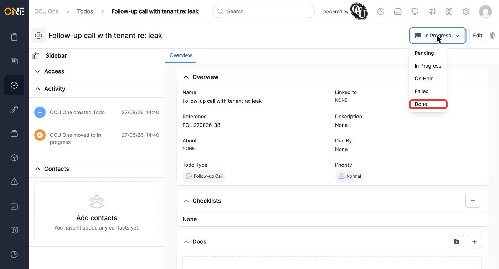
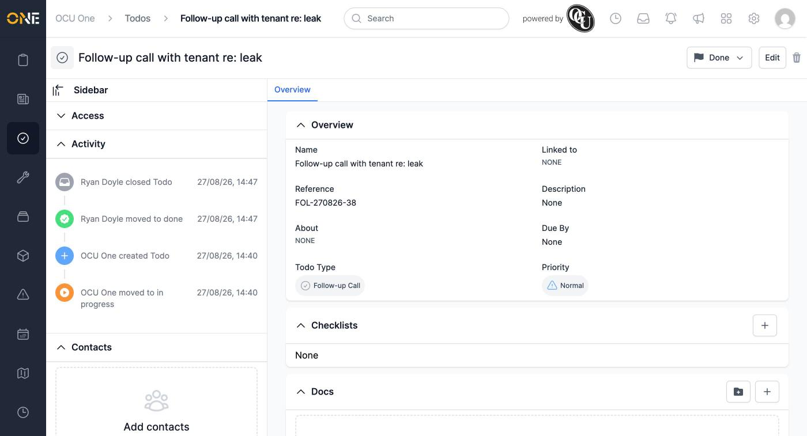

# Changing a todo's status from its detail page

Every todo moves through a set of statuses — **Pending**, **In Progress**, **On Hold**, **Failed**, and **Done** — as work on it progresses. The quickest way to update one is from its own detail page, without needing to open the full edit form.

## Opening the status dropdown

On a todo's detail page, its current status is shown as a button in the top-right, next to Edit. Click it to open the dropdown.

*"Follow-up call with tenant re: leak" is currently In Progress.*

All five statuses are listed. Pick the one that reflects where the todo actually is.

*Choosing "Done" once the call has been made.*

## After changing it

The status updates immediately — no separate save step needed. The todo's Activity feed also records the change, along with who made it and when.

*The status change is instant and logged in the Activity feed on the left.*

**Worth knowing:** moving a todo to **Done** (or **Failed**) marks it as closed — it drops off active lists like your assigned todos' "Up Next" section and moves into the completed view instead. Moving it to any other status re-opens it.
