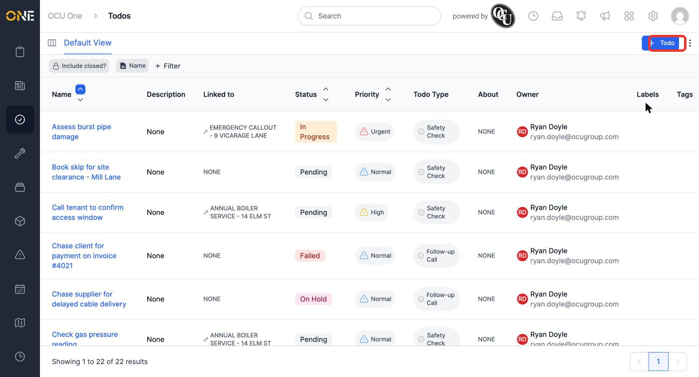
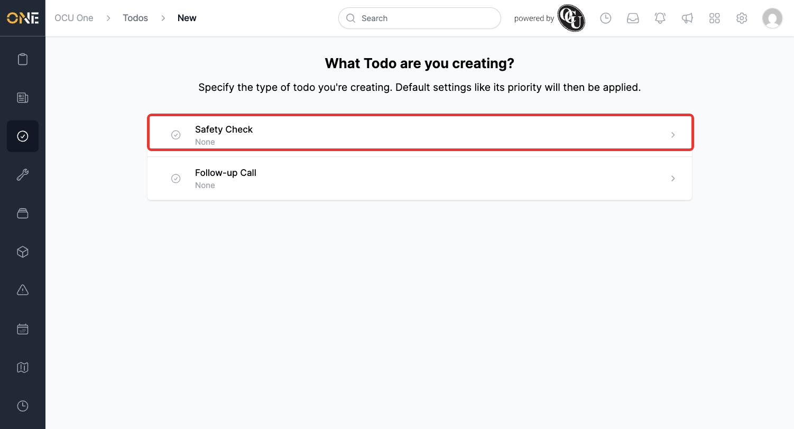
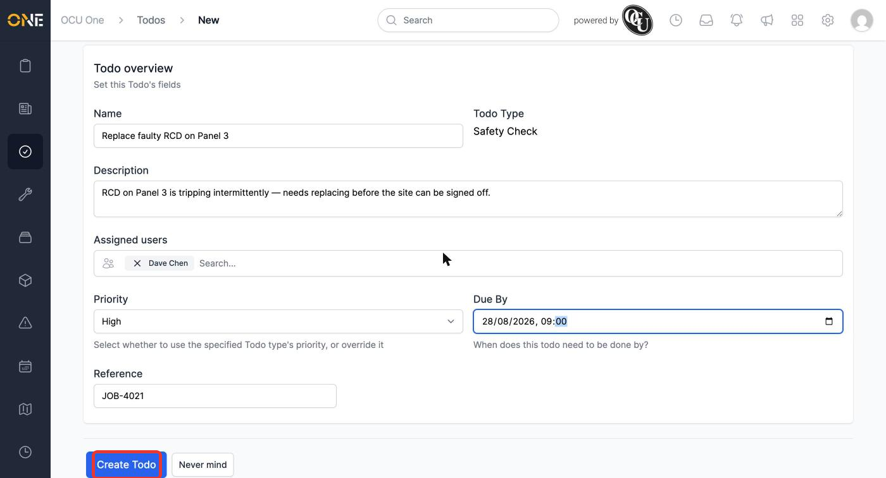
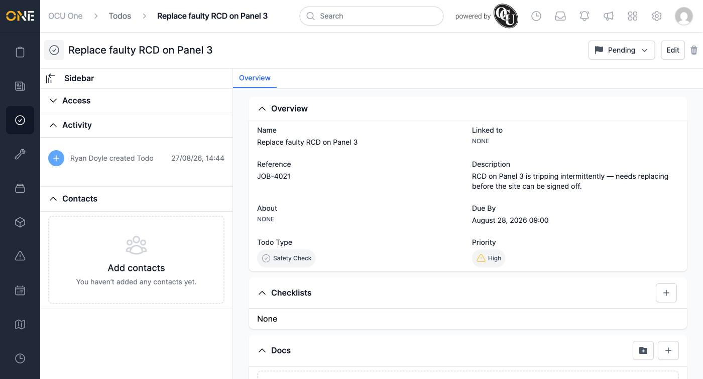
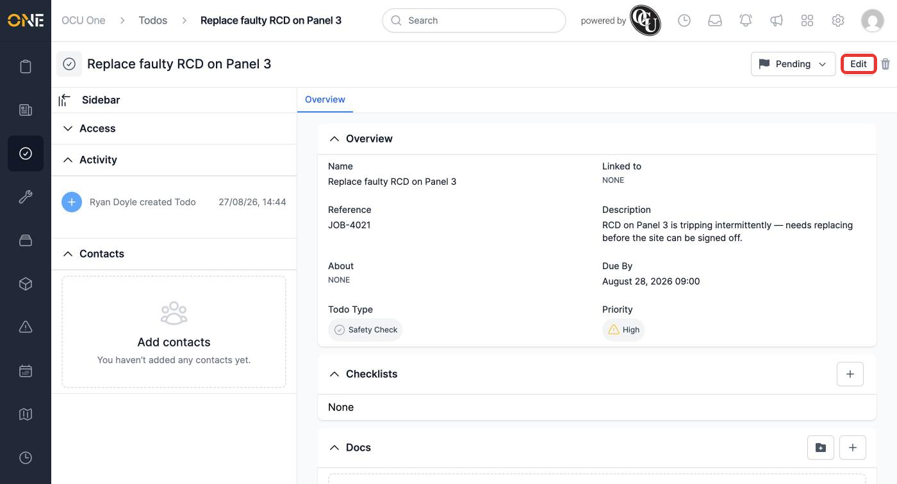
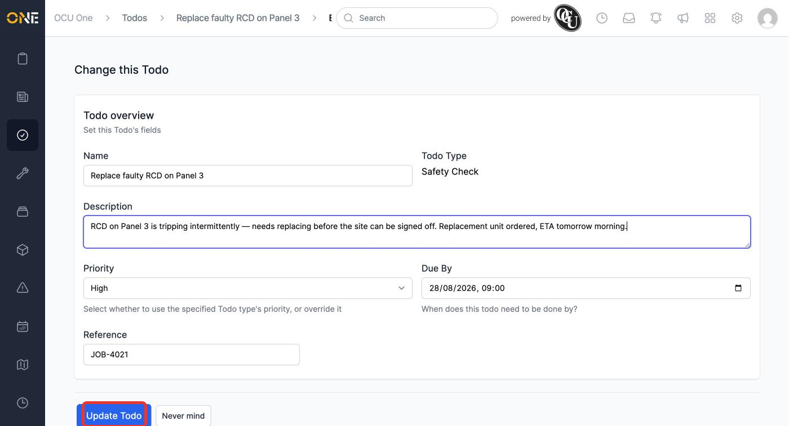
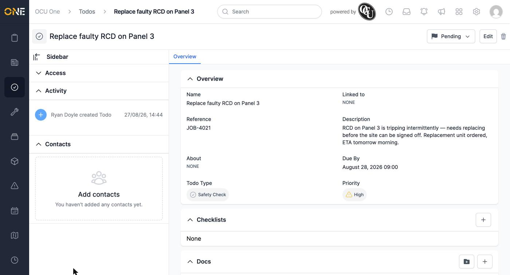
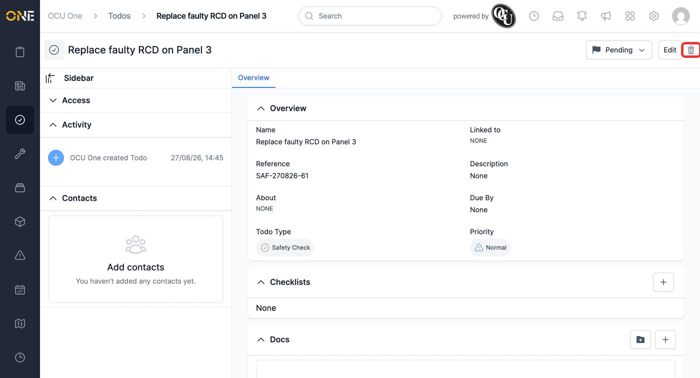
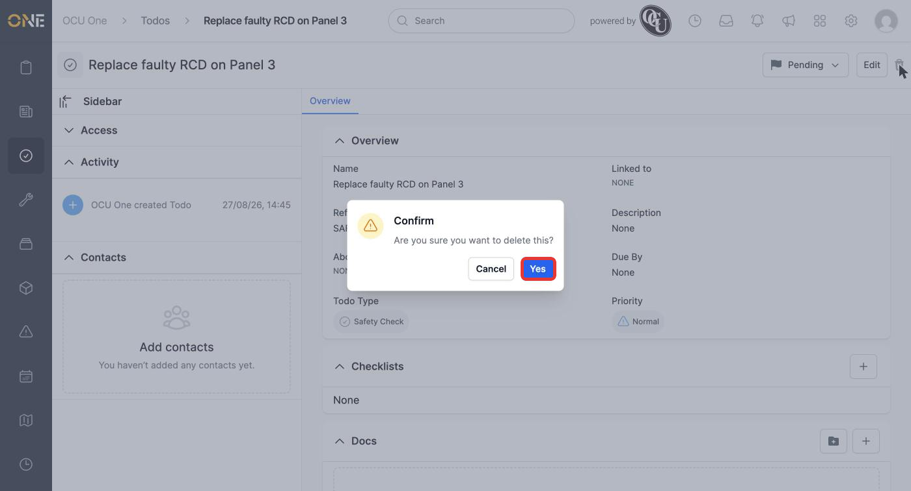
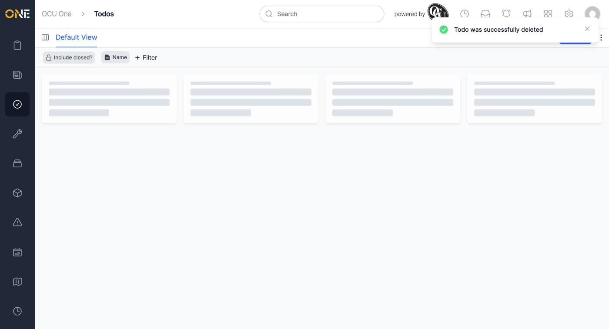

# Creating, editing, and managing a standalone todo

A todo is a simple task with a status, priority, and optional due date — used to track things that need doing, whether or not they're tied to a job, project, or other record. This guide covers the standalone **Todos** area, reached from the sidebar, where you can see and manage every todo you have access to.

## The Todos list

The Todos list shows every todo you can see, with columns for its status, priority, type, and owner. Click **+ Todo** in the top-right to create a new one.

*The Todos list. Use "Include closed?" to also show archived todos, and the column headers to sort.*

## Creating a todo

You're first asked to pick a **Todo Type** — for example, "Safety Check" or "Follow-up Call". The type you choose determines the default priority applied to the new todo.

*Picking a type before filling in the rest of the todo's details.*

The creation form then asks for:

- **Name** — required. A short description of what needs doing.
- **Description** — optional extra detail.
- **Assigned users** — search and pick one or more people this todo is for. Only shown when creating (not when editing afterwards).
- **Priority** — defaults to the todo type's own priority, but can be overridden per todo.
- **Due By** — an optional date and time.
- **Reference** — an optional free-text reference. If left blank, one is generated automatically from the todo type and creation date.

*A completed todo, ready to create.*

Click **Create Todo** to save it. You're taken straight to the new todo's detail page.

*The todo's Overview tab — its fields, along with Checklists, Docs, and Comments sections lower down the page.*

## Editing a todo

From the todo's detail page, click **Edit** in the top-right.

*The controls on a todo's detail page: status dropdown (left), Edit, and delete (trash icon).*

This reopens the same form used to create the todo (minus the one-time "Assigned users" field), pre-filled with its current values. Make your changes and click **Update Todo** to save.

*Updating the description before saving.*

*The change is saved and reflected immediately.*

Changing a todo's status is quicker done from the status dropdown next to Edit — see [[Changing a todo's status from its detail page]] for the full walkthrough.

## Deleting a todo

If a todo was created by mistake — here, a duplicate of one already logged — click the trash icon next to Edit on its detail page.

*The delete icon sits to the right of Edit.*

You're asked to confirm before anything is removed.

*Confirm to permanently archive the todo.*

Once confirmed, the todo disappears from the list and a confirmation message appears.

*The duplicate is gone. This doesn't affect the original.*
