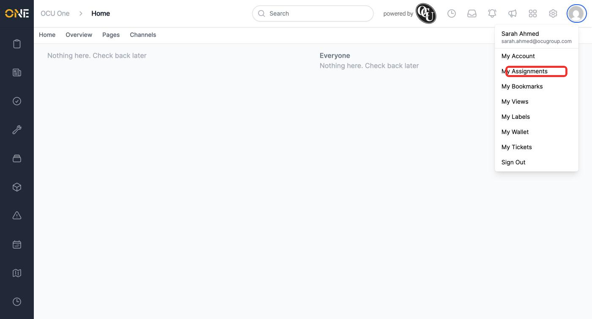
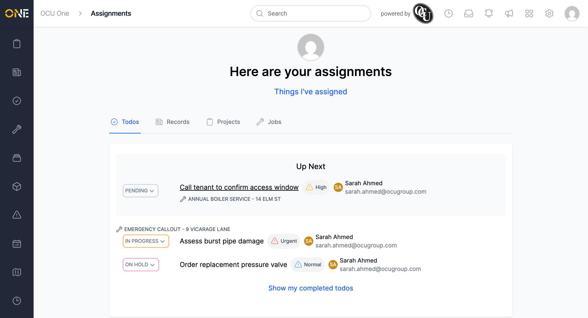
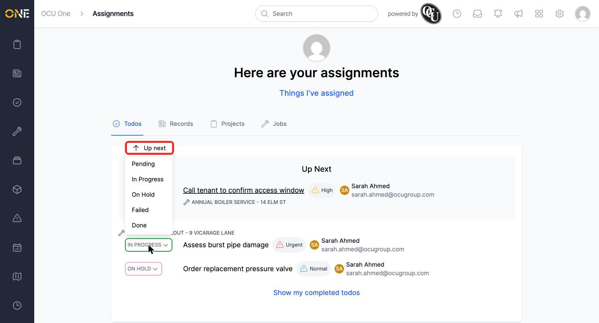
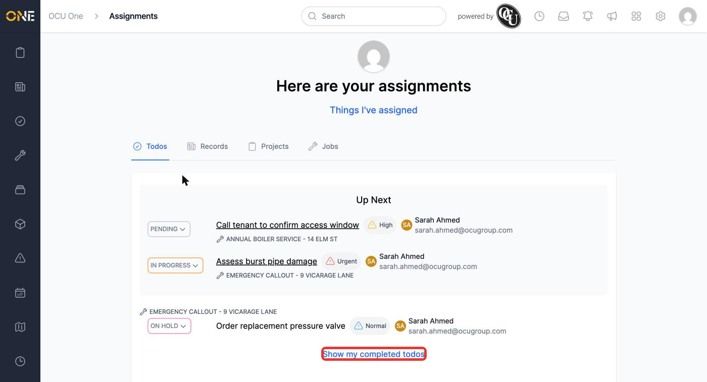
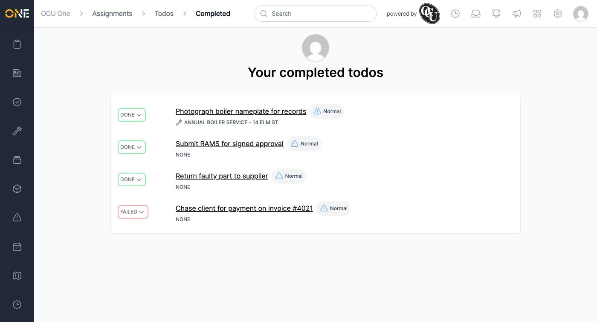

# Viewing and prioritising your assigned todos

**My Assignments** brings together everything assigned to you — including todos — in one personal view, so you don't have to go hunting across every job and project you're linked to. This guide covers the Todos side of it.

## Getting to your assignments

Click your profile picture in the top-right, then **My Assignments**.

*"My Assignments" sits alongside the other personal sections of the app, like "My Labels" and "My Views".*

The **Todos** tab is selected by default. Your todos are split into two groups:

- **Up Next** — todos you've marked as a priority, shown together at the top regardless of which job or record they belong to.
- Everything else, grouped underneath by the job, project, or record each todo is linked to.

*Each row shows the todo's status, priority, and who it's assigned to.*

Click **Things I've assigned** near the top to flip the view around and see todos (and other record types) you've assigned to other people, instead of what's assigned to you.

## Prioritising a todo

Click the status button on any todo row to open its dropdown — alongside the usual statuses, the top option lets you flag it as a priority.

*"Up next" prioritises the todo; the same option becomes "Deprioritise" once it's already flagged.*

Once prioritised, the todo moves into the **Up Next** box at the top of the list, and a **Show my completed todos** link appears below everything else.

*Prioritising is personal — it doesn't change the todo's actual status, priority level, or who else can see it.*

## Viewing completed todos

Click **Show my completed todos** to see everything you've finished — todos with a status of Done or Failed.

*Completed todos stay visible here even after they've dropped off your main assignments list.*
