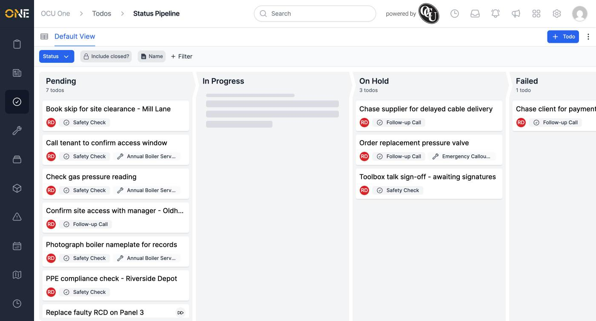
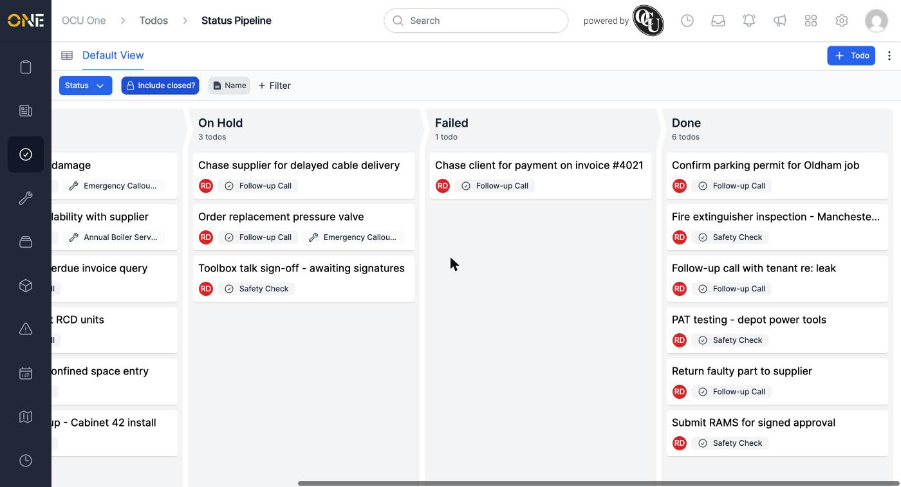

# Viewing todos as a pipeline (kanban board)

Alongside the table list, todos can also be viewed as a kanban-style board, with one column per status. This is a quick way to see where everything currently stands at a glance, without opening each todo individually.

## Switching to the board

From the Todos list, click the pipeline icon in the top-left to switch to the **Status Pipeline** view (and the table icon to switch back).

*Each card shows the todo's name, owner, and todo type. By default, closed todos (Done) aren't shown.*

Todos are grouped into columns by status: **Pending**, **In Progress**, **On Hold**, and **Failed**, in that order.

## Including completed todos

Toggle **Include closed?** in the filter bar to also bring in the **Done** column at the far right.

*With "Include closed?" on, finished todos still show up in their own Done column instead of disappearing from the board entirely.*

Each column header shows a running count of how many todos are in it, which updates as todos move between statuses.

## Working with the board

- Click a card to open that todo directly.
- Use the **Status** filter and **Name** search above the board to narrow down what's shown, the same way you would on the table list.
- The same **+ Todo** button in the top-right lets you create a new todo without leaving the board.

**Worth knowing:** the board shows every todo you have access to, not just your own — it's a shared view of what's in progress across your team, not a personal worklist. For a view scoped to just what's assigned to you, see [[Viewing and prioritising your assigned todos]] instead.
