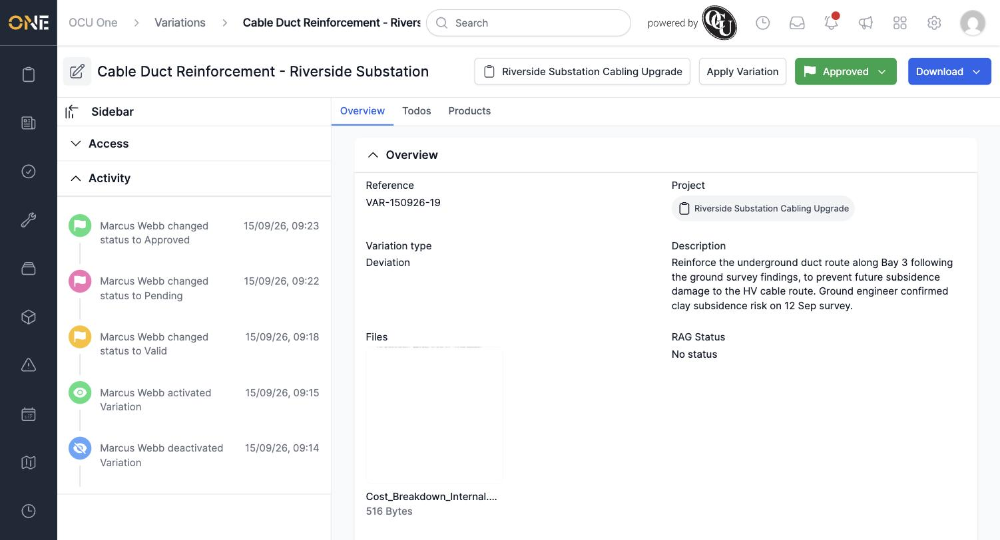
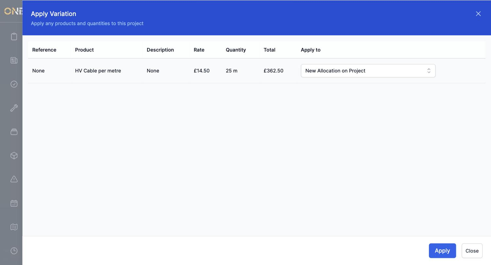
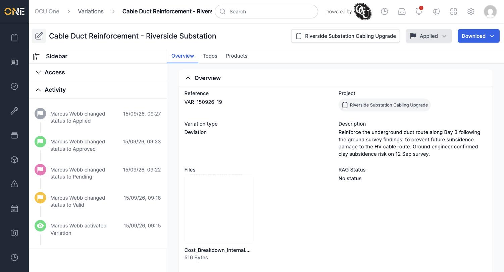

# Applying an approved variation to a job or project

Once a variation has been **Approved** and has products allocated to it, you can apply it — turning its planned products into a real allocation on the project.

## Applying the variation

Open an Approved variation and click **Apply Variation**, next to its status badge.

The Apply Variation screen lists every product on the variation, with its rate, quantity, and total. Each row's **Apply to** column defaults to **New Allocation on Project**.

*You can instead choose an existing allocation here to add the variation's quantity onto it, rather than creating a new one.*

Click **Apply**. The variation's products are copied onto the project as a real product allocation, and the variation itself moves straight to **Applied** status.

*Applied is a final status — the variation can no longer be edited, and there's nothing left to apply.*

**Worth knowing:** applying is only available once every product on the variation has been resolved to either a new allocation or an existing one — if any product is left unselected, the Apply screen shows a "Please choose something to apply to" error instead.
