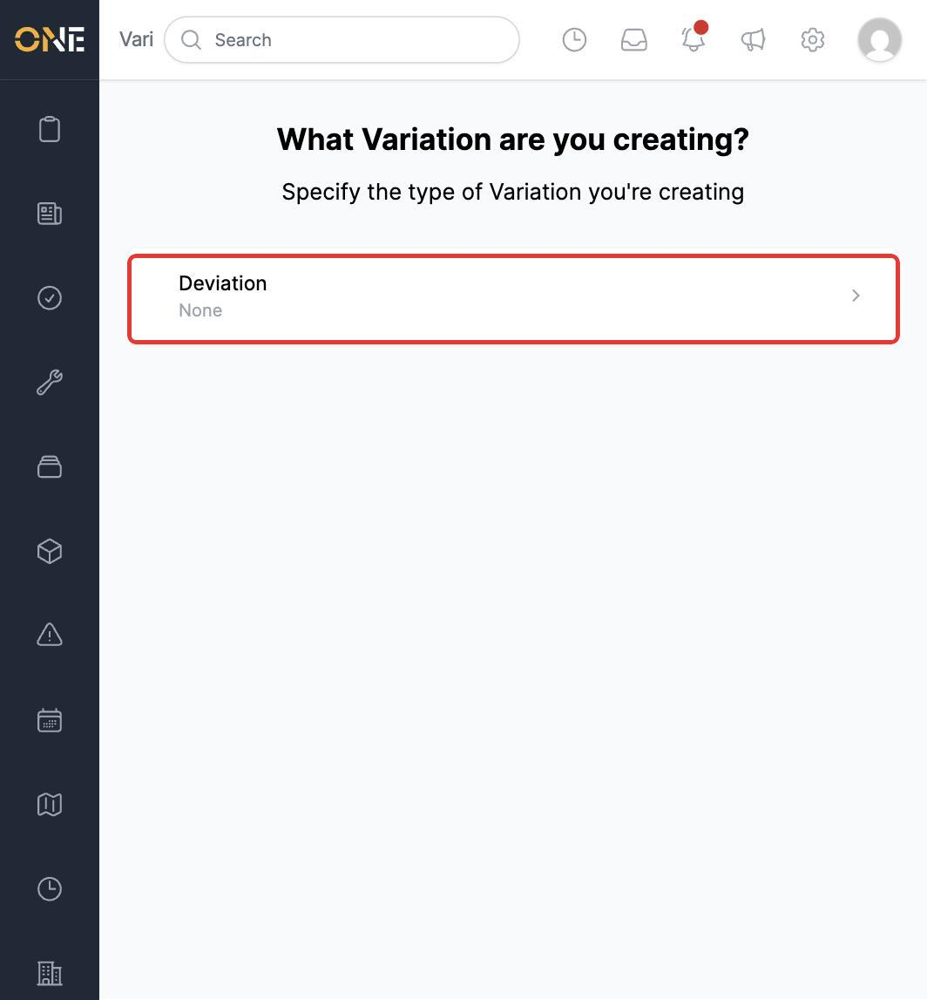
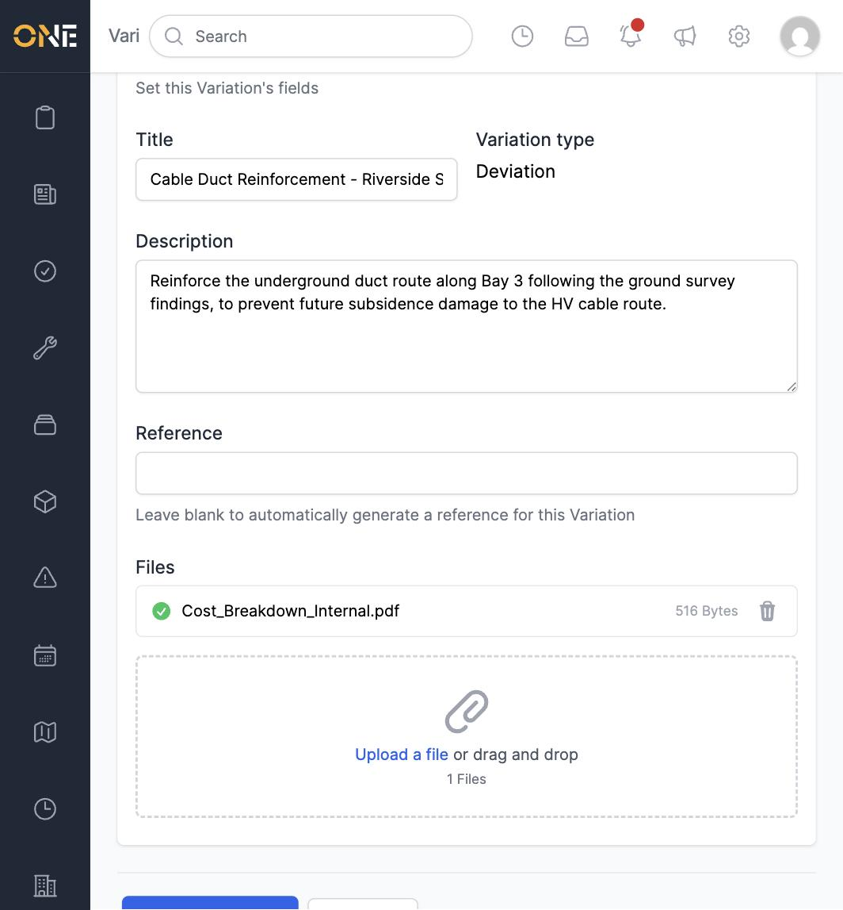
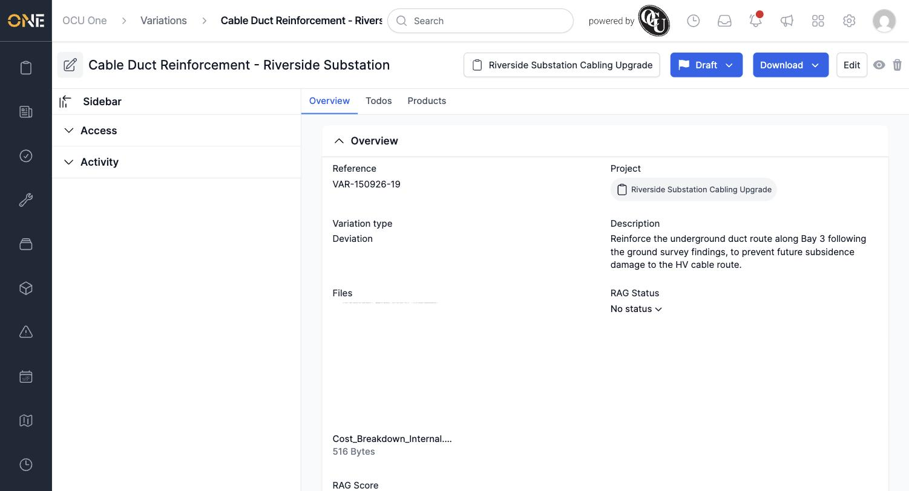

# Creating a new variation

A **Variation** records a change to the agreed scope of work on a project — extra work, a deviation from the original plan — and what it's worth. You can raise one from the **Variations** screen or from a project's own Variations tab.

## Choosing a variation type

Click **+ Variation**. If your tenant has more than one variation type configured, you'll be asked to pick one first.

*Only the variation types you have permission to create appear here — in this tenant, that's just **Deviation**.*

## Filling in the form

Pick the **Project** this variation is for, then fill in a **Title** and optionally a **Description**, **Reference**, and any supporting **Files**.

*Only Title is required. Leave Reference blank to have one generated automatically.*

Click **Create Variation** to save it. It's created in **Draft** status.

*A new variation lands on its own overview page, with Todos and Products tabs available from here.*

**Worth knowing:** a variation's value comes from the products allocated to it (see **Managing products on a variation**), not a figure you type in — a newly raised variation shows £0.00 until products are added.
