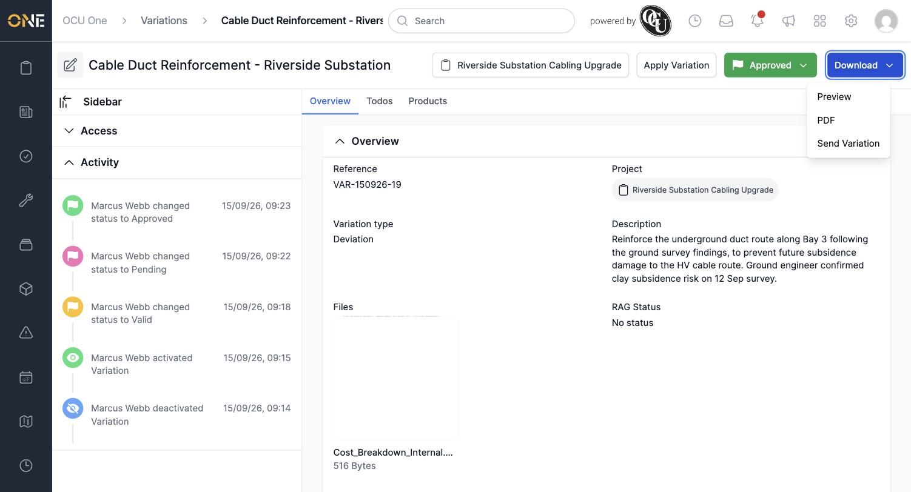
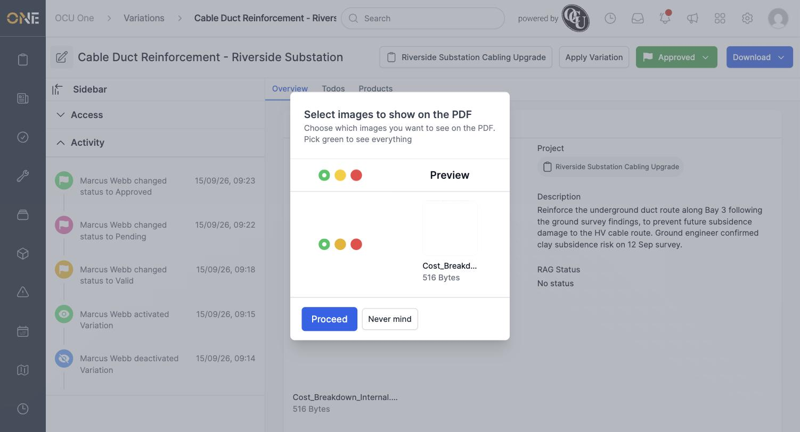
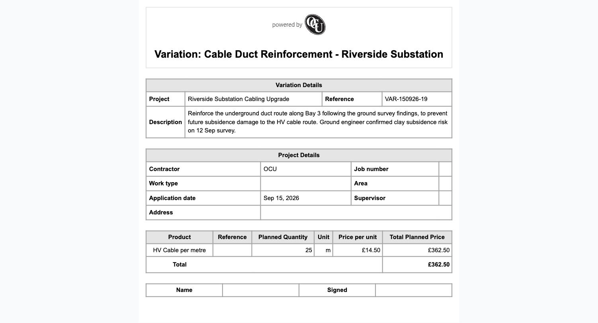

# Downloading or previewing a variation PDF

Every variation can be exported as a PDF — useful for sharing a paper record of the change and its cost with a client or colleague.

## Choosing Preview or PDF

Open a variation and click **Download** in the top right. Choose **Preview** to view it in the browser, or **PDF** to generate a downloadable file.

Either option first takes you to a **Select images to show on the PDF** screen, where you choose whether any attached files should appear. Green shows an attachment on every export, amber hides it just for this one, and red excludes it going forward. Pick green (the default) to include everything, then click **Proceed**.

The preview shows the variation's reference, description, project details, and its allocated products with their planned quantity and price.

**Worth knowing:** generating an actual PDF (as opposed to the in-browser Preview) relies on a headless-Chrome rendering step that isn't set up in every environment — if the **PDF** option fails, the **Preview** option renders the same layout directly in the browser instead.
