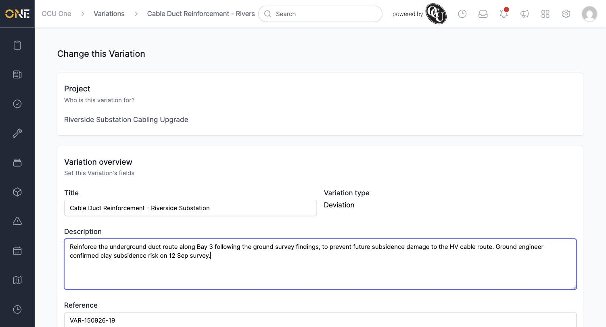
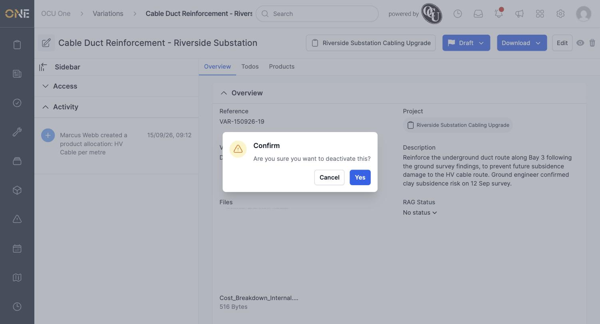
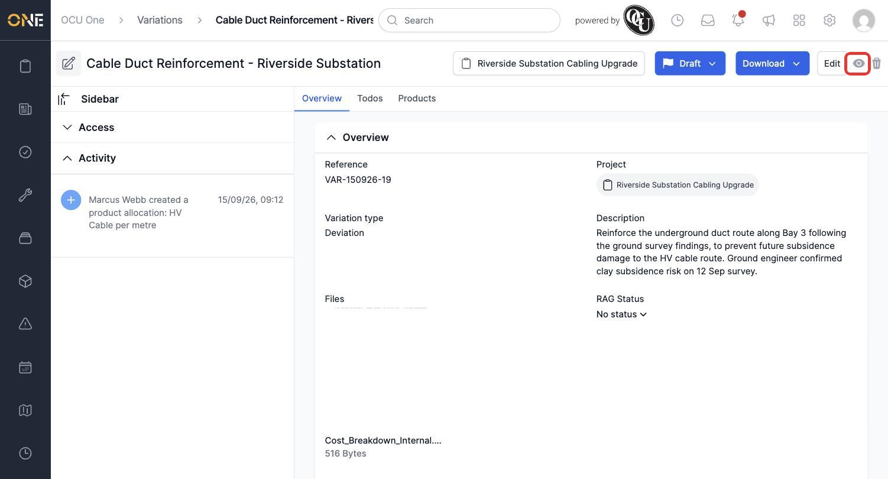
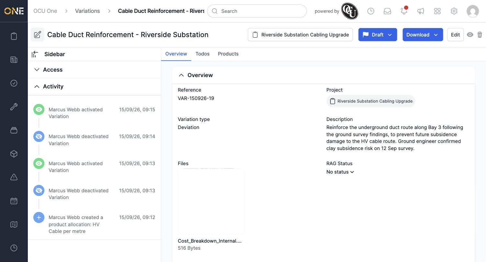
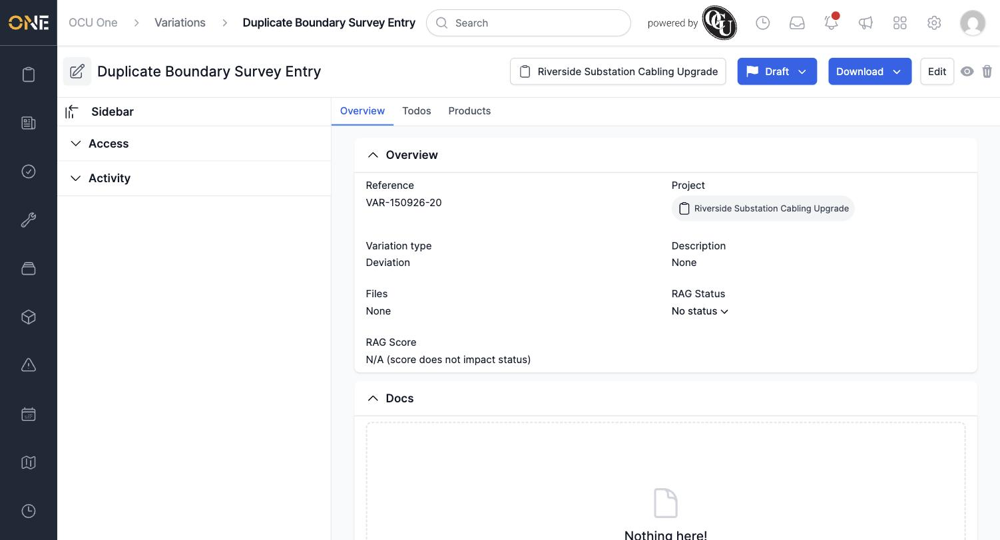
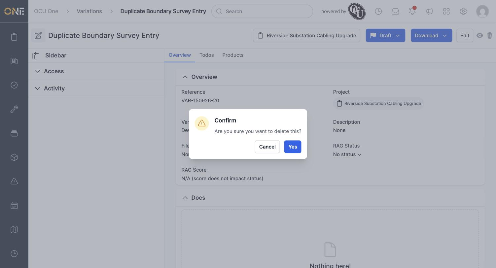
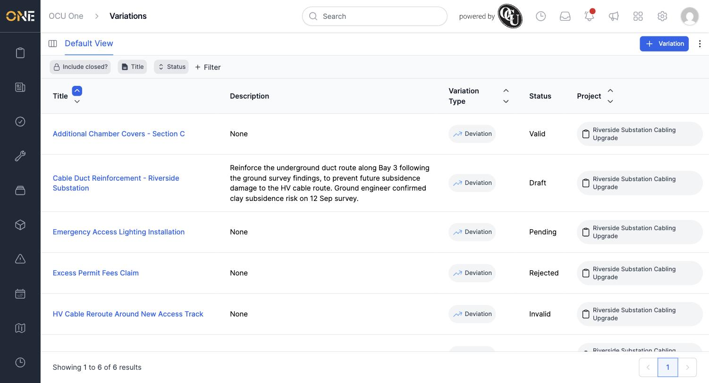

# Editing, activating or deactivating, or deleting a variation

You can update, hide, or permanently remove a variation from its overview page — but only while it's still in **Draft** status.

## Editing a variation

Click **Edit** in the top right of a Draft variation's overview page. Update the **Title**, **Description**, **Reference**, or **Files**, then save.

*Click **Update Variation** to save your changes.*

## Deactivating and reactivating a variation

Click the eye icon next to **Edit** to deactivate a variation you no longer need visible in day-to-day lists, without deleting it outright.

*Confirm to deactivate. The eye icon changes to an eye-slash, and the change is logged in the Activity feed.*

*A deactivated variation is hidden from the default Variations list, but still reachable by direct link or with "Include closed?" turned on.*

Click the same icon again and confirm to reactivate it.

*Reactivating brings it back into the default list.*

**Worth knowing:** after deactivating or activating, the eye icon and Activity feed can take a moment to refresh — if the page doesn't seem to update right away, reload it to see the current state.

## Deleting a variation

Click the trash icon to permanently remove a Draft variation you created by mistake.

*Confirming removes it for good — this can't be undone.*

*The deleted variation is gone from the list.*

**Worth knowing:** none of Edit, deactivate/activate, or Delete are available once a variation has moved past Draft (to Valid, Pending, Approved, Applied, or Rejected) — the buttons disappear from its overview page.
