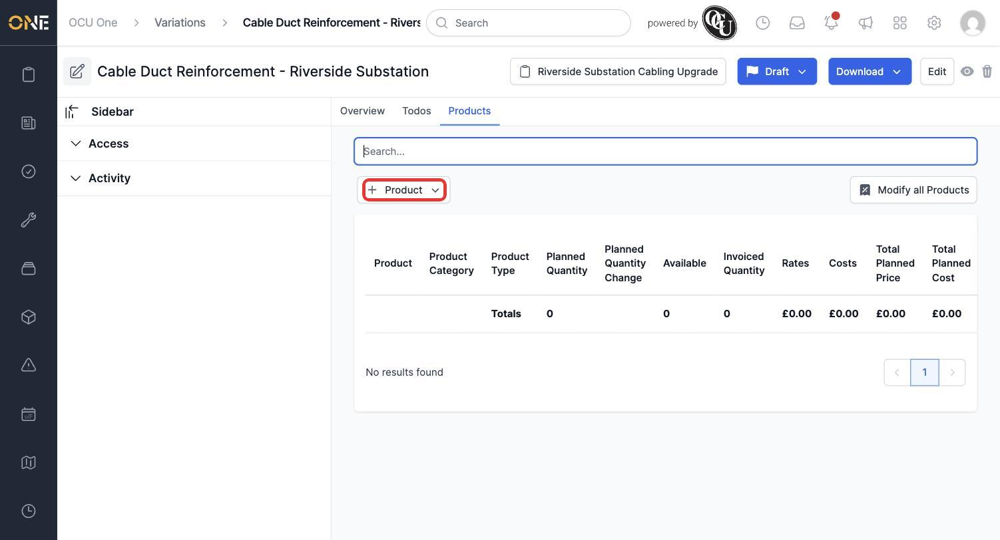
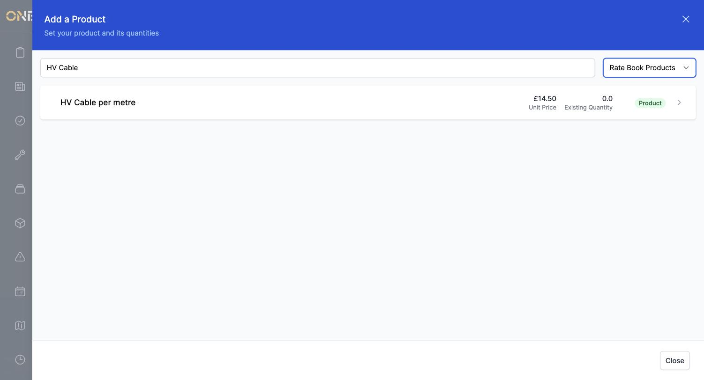
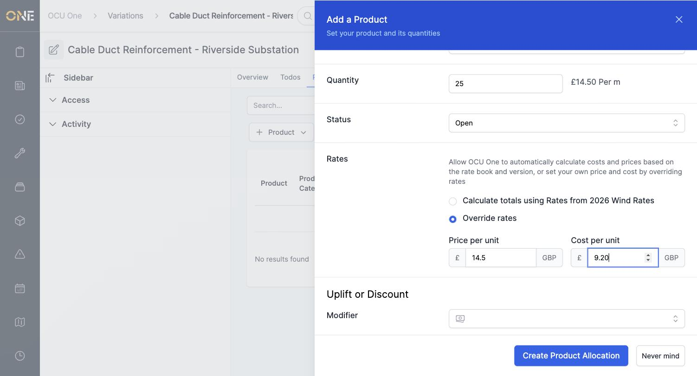
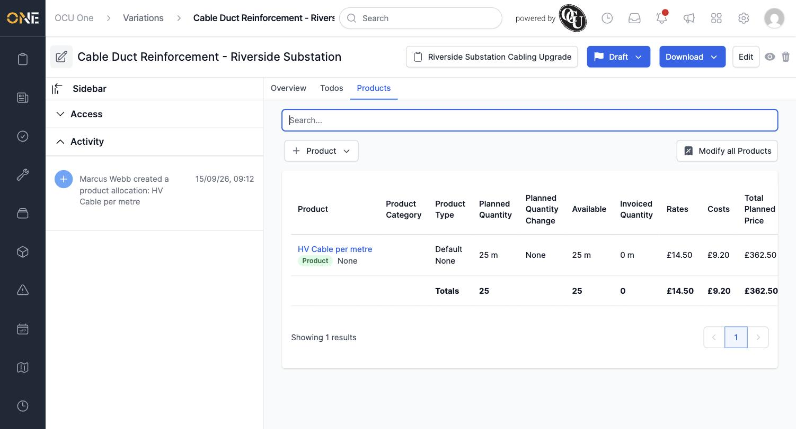

# Managing products on a variation

A variation's value comes entirely from the products allocated to it. The **Products** tab is where you attach those products and set their quantities.

## Viewing the Products tab

Open a variation and click its **Products** tab. A new variation starts here with no products and a £0.00 total.

*Click **+ Product** to add one.*

## Adding a product

Click **+ Product** and choose an allocation type if more than one is configured (this tenant has **Default** and **Planned Works**). In the picker that opens, switch from **Existing Products** to **Rate Book Products** and search for the product you want.

*Searching under Rate Book Products surfaces products from the project's rate book.*

Click the product, then set its **Quantity**. The system can calculate the price and cost automatically from the project's rate book, or you can override both manually.

*Here the rate book only had a sell price configured, so Cost per unit was overridden manually to save it.*

Click **Create Product Allocation**. The product now appears in the table with its planned quantity, rate, and total price.

*The variation's total (£362.50) now reflects this allocation.*

**Worth knowing:** if you try to calculate totals from the rate book and get a "Cost per unit can't be blank" error, it means that rate book version only has a sell price set up for this product, not a cost — switch to **Override rates** and enter both figures yourself.

You can only add products to a variation while it's still in **Draft** status — once it moves to Valid, Pending, or beyond, the Products tab becomes read-only.
