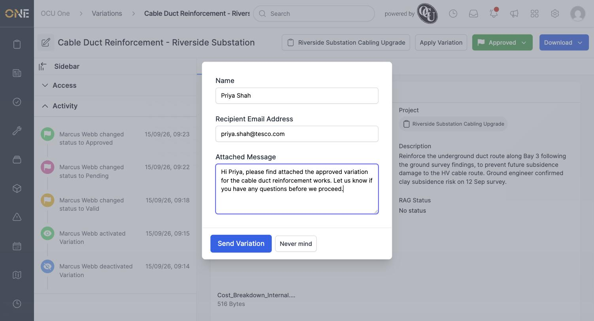

# Sending a variation for client approval

Instead of downloading a variation's PDF yourself, you can email it straight to a client contact for sign-off.

## Filling in the send form

Open a variation and click **Download**, then **Send Variation**.

Fill in the recipient's **Name** and **Recipient Email Address**, and add an **Attached Message** to go with it.

*All three fields are required — leaving any of them blank shows a validation error instead of sending.*

Click **Send Variation** to email the variation's PDF, along with your message, to the recipient.

**Worth knowing:** sending a variation builds the same PDF used by the Download and Preview options, so it depends on the same headless-Chrome rendering step — in an environment where that isn't set up, sending will fail the same way a direct PDF download would.
