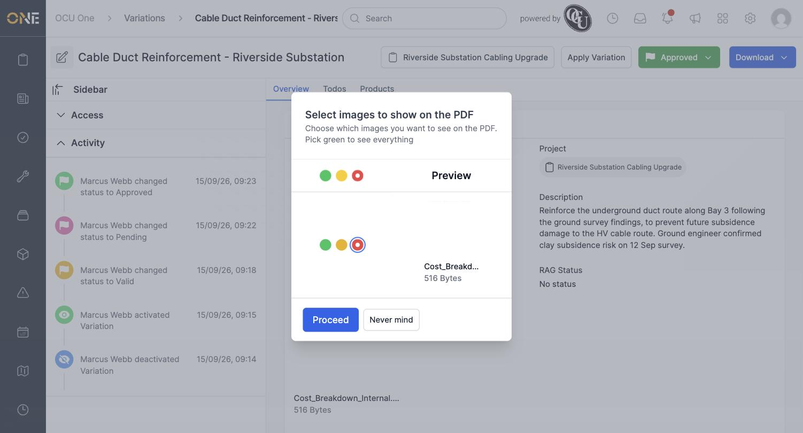
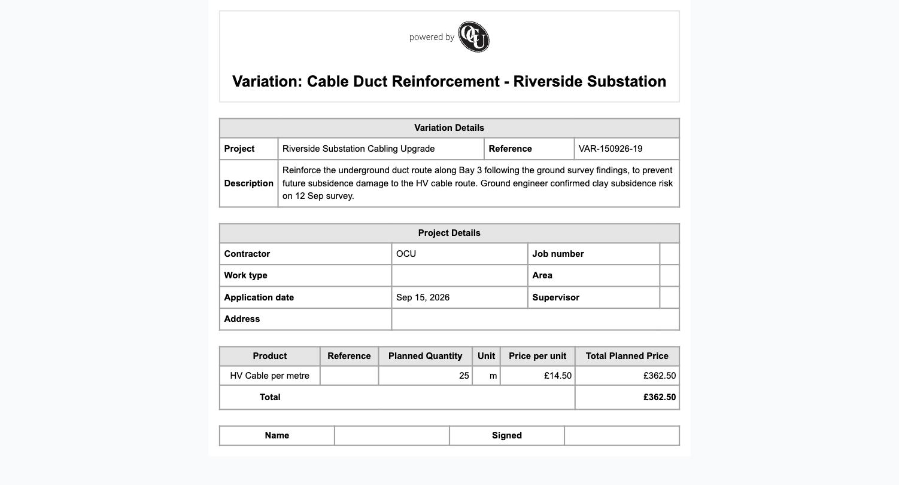

# Toggling attachment visibility on a variation PDF

If a variation has files attached to it — for example, an internal cost breakdown you don't want a client to see — you can control which ones actually appear when the variation is exported.

## Excluding an attachment

Open a variation with one or more files and click **Download**, then **PDF** (or **Preview**). On the **Select images to show on the PDF** screen, each attachment has its own green/amber/red selector:

- **Green** — always show this file on the PDF
- **Amber** — hide it for this export only
- **Red** — stop showing it on the PDF from now on

*Selecting red on an individual file also updates the bulk selector above it.*

Click **Proceed**. The file's visibility preference is saved permanently, so it stays excluded on every future export until you change it back.

**Worth knowing:** the variation's default PDF template is a details-and-products table with no photo section, so excluding a file doesn't change what's visible on this particular layout — the setting still matters if your tenant uses a custom PDF template that does display attached images.
