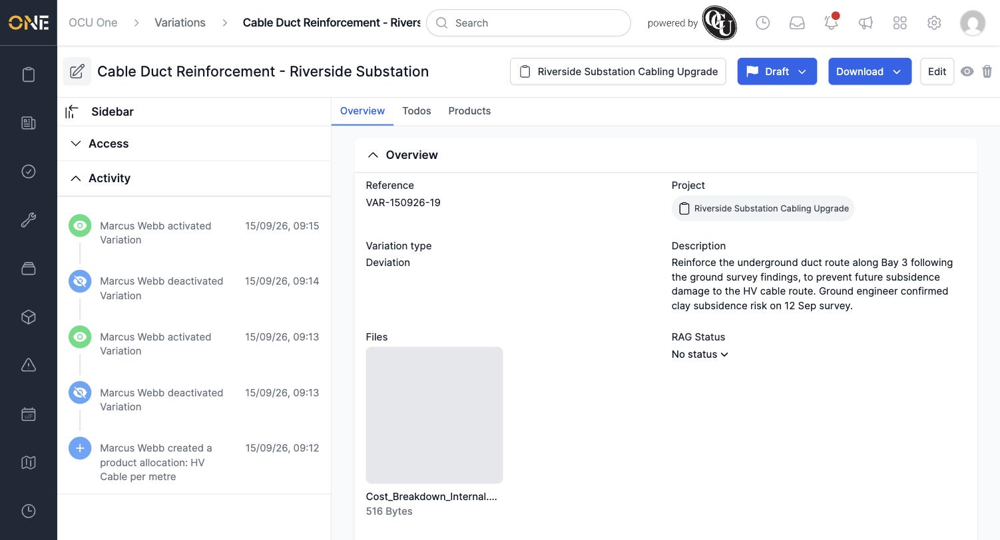
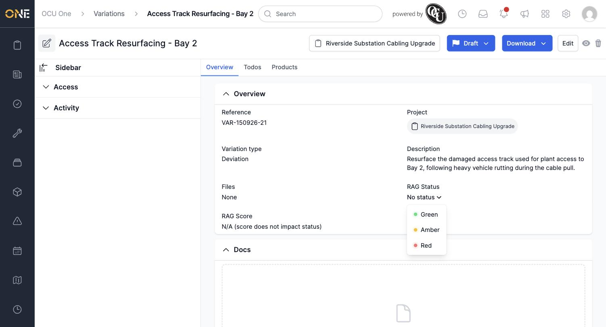
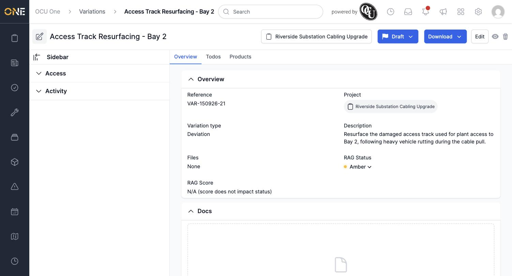
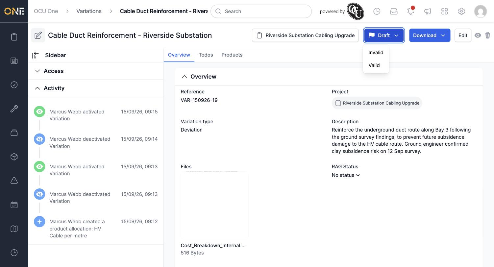
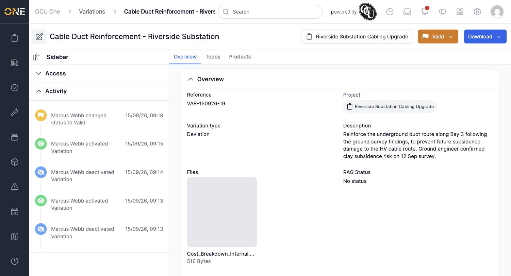
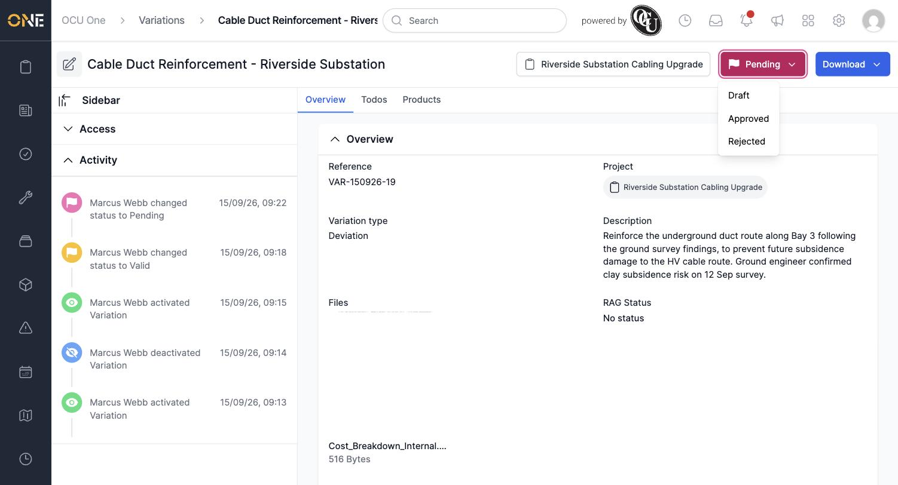
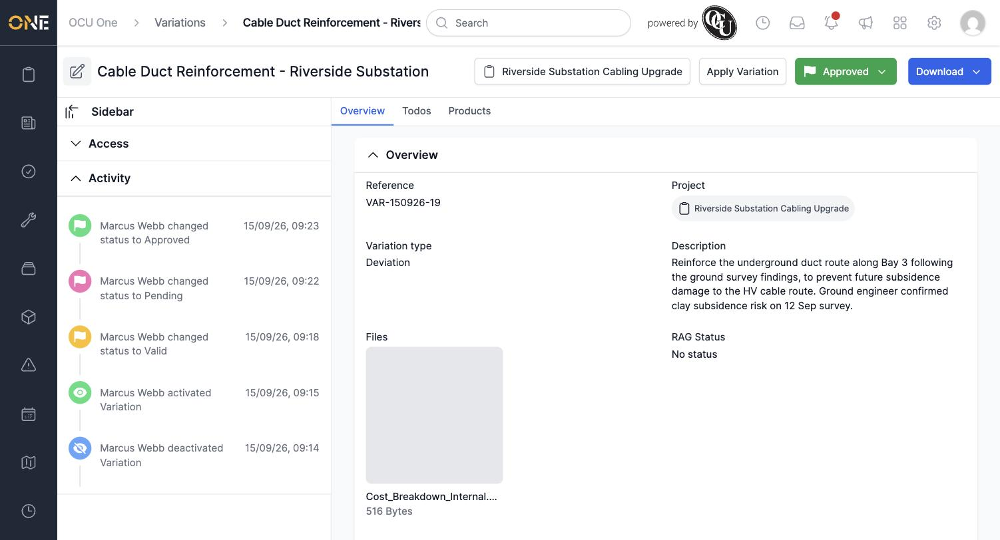

# Viewing a variation overview and updating status/RAG

A variation's **Overview** tab shows its core details and is where you move it through its approval workflow, from Draft through to Applied.

## The Overview tab

Open any variation to land on its Overview tab: reference, project, variation type, description, attached files, and (if the variation type has RAG scoring switched on) a **RAG Status**.

## Setting the RAG status

While a variation is still in **Draft**, click the **RAG Status** field to pick **Green**, **Amber**, or **Red**.

**Worth knowing:** RAG status can only be set (or changed) while the variation is in Draft. Once it moves to any later status, the RAG Status field becomes a plain read-only value with no dropdown.

## Changing status

Click the coloured status button in the top right (it shows the variation's current status) to see the statuses you can move to next. Each status only allows specific next steps:

- **Draft** → Invalid or Valid
- **Valid** → Pending
- **Pending** → Draft, Approved, or Rejected
- **Approved** → Draft
- **Rejected** → Draft
- **Applied** — final, no further changes

Pick **Valid** to move it forward.

*Once a variation leaves Draft, the Edit button and Products tab both stop being editable.*

Continue through **Pending**...

...and on to **Approved**, which unlocks the **Apply Variation** button (see **Applying an approved variation to a job or project**).

**Worth knowing:** after clicking a status option, the badge and Activity feed can take a moment to refresh — if it looks like nothing happened, reload the page to confirm the change went through.
