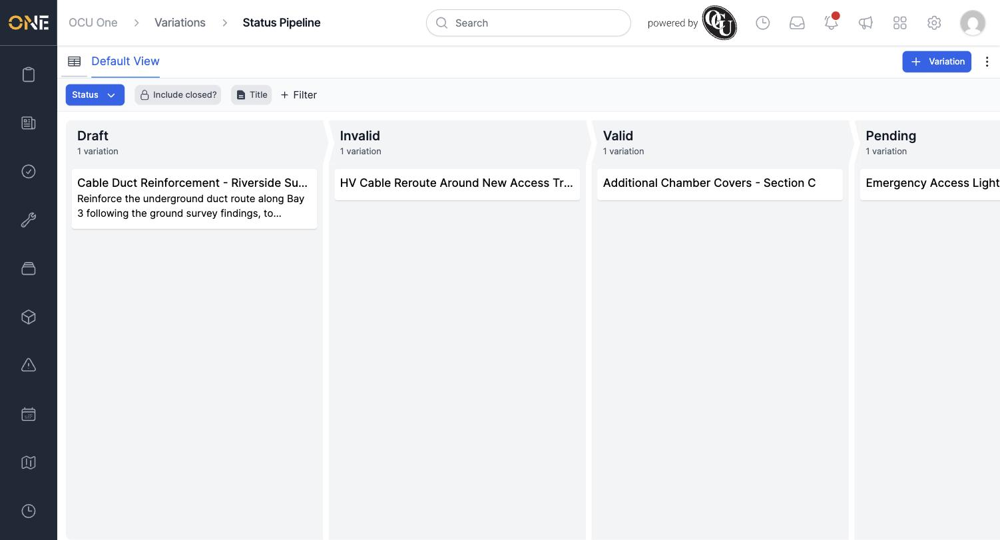

# Viewing and filtering variations and the variations pipeline

The **Variations** screen lists every variation raised across your projects, in either a table or a pipeline (kanban) board. Both views cover the same seven statuses a variation moves through: **Draft**, **Invalid**, **Valid**, **Pending**, **Approved**, **Applied**, and **Rejected**.

## Table view

Open **Variations** from the sidebar to see the default table. Each row shows the variation's title, description, type, status, and the project it belongs to.

*The Variations table. Click a title to open that variation.*

Use **Title** and **Status** to filter the list, or **+ Filter** to add another field. The **Include closed?** toggle brings back any deactivated variations that are hidden by default.

## Pipeline (board) view

Click the pipeline icon at the top left to switch to the board. This is the built-in **Status Pipeline** — a column for each of the seven statuses, showing how many variations sit in each one.

*The Status Pipeline board. Scroll right to see the remaining Approved, Applied, and Rejected columns.*

Switch back to the table at any time using the table icon in the same spot.

**Worth knowing:** unlike some other record types, variations don't support admin-configured custom pipelines — the Status Pipeline (based on the variation's status field) is the only board view available.
