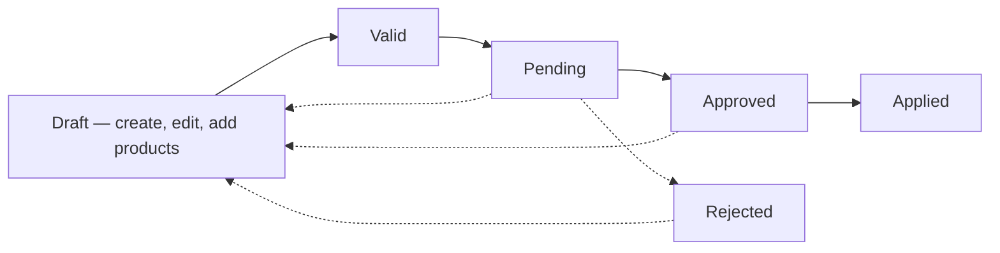

# Variations (Change Projects) — Overview

A **Variation** records a change to the agreed scope of work on a project — extra work, a deviation from the original plan — and what it's worth. This area covers browsing variations, raising and working one end to end, and everything around its PDF export.

## The core pieces

A variation belongs to a **Project** and has a **Variation Type** (e.g. Deviation). Like an estimate, its value comes entirely from the **products** allocated to it, not a typed-in figure. It moves through seven statuses: **Draft**, **Invalid**, **Valid**, **Pending**, **Approved**, **Applied**, and **Rejected** — each one only allowing specific next steps.

## The end-to-end flow

Start with [Viewing and filtering variations and the variations pipeline](Viewing%20and%20filtering%20variations%20and%20the%20variations%20pipeline.md) for the table and Status Pipeline board views.

[Creating a new variation](Creating%20a%20new%20variation.md) covers raising one against a project. Once it exists, [Managing products on a variation](Managing%20products%20on%20a%20variation.md) is how you give it a value, and [Editing, activating or deactivating, or deleting a variation](Editing%2C%20activating%20or%20deactivating%2C%20or%20deleting%20a%20variation.md) covers changing or removing it — all while it's still in Draft.

[Viewing a variation overview and updating status/RAG](Viewing%20a%20variation%20overview%20and%20updating%20status-rag.md) covers its overview page, setting a RAG status (Draft only), and moving it through the approval workflow. Once **Approved**, [Applying an approved variation to a job or project](Applying%20an%20approved%20variation%20to%20a%20job%20or%20project.md) turns its planned products into a real allocation on the project, moving it to **Applied**.

Rounding out the area: [Downloading or previewing a variation PDF](Downloading%20or%20previewing%20a%20variation%20PDF.md), [Sending a variation for client approval](Sending%20a%20variation%20for%20client%20approval.md), and [Toggling attachment visibility on a variation PDF](Toggling%20attachment%20visibility%20on%20a%20variation%20PDF.md) — controlling which files show up on that PDF.

## The flow at a glance

- **Draft** — the only status where you can edit details, manage products, or delete the variation.
- **Valid / Pending** — moving through review; Pending can still bounce back to Draft or be Rejected.
- **Approved** — locked for editing, but now applicable.
- **Applied** — final; its products are now a real allocation on the project.
