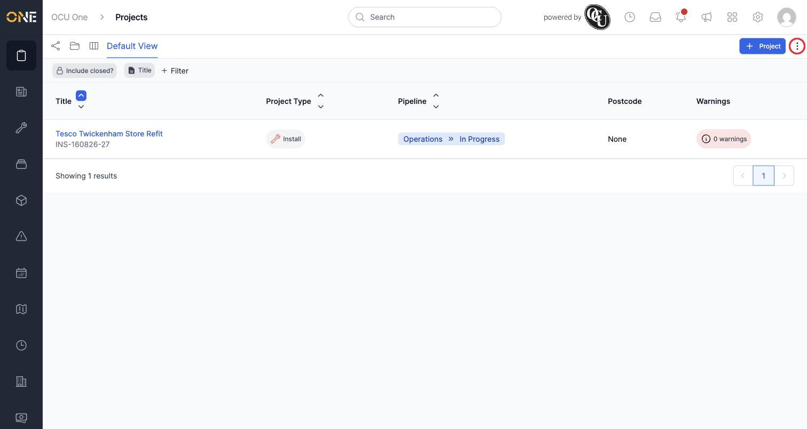
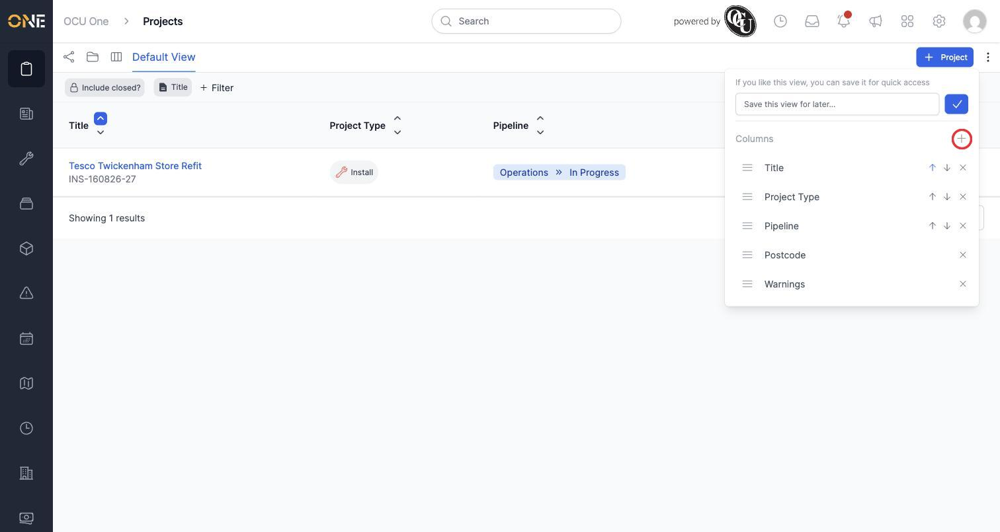
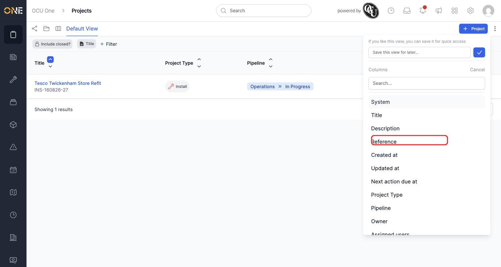
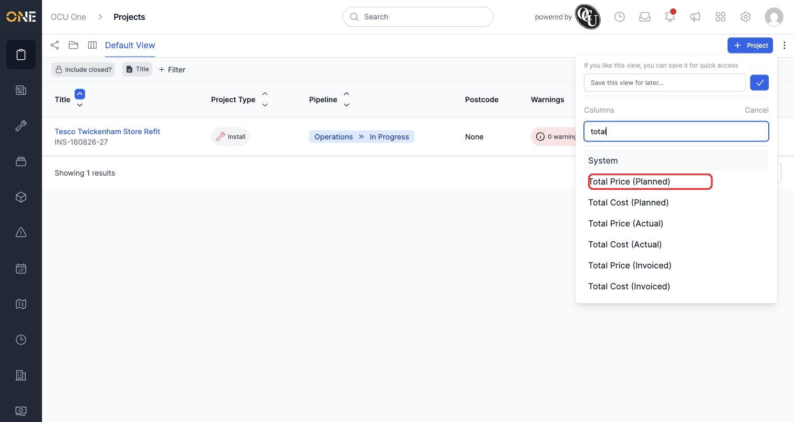
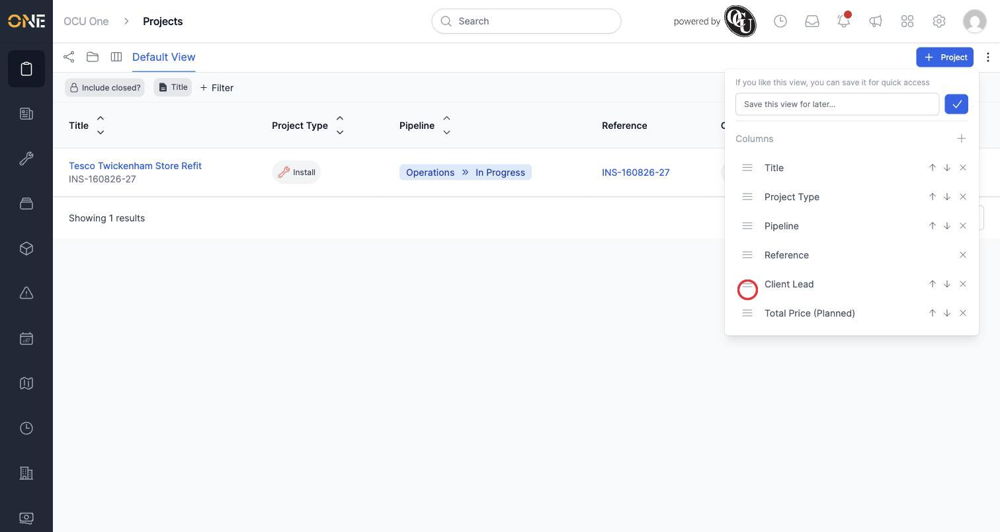
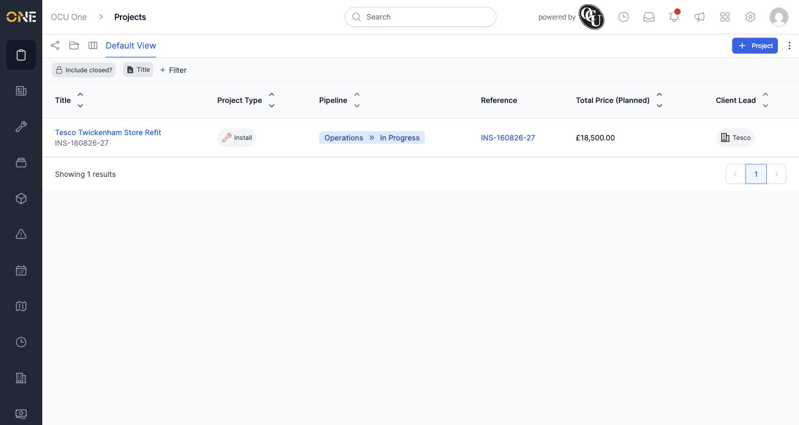

# Customising which columns appear in a list/table view

Every list screen in OCU One shows a default set of columns, but you can add, remove, and reorder them to show exactly the information you need. In this example, Priya customises the Projects list to show the project number, client, and planned total value.

## Opening the columns panel

1. Click the **⋮** (three-dot) menu in the top-right corner of the list screen.

   

2. A panel drops down showing every column currently on the list, along with sort arrows and a remove (**x**) button for each one.

   

## Adding a column

1. Click the **+** next to **Columns** to search for a field to add.

   

2. Type to search, then click the field you want — for example **Reference** (the project's reference number).

   

3. Repeat to add more columns. Here, **Total Price (Planned)** is added the same way.

   

4. Each column you add appears immediately in the table and in the columns list, alongside the ones already there.

   

## Reordering and removing columns

- To reorder a column, click and drag its handle (the **≡** icon on the left of its row) up or down in the list.
- To remove a column you no longer want to see, click the **x** on its row.

Continuing the example, removing the columns that aren't needed and putting **Total Price (Planned)** ahead of **Client Lead** gives a clean, purpose-built layout:

## Things to know

- Column changes apply immediately to what you're looking at, but like filters, they aren't saved automatically — reloading the page or navigating away resets to the list's saved view. To keep a customized set of columns for next time, save it as a personal view (see the guide on saving filters and columns as a new view).
- Not every field can be sorted from the columns panel — only certain ones show the up/down sort arrows next to their name. All columns can still be removed or reordered regardless.
- The columns available to add depend on the type of record the list shows — a Jobs list offers different fields to add than a Projects or Tickets list.
