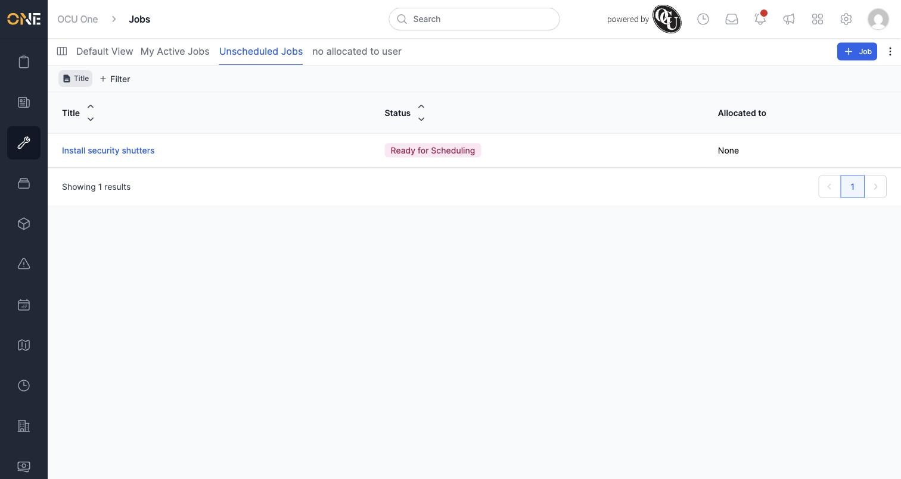
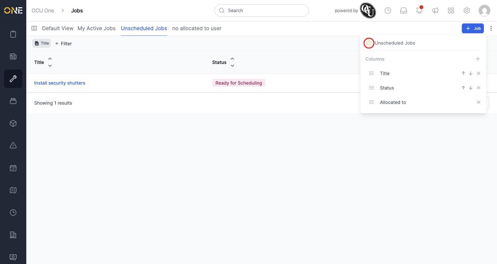
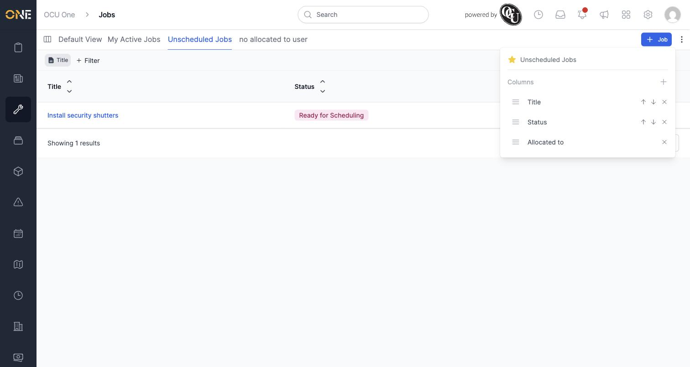
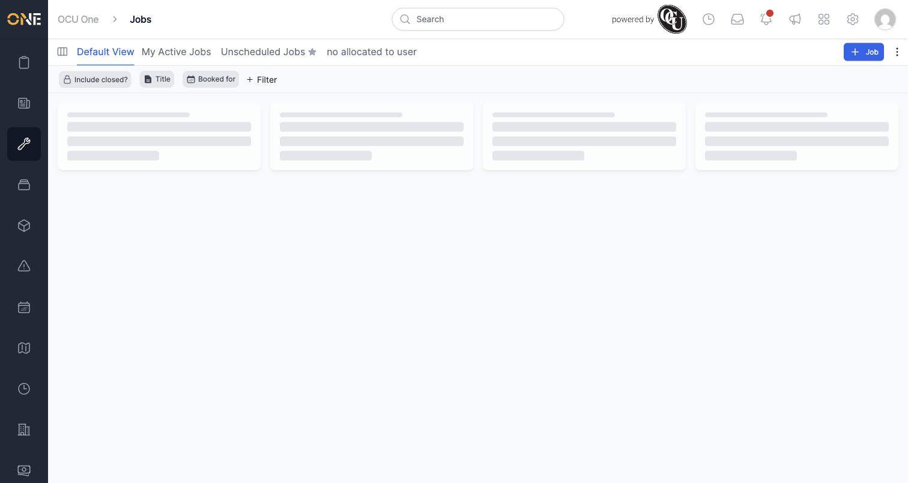

# Favouriting a saved view

If you have several saved views on a list screen, favouriting one marks it out so you can spot it at a glance in the tab bar — a small star appears next to its name whenever that tab isn't the one currently selected.

In this example, Priya favourites her "Unscheduled Jobs" view on the Jobs list.

## Favouriting a view

1. Open the saved view — here, **Unscheduled Jobs** — then click the **⋮** (three-dot) menu in the top-right corner.

   

2. Click the star icon next to the view's name at the top of the panel.

   

3. The star fills in immediately to show the view is now favourited.

   

4. Close the panel and check the tab bar — a star now appears next to **Unscheduled Jobs** whenever you're looking at a different tab.

   

## Things to know

- Only one saved view per list type can be favourited at a time — favouriting a different Jobs view (like "My Active Jobs") automatically un-favourites the one you had starred before. Favourites on different screens (like a Tickets view) aren't affected by this.
- The star doesn't show up next to the tab you're currently viewing — it's there to help you spot your favourite view from any of the other tabs, not to confirm which one is active.
- To un-favourite a view, open the same menu and click the filled star again.
