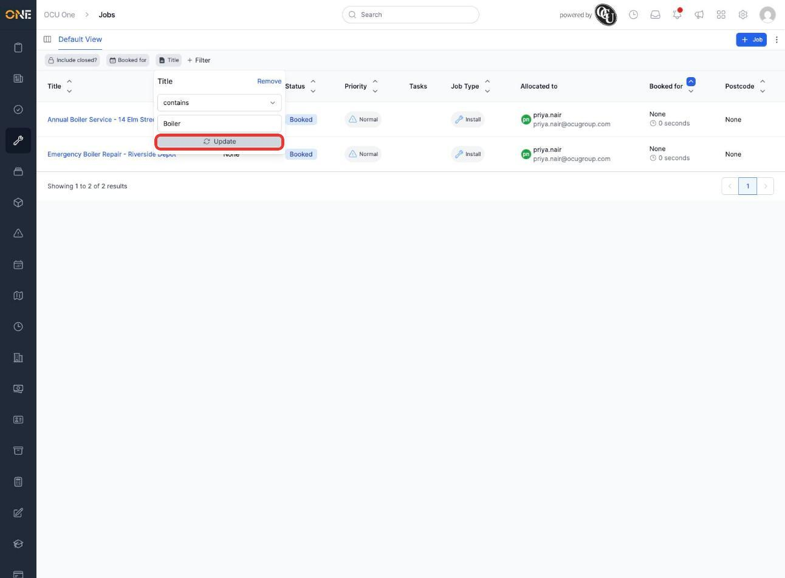
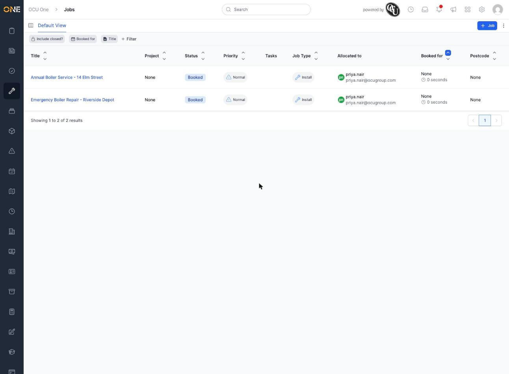
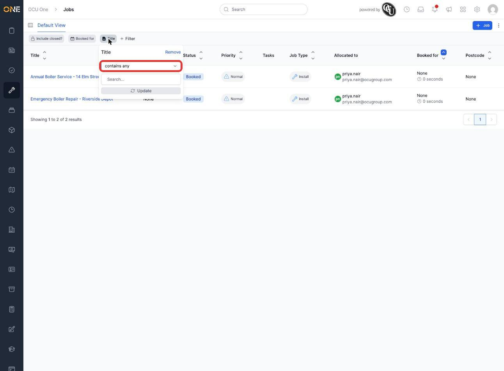
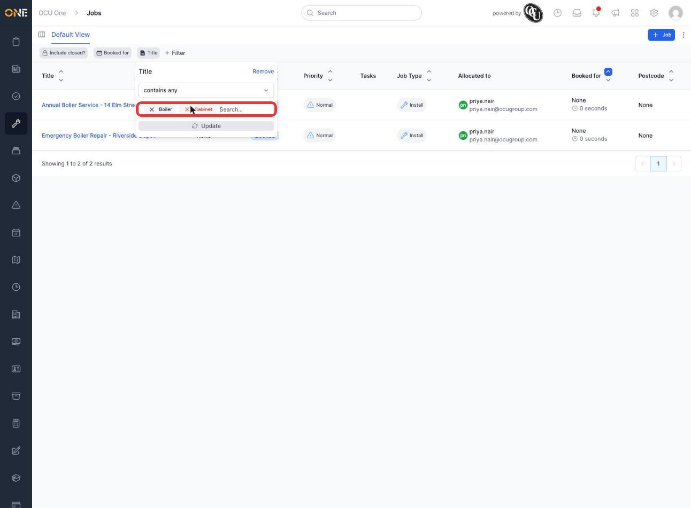
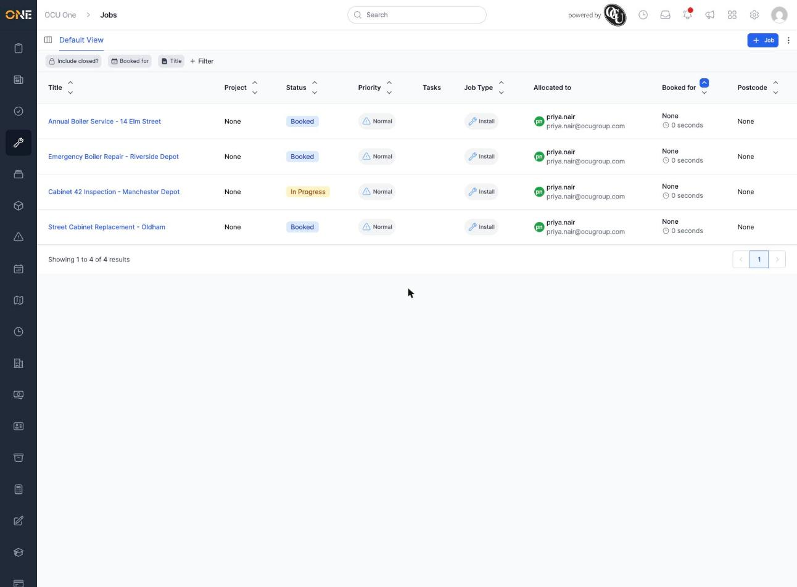
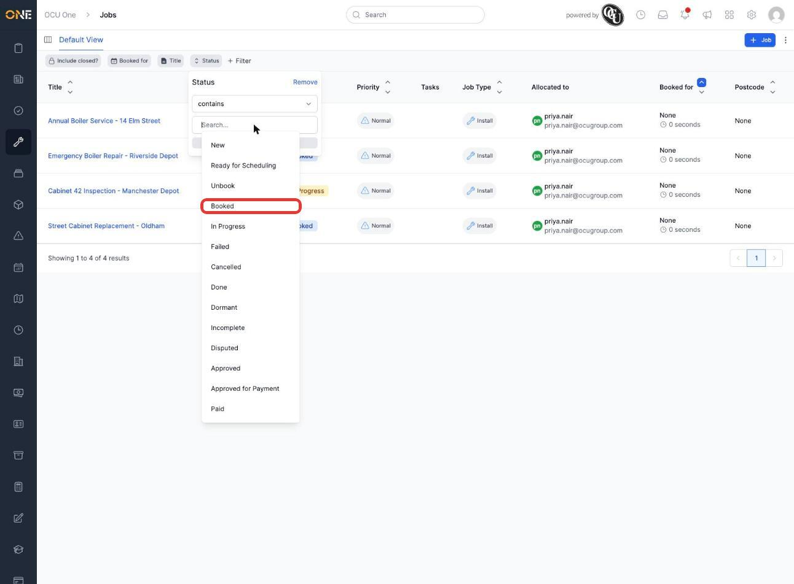
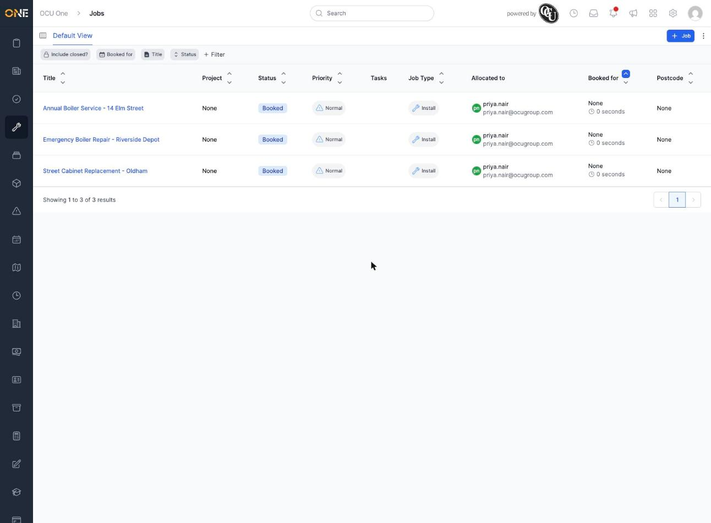
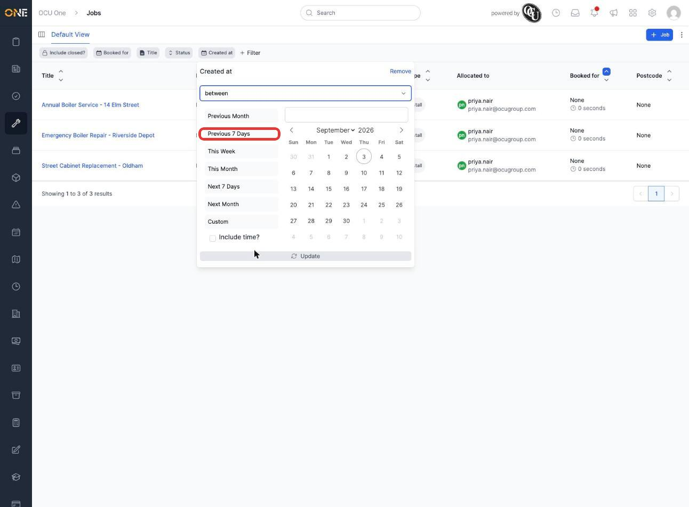
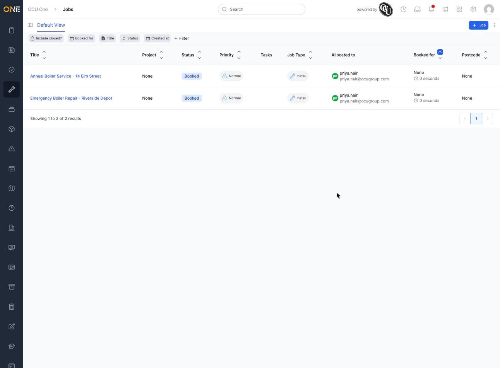

# Filtering a list view by a field

Most list screens in OCU One — Jobs, Tickets, Projects, and others — show every record you have access to by default. Filters let you narrow that list down to only the records that match specific criteria, so you're not scrolling through everything to find what you need.

In this example, Priya starts from the Jobs list and filters it down step by step: first by a word in the job title, then by status, then by when the job was created.

## Adding a filter

1. On any list screen, click **+ Filter** in the toolbar above the table.

   

2. A search box appears listing every field you can filter by. Type to search, or scroll the list, and click the field you want — for example **Title**.

3. A filter chip for that field appears in the toolbar and opens automatically. What you see next depends on the field's type — a text field like **Title** shows an operator (how to compare) and a box to type into. Leave the operator as **contains** and type a word, for example **Boiler**, then click **Update** to apply it.

   

   The list refreshes immediately to only show jobs whose title contains that word.

   

## Matching more than one word at once

Text filters like **Title** and **Description** also let you match several words in one go, instead of only one at a time.

1. Reopen the filter chip and change the operator from **contains** to **contains any**.

   

   The single text box is replaced with a tag-style box where you can add more than one word.

2. Type a word and press **Enter** to add it as a tag, then repeat for as many words as you want to match. Here, **Boiler** and **Cabinet** have both been added.

   

   Click **Update** to apply it. The list now shows every job whose title contains *either* word — not just one.

   

   To remove one of the words, click the **×** on its tag. To go back to matching a single word, switch the operator back to **contains**.

## Combining filters

You can add more than one filter at a time — each one narrows the list further rather than replacing what's already there.

1. Click **+ Filter** again and add a second field — for example **Status**. Depending on the field type you'll see different options — for **Status** it's a list of values to choose from. Click the value you want, for example **Booked**.

   

   Click **Update**. The list now only shows jobs that match *both* filters — the title still has to contain "Boiler" or "Cabinet", and the status has to be Booked.

   

2. Add a third filter — for example **Created at** — to narrow things down even further. Date fields let you pick a comparison (here, **between**) and then a ready-made range like **Previous 7 Days**, or set custom dates yourself.

   

3. Once you're happy with a filter's settings, click **Update** inside its chip to apply it. With all three filters active, the list shows only the jobs that match every one of them.

   

## Things to know

- Filters combine — adding a second filter narrows the list further rather than replacing the first one. A record has to match **all** active filters to show up.
- For a text field, the operator you choose changes what you can type: **contains**, **equals**, **starts with**, and similar operators take a single word or phrase, while **contains any** switches to the tag-style box so you can match several words at once.
- Each filter chip stays visible in the toolbar while it's active, so you can always see at a glance what the list is currently filtered by.
- Filters you add this way apply only while you're looking at the list — they aren't saved automatically. If you want to come back to the same filtered list later, see the guide on saving filters and columns as a new personal view.
- To change a filter you've already added, click its chip in the toolbar to reopen its settings. To remove one, open its chip and click **Remove**.
