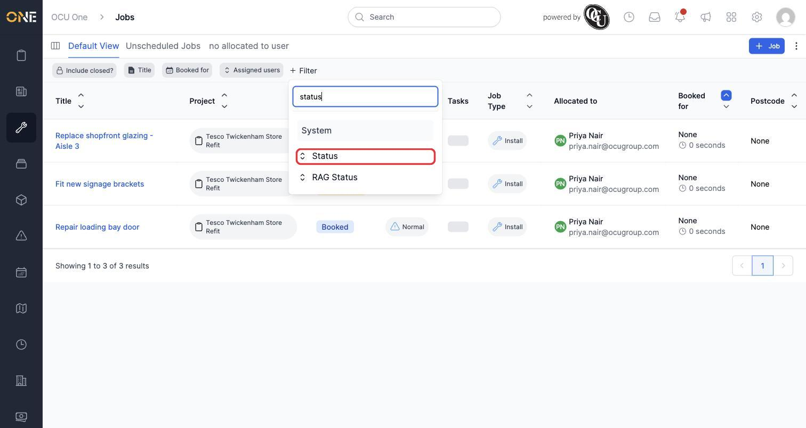
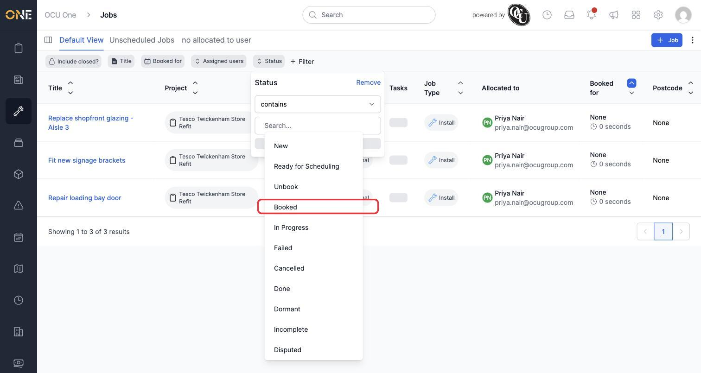
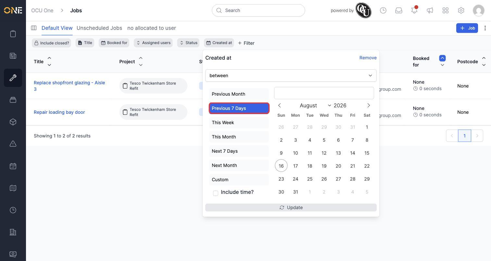
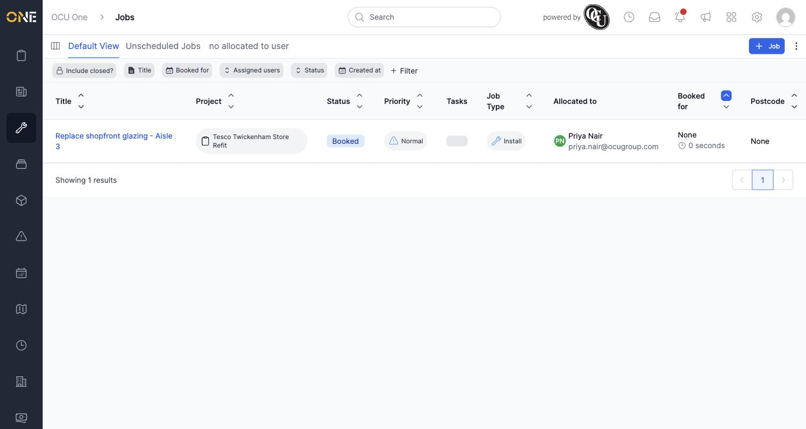

# Filtering a list view by a field

Most list screens in OCU One — Jobs, Tickets, Projects, and others — show every record you have access to by default. Filters let you narrow that list down to only the records that match specific criteria, so you're not scrolling through everything to find what you need.

In this example, Priya starts from the Jobs list already narrowed down to the jobs assigned to her, and then filters further by status and date.

## Adding a filter

1. On any list screen, click **+ Filter** in the toolbar above the table.

   

2. A search box appears listing every field you can filter by. Type to search, or scroll the list, and click the field you want — for example **Status**.

   

3. A filter chip for that field appears in the toolbar and opens automatically. Depending on the field type you'll see different options — for **Status** it's a list of values to choose from. Click the value you want, for example **Booked**.

   

4. You can add more than one filter at a time. Click **+ Filter** again and add a second field — for example **Created at** — to narrow things down further. Date fields let you pick a comparison (here, **between**) and then a ready-made range like **Previous 7 Days**, or set custom dates yourself.

   

5. Once you're happy with a filter's settings, click **Update** inside its chip to apply it. The list refreshes immediately to only show matching records.

   

## Things to know

- Filters combine — adding a second filter narrows the list further rather than replacing the first one. A record has to match **all** active filters to show up.
- Each filter chip stays visible in the toolbar while it's active, so you can always see at a glance what the list is currently filtered by.
- Filters you add this way apply only while you're looking at the list — they aren't saved automatically. If you want to come back to the same filtered list later, see the guide on saving filters and columns as a new personal view.
- To change a filter you've already added, click its chip in the toolbar to reopen its settings. To remove one, open its chip and click **Remove**.
