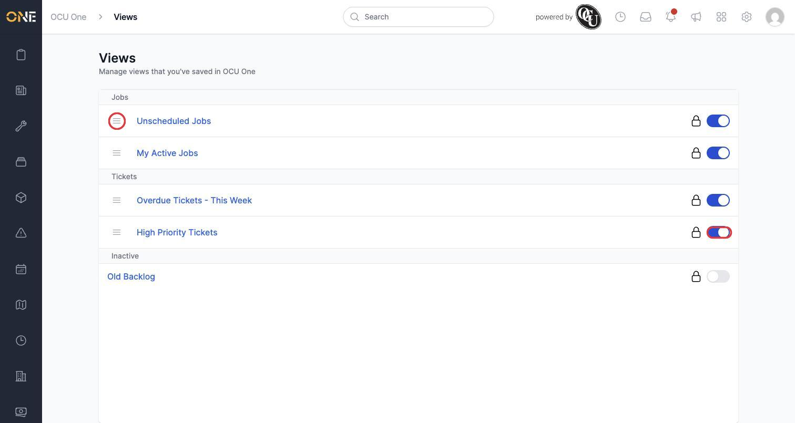
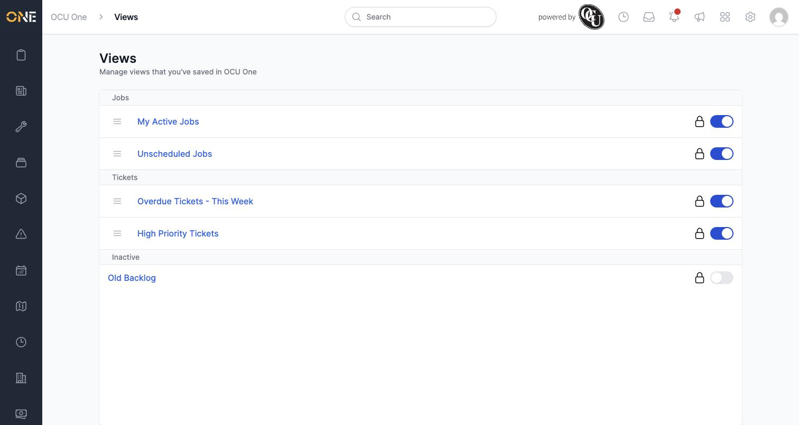
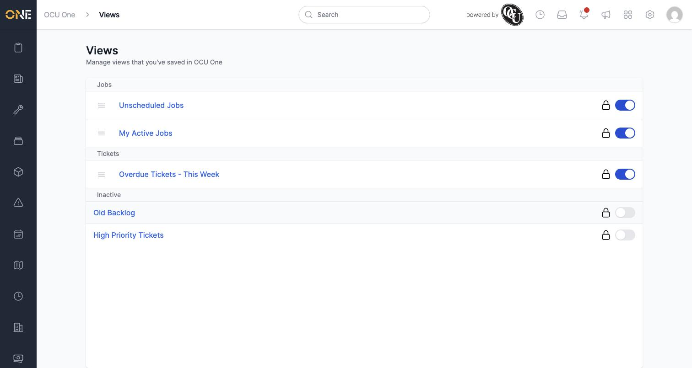

# Managing all your saved views ("My Views")

The **Views** page brings together every saved view you've created across the whole app, grouped by the list they belong to. It's the place to reorder, deactivate, or jump into any of them without hunting through each individual screen.

In this example, Priya has five saved views: two on Jobs (**Unscheduled Jobs**, **My Active Jobs**), two on Tickets (**Overdue Tickets - This Week**, **High Priority Tickets**), and one already deactivated (**Old Backlog**).

## Viewing all your views

Open **Views** from the app to see every saved view, grouped under the screen it belongs to (Jobs, Tickets, and so on), with a final **Inactive** group at the bottom for any you've deactivated.

## Reordering your views

Click and drag a view's handle (the **≡** icon on the left) up or down within its group to change the order its tab appears in on the list screen.

## Deactivating and reactivating a view

Click the toggle switch on the right of any view to deactivate it. A deactivated view drops out of the tab bar on its list screen and moves down into the **Inactive** group here — but it isn't deleted, so you can switch it back on at any time by clicking the same toggle.

## Things to know

- Clicking a view's name takes you straight to that list screen with the view applied, just like clicking its tab would.
- Reordering only affects the order of tabs within that view's own screen (for example, reordering your Jobs views doesn't touch the order of your Tickets views).
- Deactivating a view is reversible and doesn't lose any of its filters or columns — reactivating brings it back exactly as it was.
