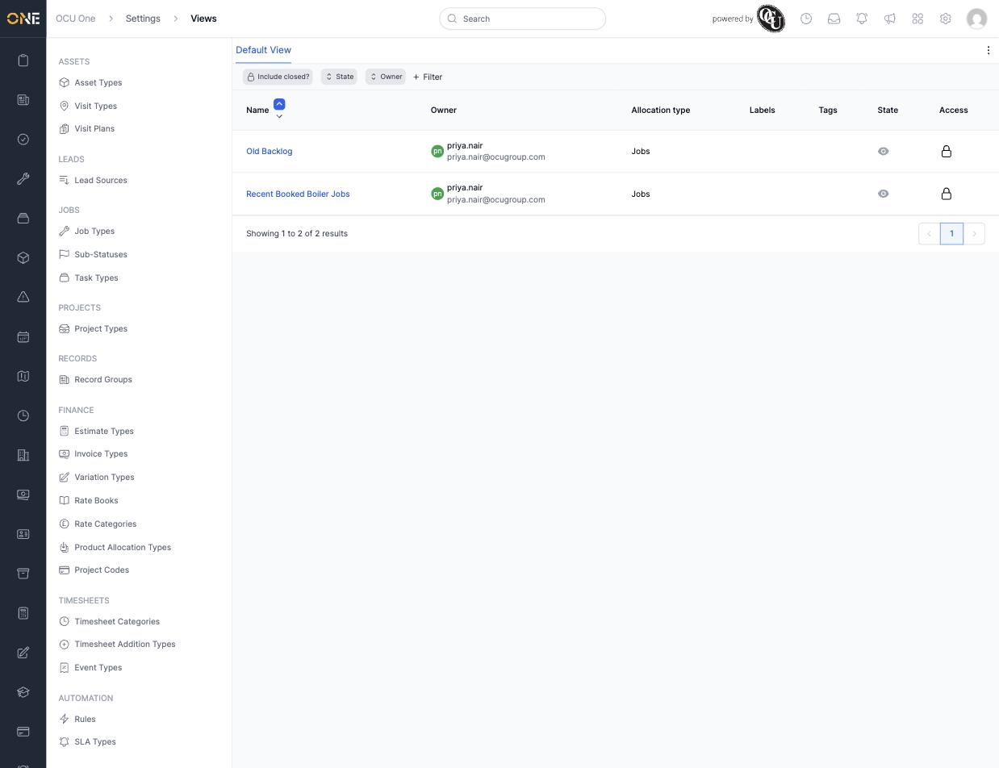
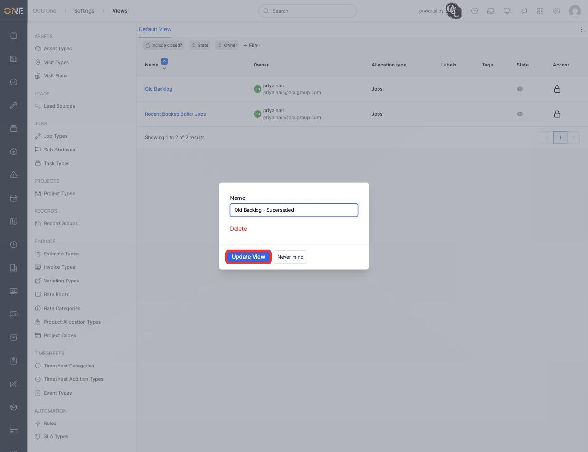
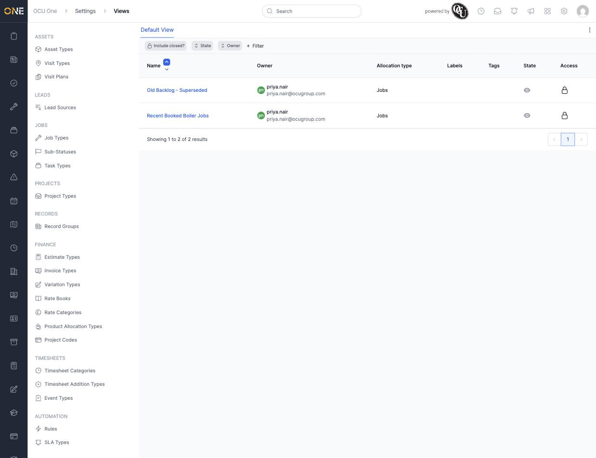
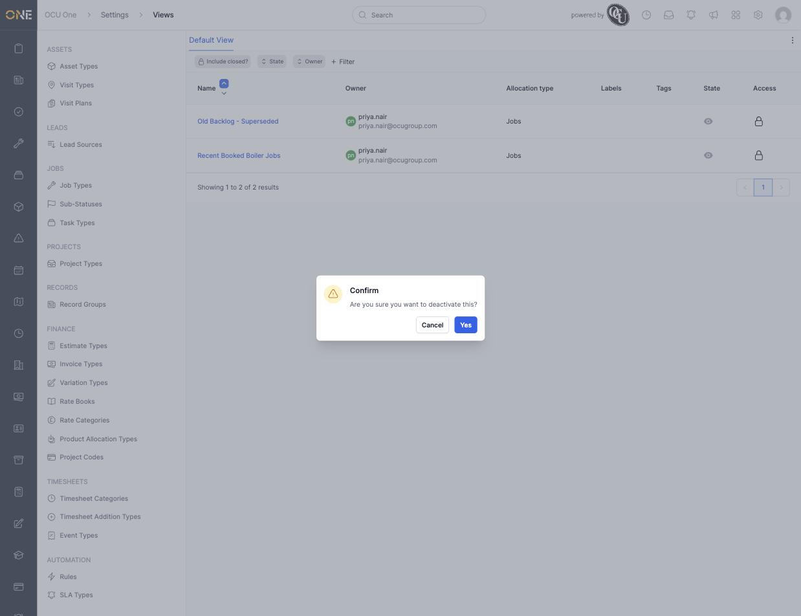
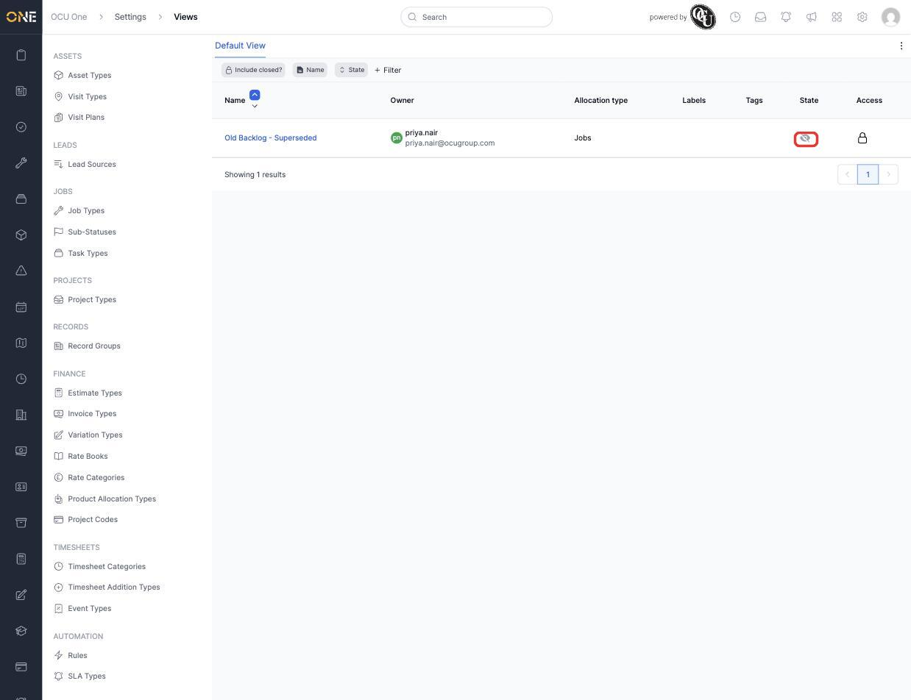
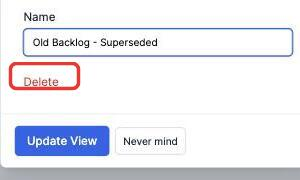
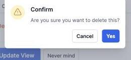
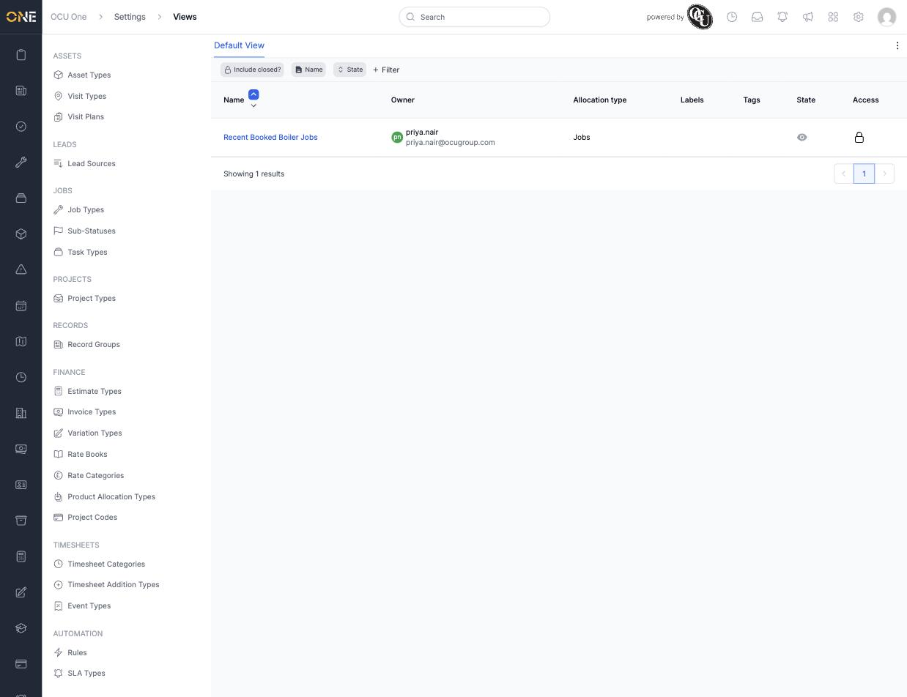

# Managing saved views (admin)

If you have admin access, **Settings > Views** lets you see and manage every saved view across the whole tenant — not just your own. From here you can rename, deactivate, reactivate, or delete a view that belongs to any user, which is useful for cleaning up or correcting views on someone else's behalf.

In this example, Marcus (an admin) manages a view belonging to Priya Nair.

## Finding a user's views

1. Open **Settings > Views**. Use the **+ Filter** toolbar to add an **Owner** filter and narrow the list down to the person you're looking for — here, Priya Nair. Every saved view in the tenant appears here by default, so filtering down to one person keeps things manageable.

   

## Renaming someone else's view

1. Click the view's name — here, **Old Backlog** — to open its edit panel. The panel shows a **Name** field, a **Delete** link, and **Update View** / **Never mind** buttons.

2. Clear the **Name** field and type the new name — here, "Old Backlog - Superseded".

   

3. Click **Update View**. The name updates immediately in the list, and the change is visible to the view's owner too, the next time they open it.

   

## Deactivating and reactivating someone else's view

1. Click the eye icon in the **State** column for the view you want to deactivate.

2. Confirm by clicking **Yes** on the prompt that appears.

   

3. The view drops out of the active list. To see it again, turn on **Include closed?** in the toolbar — the **State** column shows a crossed-out eye for anything deactivated.

   

4. To reactivate it, click that same icon again and confirm. The view returns to normal and reappears in the active list without needing **Include closed?** turned on.

## Deleting someone else's view

1. Open the view's edit panel and click **Delete**.

   

2. Confirm by clicking **Yes** on the prompt that appears. This permanently removes the view — unlike deactivating, there's no way to bring it back afterwards.

   

3. The view is gone from the list for good, while the owner's other views are unaffected.

   

## Things to know

- These admin actions work on any user's view, not just your own — always check the **Owner** column before making a change.
- Renaming, deactivating, or reactivating a view here doesn't touch its filters or columns; the view works exactly the same for its owner, just under a new name or hidden from their tab bar.
- Deactivating is reversible from this same screen at any time. Deleting is not — use it only for views you're sure aren't needed.
- Only admins with permission to manage views will see this page under **Settings**.
