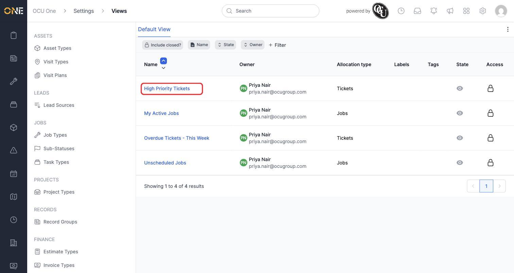
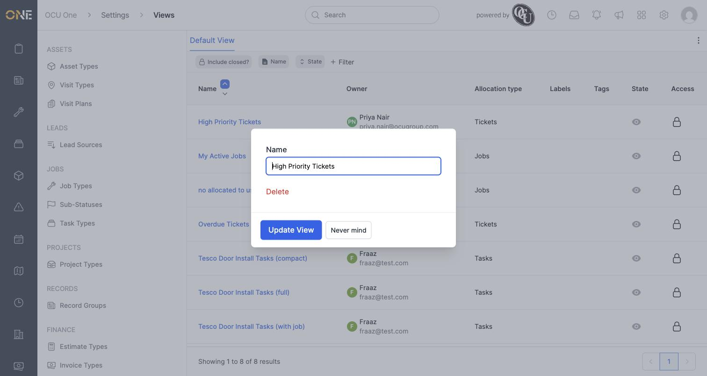
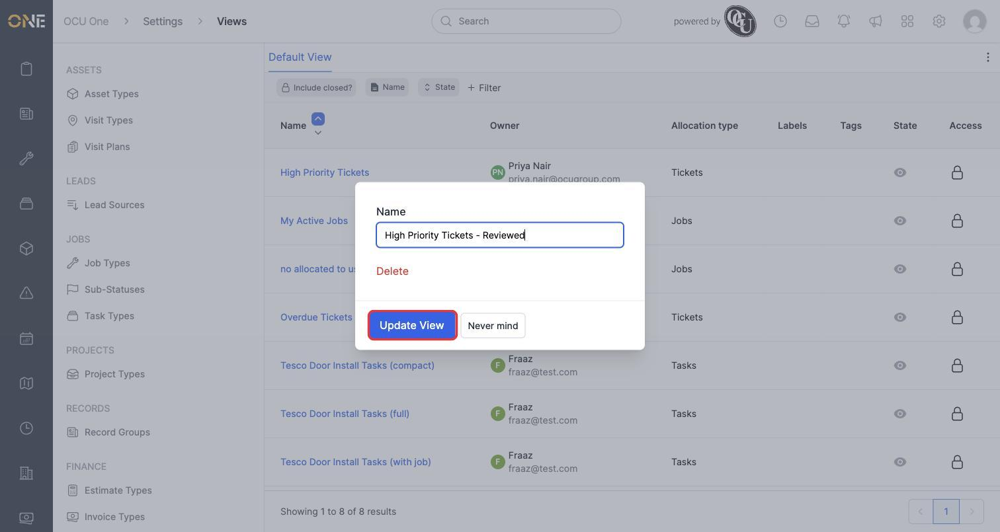
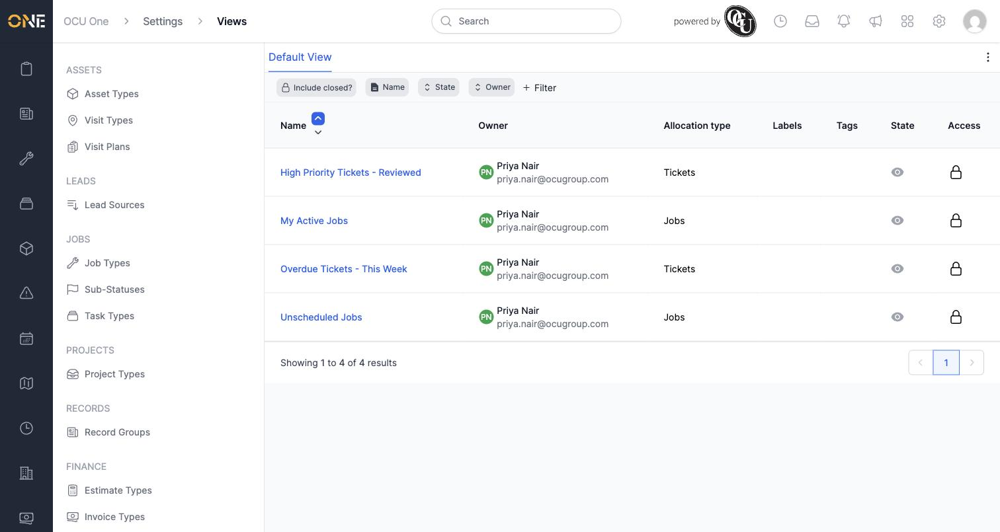
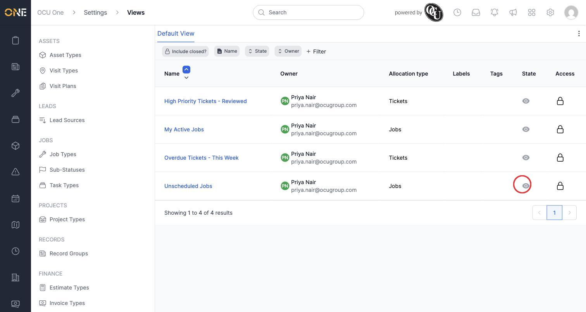
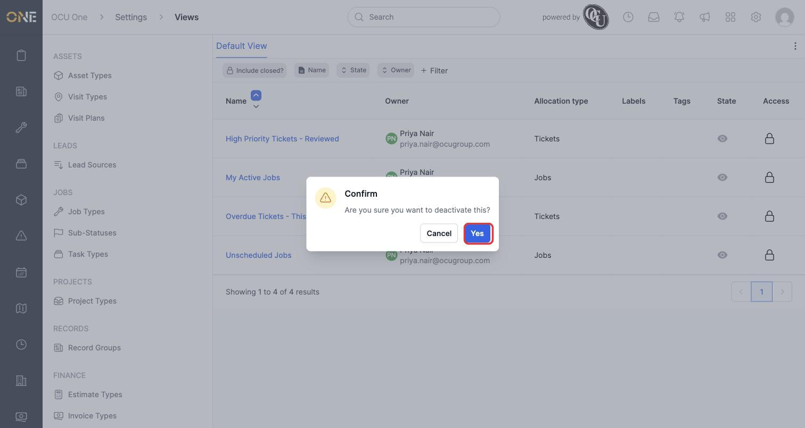
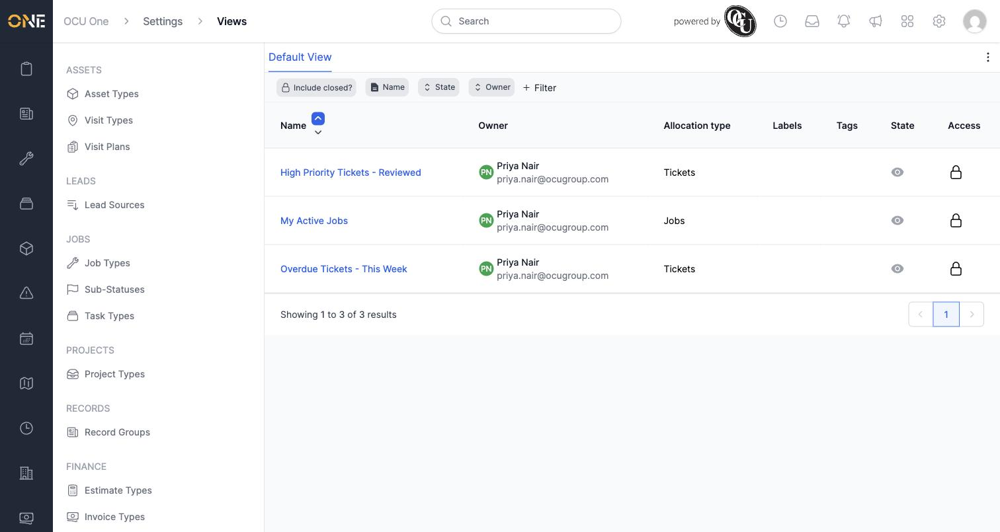

# Managing saved views (admin)

If you have admin access, **Settings > Views** lets you see and manage every saved view across the whole tenant — not just your own. From here you can rename or deactivate a view that belongs to any user, which is useful for cleaning up or correcting views on someone else's behalf.

In this example, Marcus (an admin) manages views belonging to Priya Nair.

## Finding a user's views

1. Open **Settings > Views**. Use the **Owner** filter to narrow the list down to the person you're looking for — here, Priya Nair.

   

## Renaming someone else's view

1. Click the view's name — here, **High Priority Tickets** — to open its edit panel.

2. The panel shows a **Name** field along with **Delete**, **Update View**, and **Never mind**.

   

3. Clear the **Name** field and type the new name — here, "High Priority Tickets - Reviewed" — then click **Update View**.

   

4. The view's name updates immediately, and the change is visible to Priya too the next time she opens her Tickets list.

   

## Deactivating someone else's view

1. Click the eye icon in the **State** column for the view you want to deactivate — here, Priya's **Unscheduled Jobs**.

   

2. Confirm by clicking **Yes** on the prompt that appears.

   

3. The view disappears from the active list. It isn't deleted — Priya can still see it (and reactivate it herself) in her own **My Views** page.

   

## Things to know

- These admin actions work on any user's view, not just your own — always check the **Owner** column before making a change.
- Renaming or deactivating a view here doesn't touch its filters or columns; the view works exactly the same for its owner, just under a new name or hidden from their tab bar.
- Deactivating is reversible. A deactivated view isn't deleted — its owner can switch it back on any time from their own **My Views** page.
- Only admins with permission to manage views will see this page under **Settings**.
