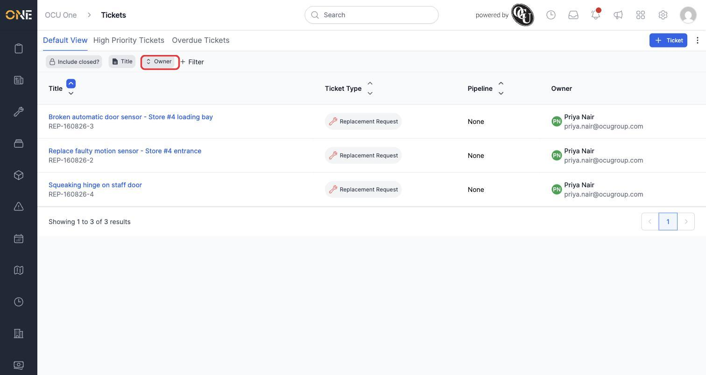
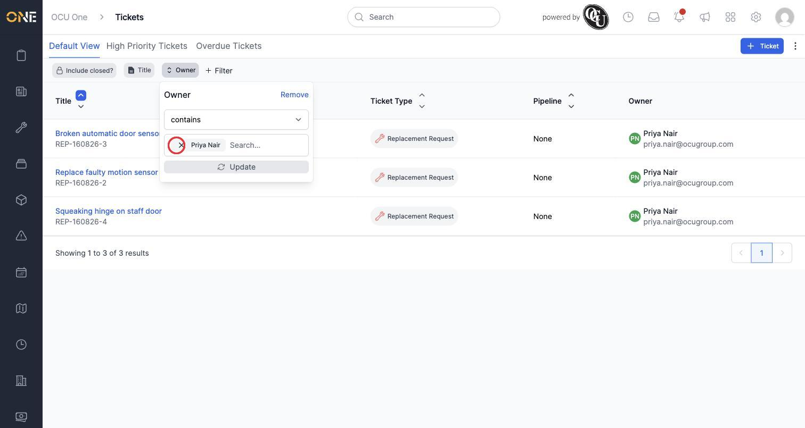
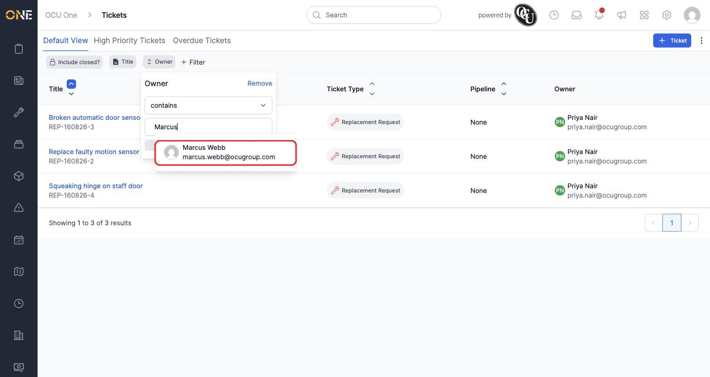
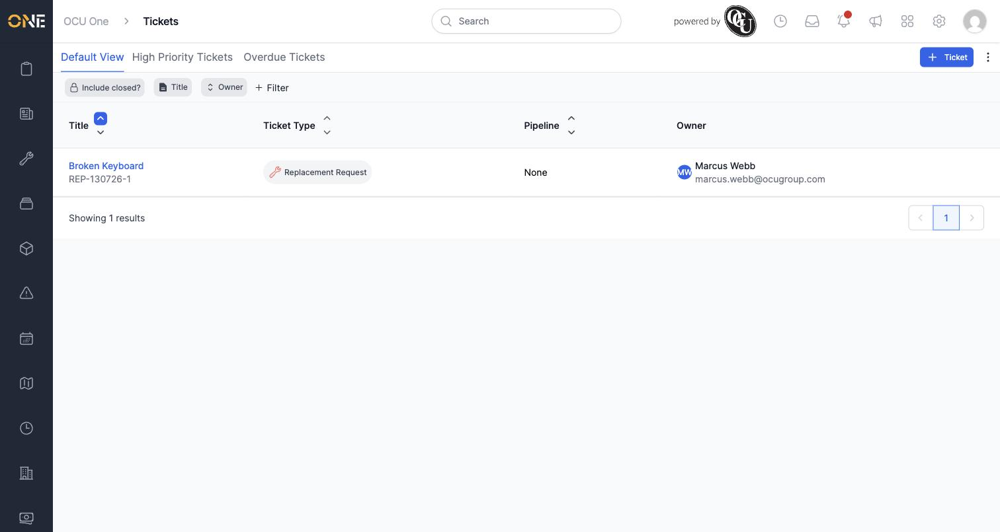
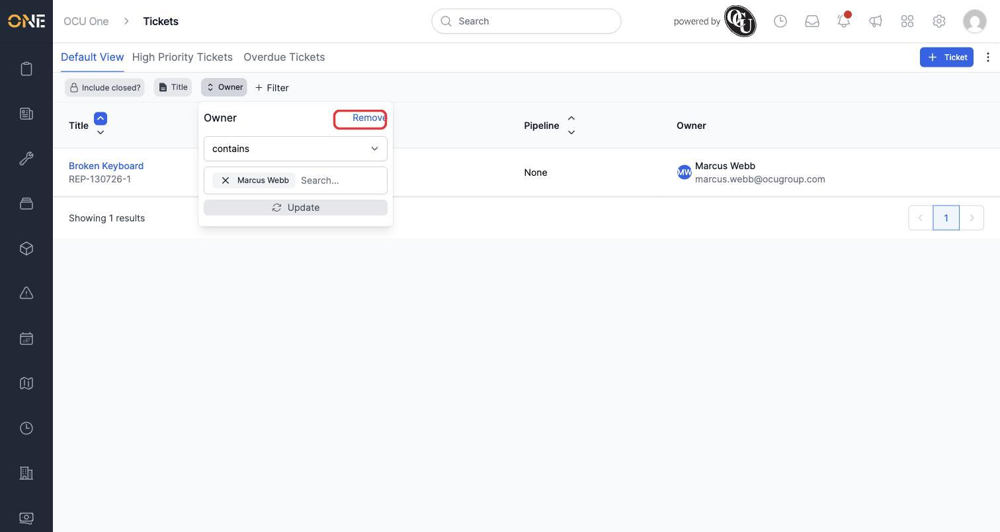
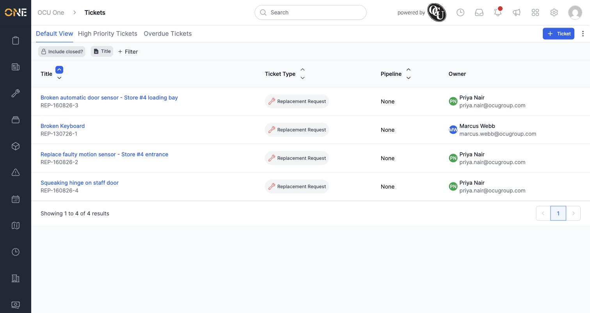

# Removing or updating an active filter

Once a filter is applied to a list, it stays active until you change or remove it. This guide covers changing what an existing filter is looking for, and taking a filter off altogether.

In this example, Priya is looking at the Tickets list, which already has a filter applied for **Owner**.

## Updating an existing filter

1. Click the filter's chip in the toolbar to reopen it. Here, the **Owner** filter is currently set to **Priya Nair**, which is why only her 3 tickets are shown.

   

2. Inside the chip, click the small **x** on the current value to remove it from the filter.

   

3. Type to search for the new value you want instead, and click it from the results — here, **Marcus Webb**.

   

4. Click **Update** to apply the change. The list refreshes to match the new filter value.

   

## Removing a filter entirely

1. Click the filter's chip to reopen it, then click **Remove** in the top-right corner of the panel.

   

2. The filter chip disappears from the toolbar, and the list goes back to showing everything you have access to.

   

## Things to know

- Updating a filter's value doesn't create a new filter — it replaces what the existing one is looking for, so the chip itself stays in the same place in the toolbar.
- Some filter types (like a person or a status) only hold one value in the **contains** condition shown here; others let you add several values by searching and selecting more than once before clicking **Update**.
- Removing a filter is immediate once you click **Remove** — there's no confirmation step, so double-check you've got the right chip open first if you have more than one filter active.
