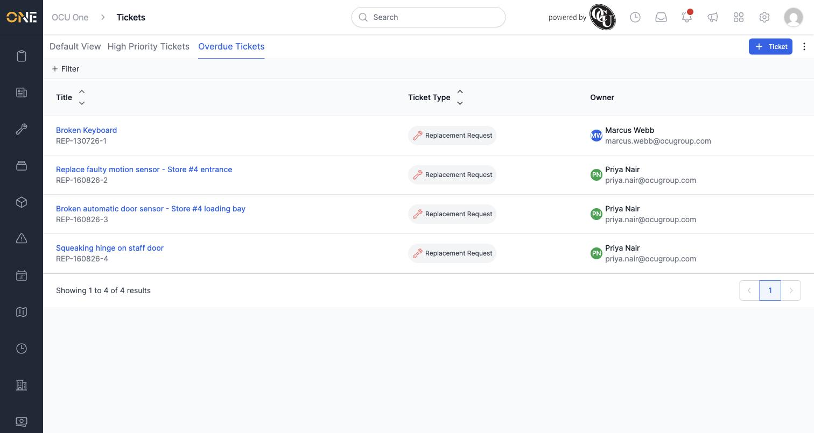
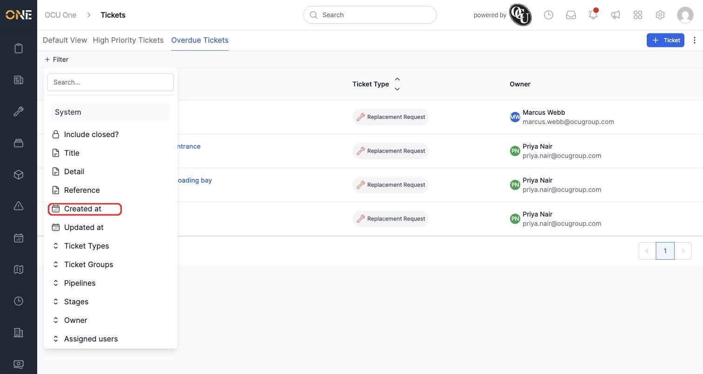
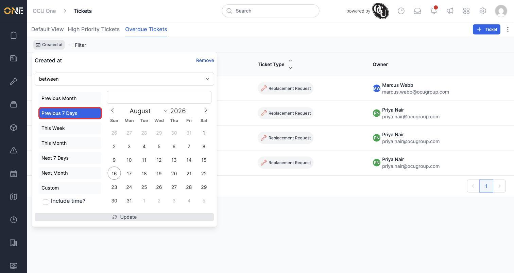
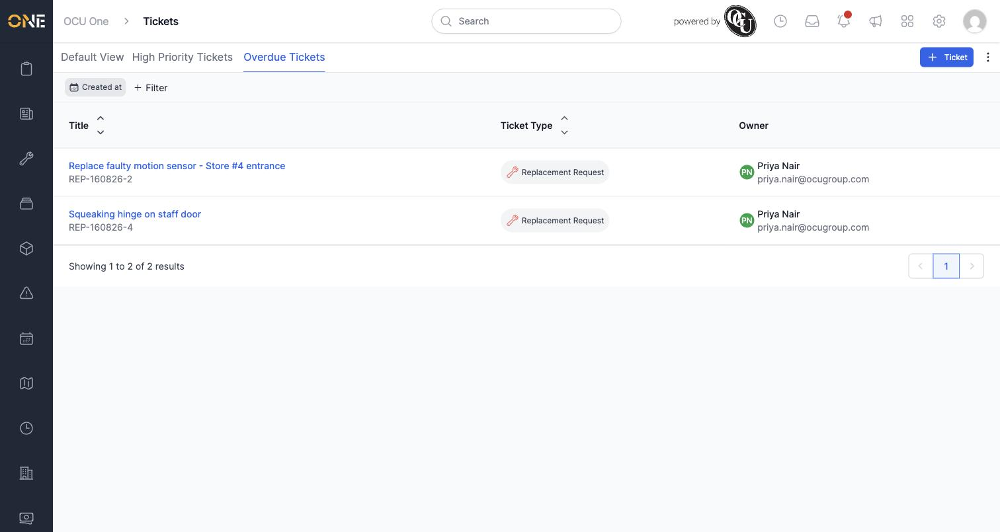
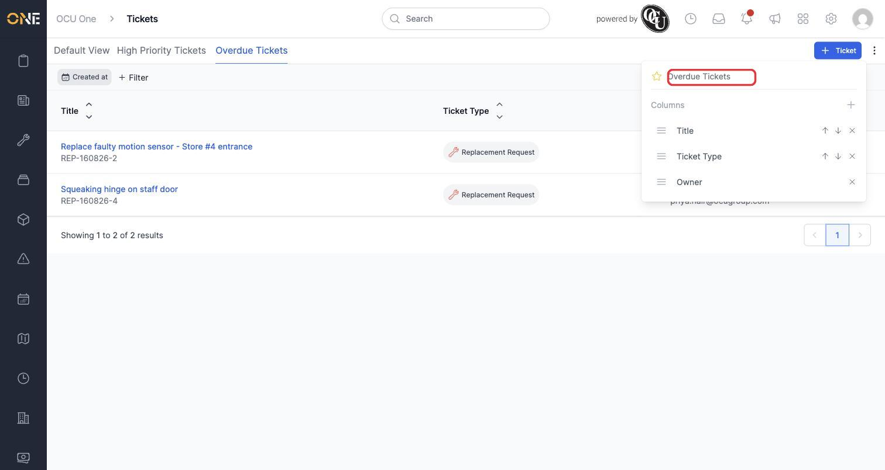
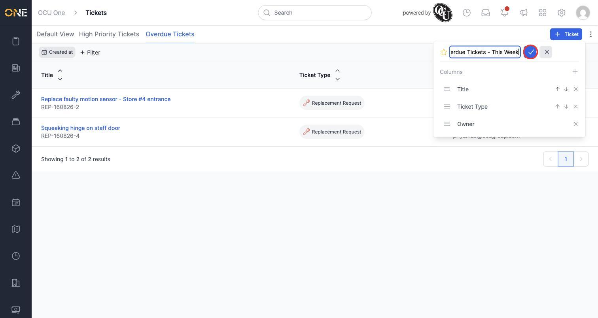
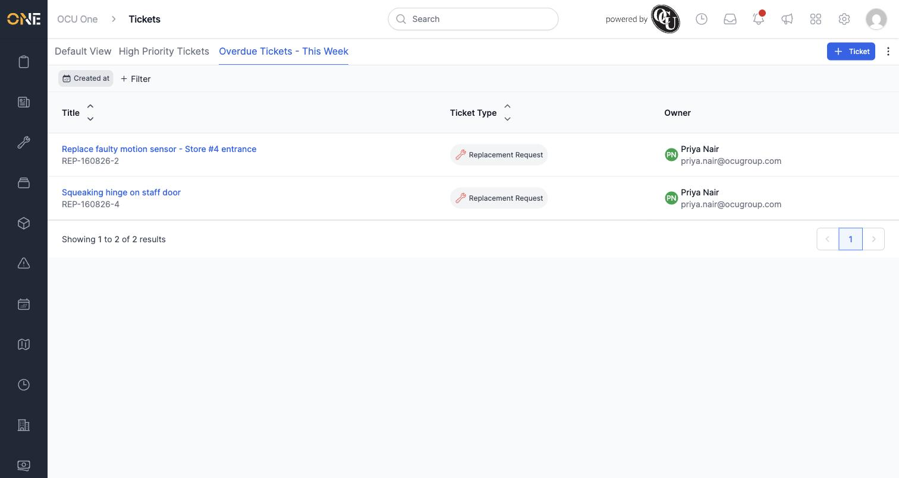

# Renaming and updating an existing saved view

A saved view isn't fixed once you've created it — you can add or change its filters at any time, and give it a new name to match. In this example, Priya updates her "Overdue Tickets" view by adding a date filter, then renames it to reflect the narrower scope.

## Adding a filter to an existing view

1. Open the saved view by clicking its tab — here, **Overdue Tickets**.

   

2. Click **+ Filter** and choose a field to narrow the view down further — here, **Created at** (the closest available field to a due date, since tickets don't have a dedicated due-date field in this app).

   

3. Choose **between** and pick a ready-made range like **Previous 7 Days**.

   

4. Click **Update** to apply. Because you're on a saved view (not Default View), this updates the view itself — the new filter becomes part of it.

   

## Renaming the view

1. Click the **⋮** (three-dot) menu in the top-right corner. For a saved view, this panel shows the view's current name at the top, editable directly.

   

2. Click into the name field, clear it, and type the new name — here, "Overdue Tickets - This Week".

   

3. Click the checkmark to confirm. The tab updates immediately to show the new name.

   

## Things to know

- Filters and columns you add or remove while a saved view is open update that view directly — there's no separate "save changes" step, so double check you're on the right tab before making changes you don't want to keep.
- Renaming only changes the label on the tab — it doesn't affect the filters, columns, or any data. You can rename a view as many times as you like.
- The star icon next to the name in this panel is the same star used to favourite a view — see the guide on favouriting a saved view.
