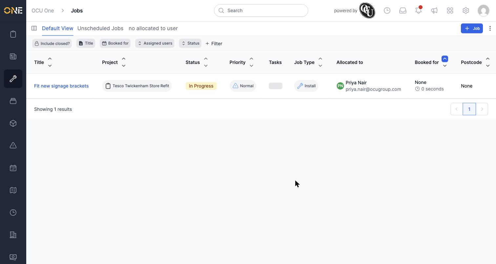
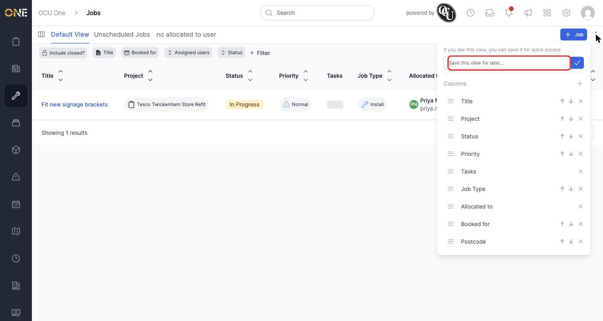
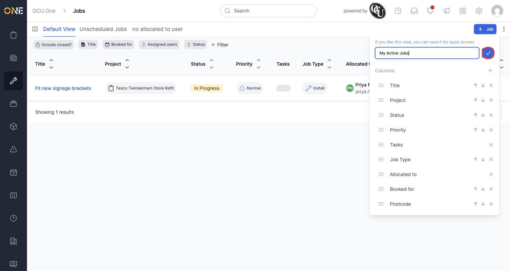
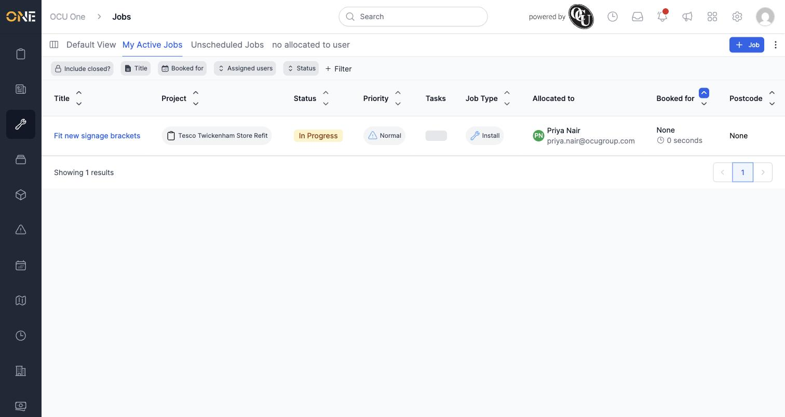

# Saving current filters/columns as a new personal view

Once you've set up a list screen exactly how you want it — filtered down and showing the columns you care about — you can save that setup as a personal view. It then appears as its own tab alongside **Default View**, so you can jump straight back to it any time without re-applying your filters.

In this example, Priya has filtered the Jobs list to jobs assigned to her with a status of **In Progress**, and wants to save this as a view called "My Active Jobs".

## Saving the view

1. With your filters and columns set up the way you want, click the **⋮** (three-dot) menu in the top-right corner.

   

2. A panel drops down with a **Save this view for later...** field at the top.

   

3. Type a name for the view — here, "My Active Jobs" — then click the checkmark button to save it.

   

4. The view is saved immediately and appears as a new tab next to **Default View**, already selected and showing your filtered results.

   

## Things to know

- A saved view remembers both your filters and your column layout at the moment you save it — if you change either afterwards, you'll need to save again (or update the view — see the guide on renaming and updating an existing saved view) for those changes to stick.
- Saved views are personal — only you see the ones you create, alongside any default or shared views for that screen.
- Once saved, a view can be renamed, reordered, favourited, deactivated, or deleted from **My Views** (see the guide on managing all your saved views).
