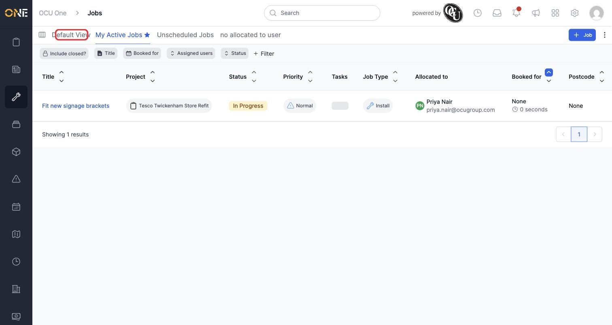
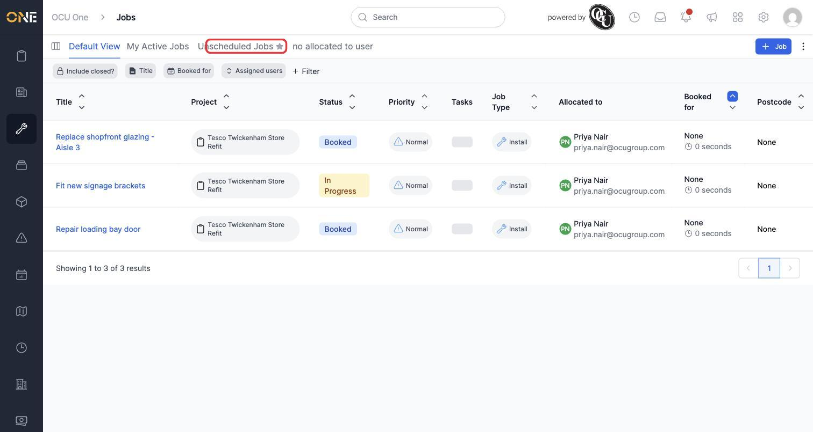
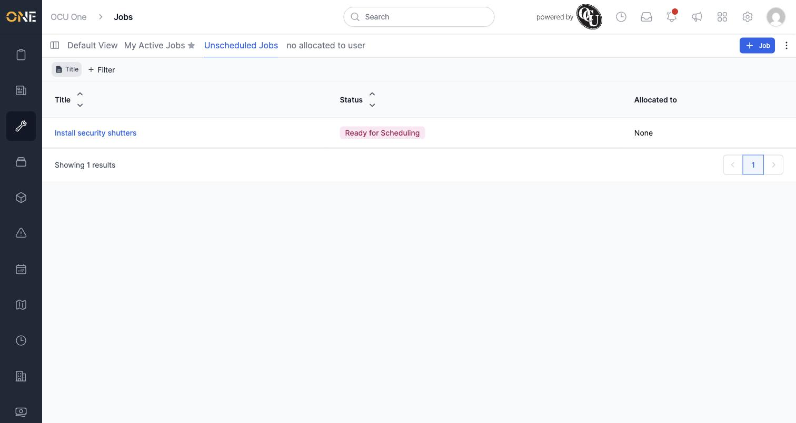

# Switching between saved views on a list screen

Every saved view you create for a list screen shows up as its own tab, right alongside **Default View**. Switching between them is as simple as clicking a different tab — there's no need to reapply filters each time.

In this example, Priya's Jobs list has three tabs: **Default View**, **My Active Jobs** (which she's favourited, shown by the star), and **Unscheduled Jobs**.

## Switching views

1. Starting on **My Active Jobs**, click **Default View** to switch to it.

   

2. **Default View** loads immediately. Unlike a saved view, it doesn't come with its own filters — here Priya has added an **Assigned users** filter for herself so the list only shows her own jobs.

   

3. Click **Unscheduled Jobs** to switch again.

4. That view loads with its own filters and columns already applied.

   

## Things to know

- The currently active tab is underlined and shown in a different colour, so you can always tell which view you're looking at.
- A tab with a star next to its name (like **My Active Jobs** here) is one you've favourited — see the guide on favouriting a saved view.
- Switching tabs is instant and doesn't lose your place elsewhere — you can jump between Default View and any of your saved views as often as you like.
