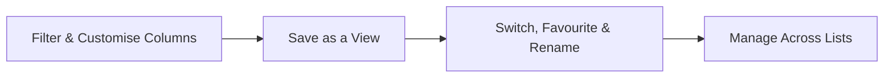

# Views — Overview

Almost every list screen in OCU One — Jobs, Tickets, Projects, and others — can be filtered, have its columns customised, and saved as a **View** for next time. This guide explains how filters, columns, and saved views fit together, before you dive into the detailed guides for each part.

## The core pieces

A **Filter** narrows a list down to only the records matching specific criteria — a status, an owner, a date range — instead of showing everything you have access to.

**Columns** control which fields appear in a list's table, and in what order.

A **Saved View** captures a specific combination of filters and columns under a name of its own, so you can jump straight back to that exact setup later instead of rebuilding it by hand. Every list starts with a **Default View**, and any views you save appear as extra tabs alongside it.

## Why this matters

Filters, columns, and saved views are how a list screen goes from "everything, in the default layout" to "exactly what I need to see, ready whenever I open it":

- **Speed** — jumping to a saved view is instant; there's no re-applying filters or rebuilding a column layout every time you open a list.
- **Focus** — the right filters and columns mean you're looking at the records and fields relevant to your work, not scrolling past everything else.
- **Consistency** — a favourited view or a shared admin-managed view means the same narrowed-down list is there for you (or your team) every time.

## The end-to-end flow

It starts with **narrowing down and customising** a list as it stands right now. Add filters to cut the list down to matching records — see [Filtering a list view by a field](Filtering%20a%20list%20view%20by%20a%20field.md) and [Removing or updating an active filter](Removing%20or%20updating%20an%20active%20filter.md) — and adjust which fields show up, and in what order, via [Customising which columns appear in a list-table view](Customising%20which%20columns%20appear%20in%20a%20list-table%20view.md). Both filters and columns applied this way are temporary — they reset once you navigate away, unless you save them.

To keep a setup for next time, **save it as a personal view** — see [Saving current filters/columns as a new personal view](Saving%20current%20filters-columns%20as%20a%20new%20personal%20view.md). Once saved, a view can be adjusted further and renamed — see [Renaming and updating an existing saved view](Renaming%20and%20updating%20an%20existing%20saved%20view.md) — or marked out with a star so it's easy to spot in the tab bar, covered in [Favouriting a saved view](Favouriting%20a%20saved%20view.md). Getting back to any saved view is as simple as clicking its tab — see [Switching between saved views on a list screen](Switching%20between%20saved%20views%20on%20a%20list%20screen.md).

As your saved views build up across different lists, **My Views** brings them all together in one place to reorder or deactivate — see [Managing all your saved views (My Views)](Managing%20all%20your%20saved%20views%20%28My%20Views%29.md). Admins have an equivalent screen for managing every user's views across the tenant, useful for renaming or deactivating a view on someone else's behalf — see [Managing saved views (admin)](Managing%20saved%20views%20%28admin%29.md).

## The flow at a glance

- **Filter & Customise Columns** — narrow a list down and adjust its columns for what you're looking at right now.
- **Save as a View** — turn a filtered, customised list into a named tab you can return to.
- **Switch, Favourite & Rename** — jump between saved views, star your go-to one, and keep names up to date.
- **Manage Across Lists** — reorder or deactivate your views from My Views, or, as an admin, manage anyone's.

Not every filter or column change gets saved as a view — plenty of filtering is one-off — but any setup worth keeping can be turned into a view in a couple of clicks.