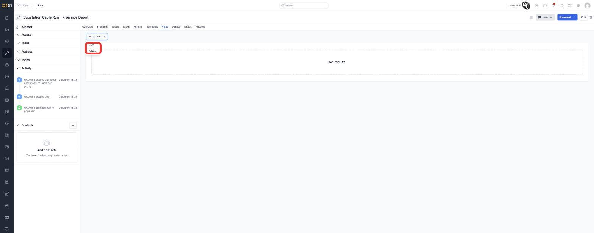
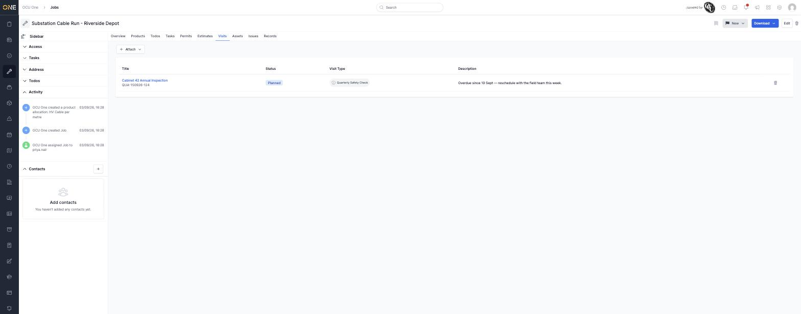
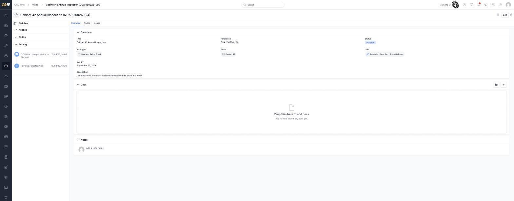
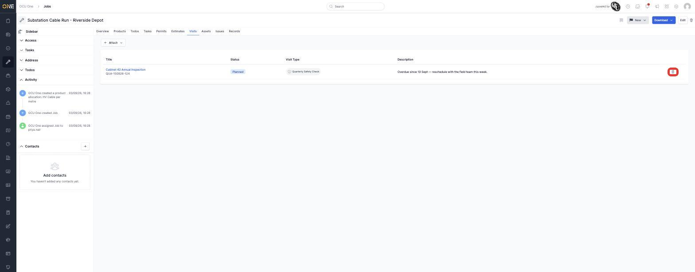

# Attaching or detaching a visit from a job

A visit can be linked to a job — for example once you decide the
inspection it covers is worth booking in as actual work. This is done from
the **job's** Visits tab, not from the visit itself.

## Attaching an existing visit

Open the job and go to its **Visits** tab, then click **Attach > Existing**.

Search for the visit by title and select it, then click the link icon to
confirm.

Once attached, the visit appears on the job's Visits list, and its status
automatically moves from **Pending** to **Planned**.

The visit's own overview page reflects the same thing — its **Job** field
now shows the job it's linked to.

## Detaching a visit

From the same Visits tab, click the trash icon on the visit's row.

You'll be asked to confirm ("Are you sure you want to detach this?")
before the visit is unlinked. Detaching moves the visit's status back to
**Pending** automatically.

## Things to know

- Creating a new job directly from a visit uses the same "New" option in
  that Attach dropdown, or the **+ Job** button on the Visits list — see
  [Browsing visits](Browsing%20visits.md).
- A visit can only be attached to one job at a time.
