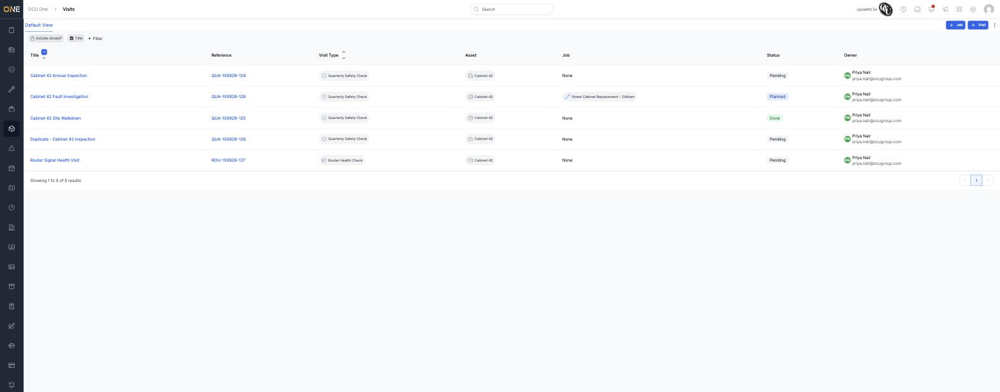

# Browsing visits

The **Visits** list shows every visit across all your assets in one place —
useful when you want to see what's outstanding, overdue, or already done,
without having to open each asset individually.

## Reading the list

Open **Visits** from the sidebar. Each row shows the visit's **Title**,
**Reference** (auto-generated), **Visit Type**, **Asset**, the **Job** it's
attached to (if any), its **Status**, and its **Owner**.

*Five visits on Cabinet 42: two Quarterly Safety Check visits still pending
(one already linked to a job, shown Planned), one completed ("Done"), and
one Router Health Check visit shown separately below.*

**Include closed?** toggles whether archived (deleted) visits are included
in the list — off by default, so deleted visits stay out of the way.

## Finding a specific visit

Click **+ Filter** to filter the list by any field — Status, Visit Type,
Asset, Job, Due By, RAG Status, Owner, Labels, or Tags, among others. See
[Filtering a list view by a field](../Views/Filtering%20a%20list%20view%20by%20a%20field.md)
for how the filter picker itself works — it's the same mechanism used
across every list in the app.

## Creating from here

**+ Visit** starts a new standalone visit — see
[Creating a visit](Creating%20a%20visit.md). **+ Job** lets you bulk-create
jobs directly from a selection of pending visits.
