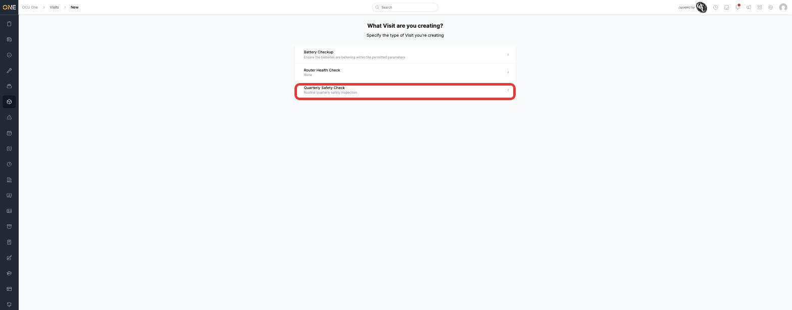
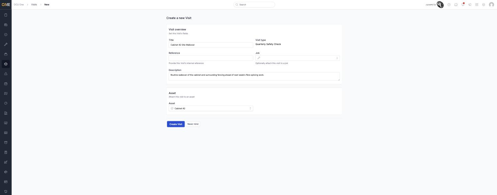
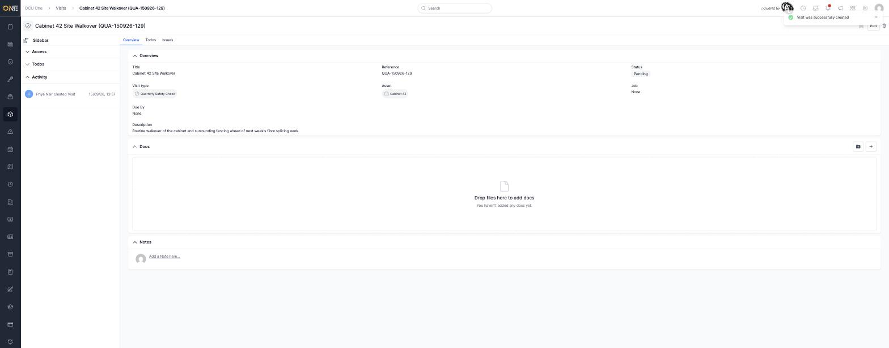

# Creating a visit

A visit is a planned or completed trip out to check on or inspect an asset —
either created manually here, or generated automatically from a recurring
visit plan (see [Scheduling a maintenance visit plan for an asset](../Assets/Scheduling%20a%20maintenance%20visit%20plan%20for%20an%20asset.md)).

## Starting a new visit

From the [Visits list](Browsing%20visits.md), click **+ Visit**. You're
first asked which **Visit Type** you're creating — each type is set up in
advance and can carry its own default fields (like RAG tracking).

*Picking "Quarterly Safety Check" as the visit type.*

## Filling in the details

Once you've picked a type, fill in:

- **Title** — a short, descriptive name.
- **Reference** — optional; leave blank and one is generated automatically.
- **Job** — optionally attach this visit to a job straight away (see
  [Attaching or detaching a visit from a job](Attaching%20or%20detaching%20a%20visit%20from%20a%20job.md)).
- **Description** — any extra context.
- **Asset** — which asset this visit is for. This is required.

Click **Create Visit**. You land on the new visit's overview page, which
starts in **Pending** status with no job attached.

